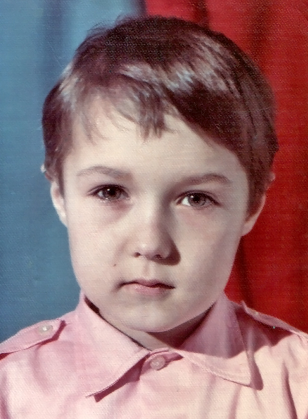

Январь 1990, мне **6 лет** и я живу в поселке [Саракташ](https://nashural.ru/mesta/orenburgskaya-oblast/gorod-saraktash-istoriya-dostoprimechatelnosti-foto/), 
почти в самом центре бескрайних степей Оренбургской области. 

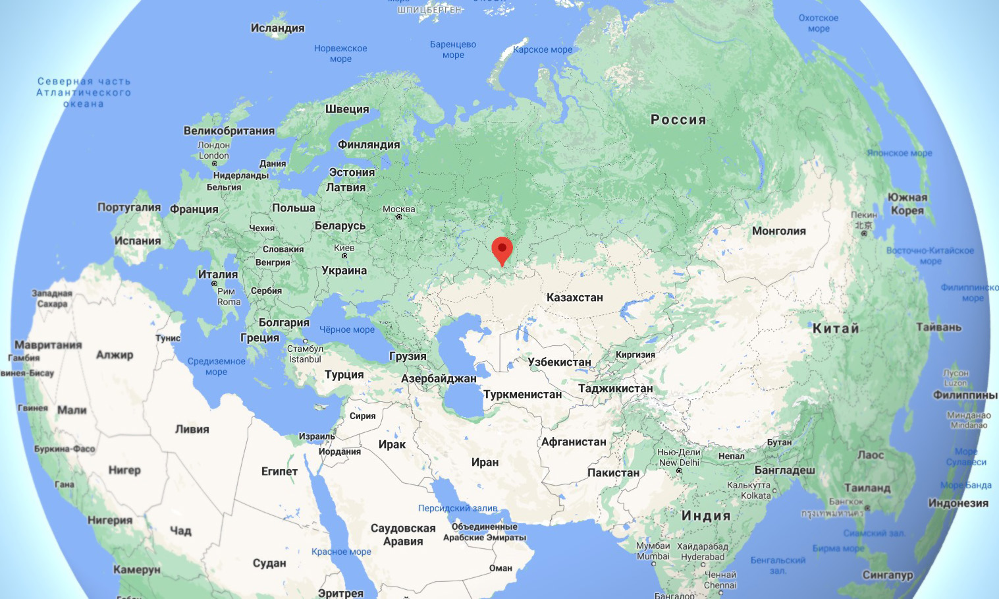

Перед новым годом мамины бабушка с дедушкой получили квартиру в новом трехэтажном доме на окраине поселка. Мои родители живут вместе с ними и строят свой дом неподалеку. Папина бабушка живет в центре и периодически мы ездим к ней в гости.

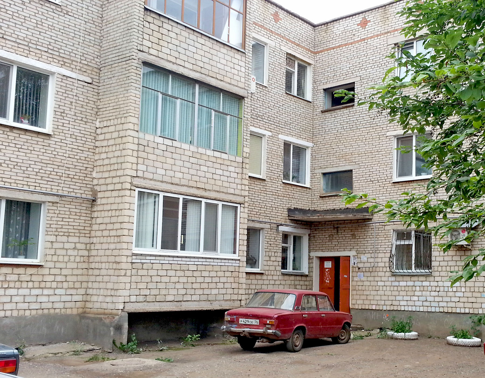

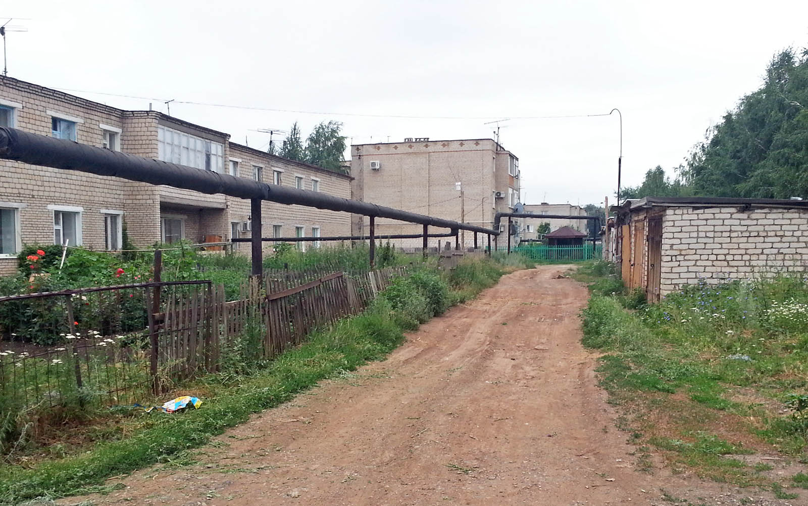

Я хожу в старшую группу садика. Садик расположен в нескольких кварталах от дома. Он двухэтажный, у него есть балконы и стеклянная крыша. Вокруг территория с беседками и песочницами. Весной во время прогулок я собираю отполированные водой камушки, а летом строю из песка большие замки.

Мы ходим в шортах и колготках, нас кормят кашами и компотом. В обед обязателен тихий час, когда всех раскладывают по кроватям. Но я не хочу спать и обычно фантазирую, смотря в окно на проплывающие облака. Размышлять над устройством мира одно из моих самых любимых занятий.

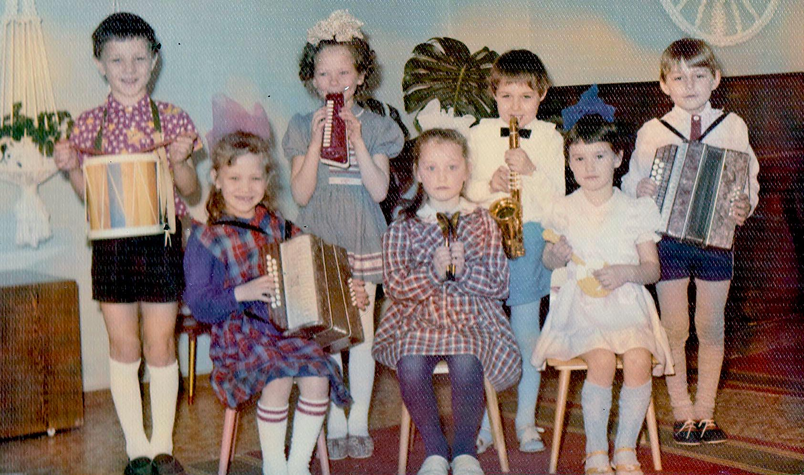

У меня в группе есть пара друзей, Женька и Эдик. Женька учит меня плохому, например, воровать. Мы завели себе секретное место, куда таскали всякие блестящие безделушки, найденные в ящиках с игрушками. Недавно мы научились вытаскивать иголки из кактусов так чтобы не уколоться самим и теперь многие кактусы стоят почти голые. Этими иголками мы колем других детей.

Есть у меня в группе и враги, например, Бися. Однажды он захлопнул дверцу шкафчика, когда мой палец был внутри. После палец посинел и с него отвалился ноготь. Мы периодически деремся, но я редко выхожу победителем. Иногда двое могут растянуть кого-нибудь на полу, а третий прыгает на нем ногами. Даже тогда мне это казалось диким.

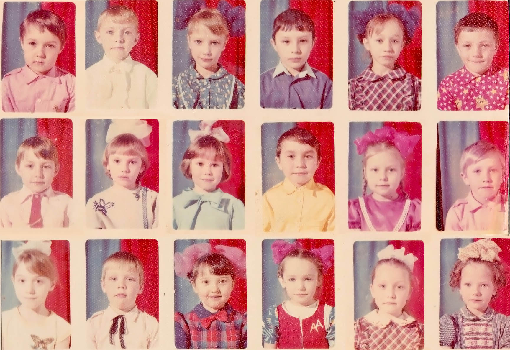

Я часто болею простудами и иногда задыхаюсь. У меня слабые ноги и от долгой ходьбы начинают болеть колени. Я люблю бегать и лазать в свое удовольствие, но стараюсь избегать навязанной мне физической активности. 

Весной мы ездили к тете в Оренбург лечиться в барокамере. Это такая большая бочка, в которой можно регулировать давление. Спустя много лет учась в институте, я встречусь с теткой, которая придумала и внедряла эту методику. Но, судя по результатам, это лечение мне не особо помогло.

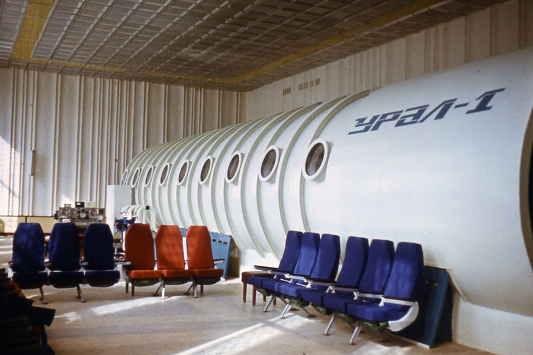

Однажды нас возили с экскурсией на местный фаянсовый завод. Тогда при СССР в Саракташе было много разных заводов. Мне было интересен сам процесс производства, то, как появляются вещи. Я любил лепить из глины и пластилина, создавать что-то новое. У меня была любимая кружка-бюветница с носиком в ручке, привлекавшая своей странной конструкцией. 

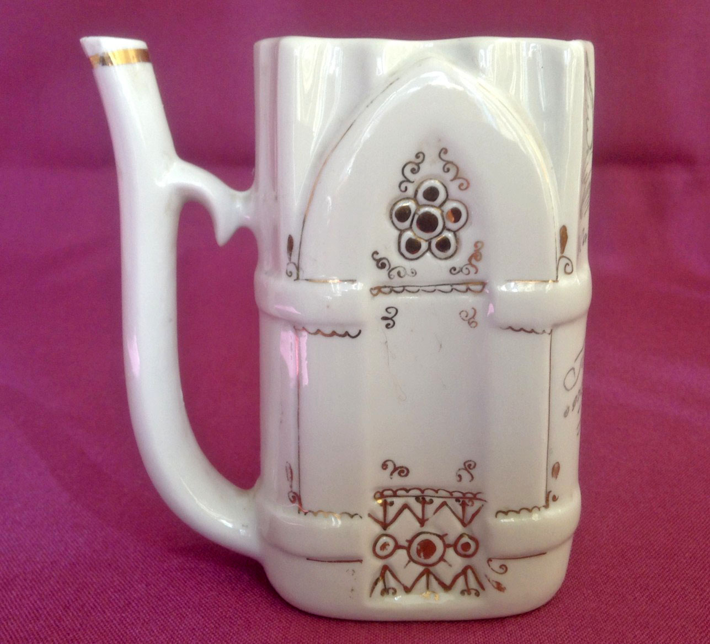

В старшей группе нас стали готовить к школе, заставляя учиться читать и считать. Я не очень понимал, зачем это нужно, ведь в школе будут учить тому же. Читать я уже умел, но не очень хорошо, зато мог легко заучивать прочитанное мне вслух и помнил, на какой странице что написано.

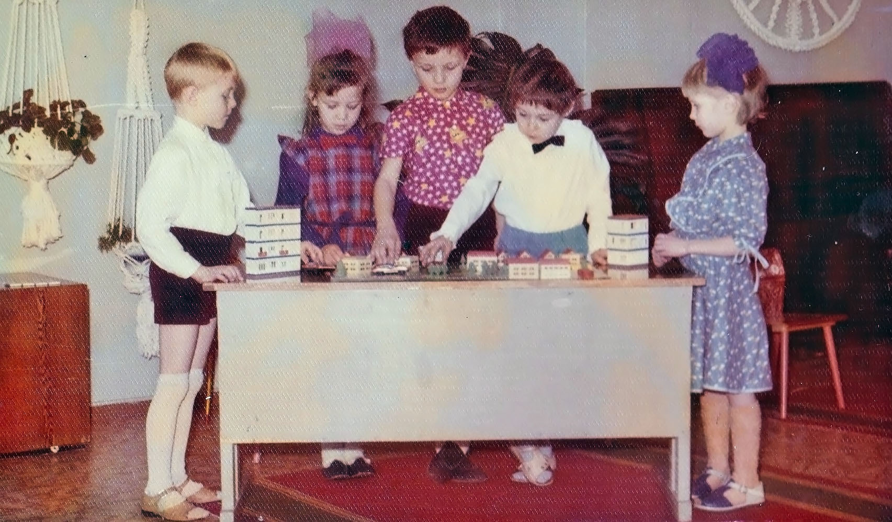

Перед окончанием садика нам провели показушную фотосессию, выдав игрушки, специально хранимые на этот случай. В реальности мы обычно играли сидя на полу, какими-нибудь деревянными кубикам или пластмассовым литьем. 

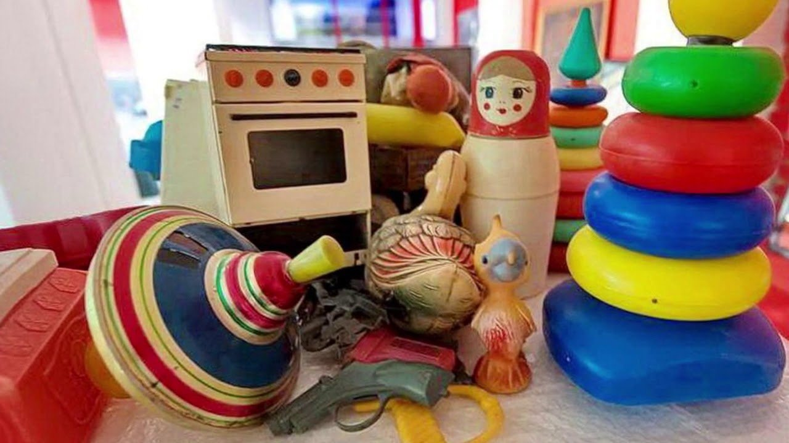

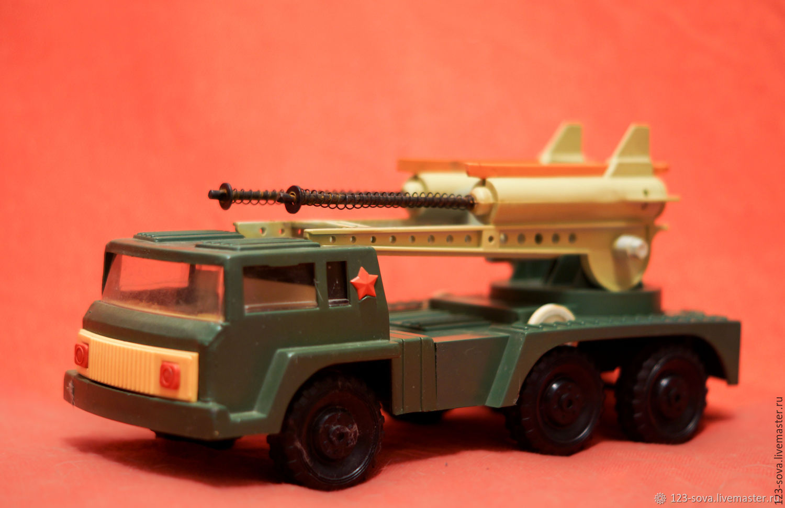

Советские игрушки, как другие повседневные товары, не отличались каким-то изяществом. У меня была редкая по тем временам железная дорога из ГДР, было с чем сравнивать. 

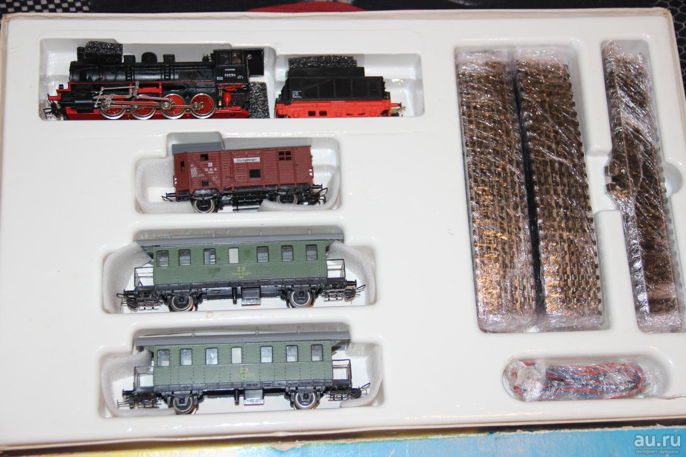

Впрочем, у примитивных игрушек были и положительные качества: они редко ломались и развивали фантазию, заставляя додумывать несуществующие детали.

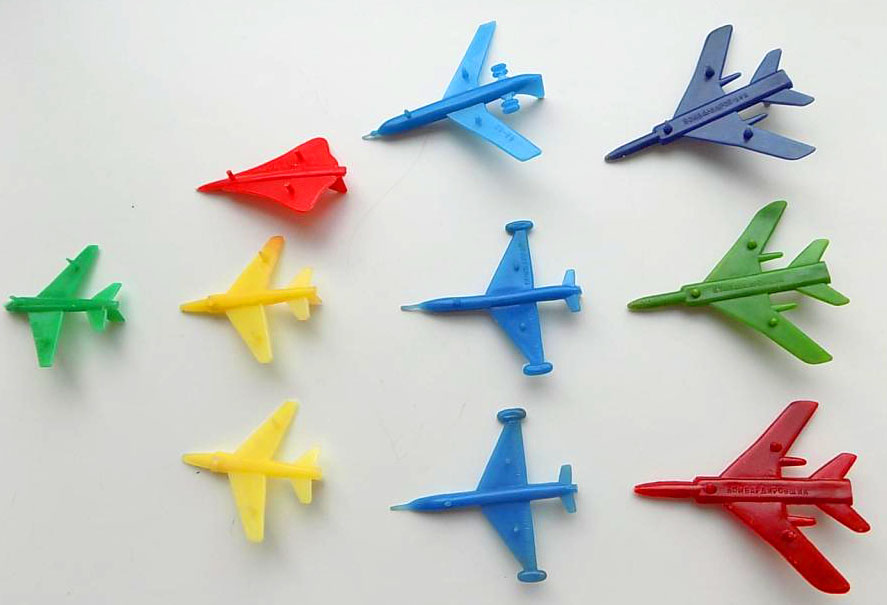

Цветному разнообразию в СССР внимания особо не уделяли. Полы всегда красили одинаковым коричневым, стены – синим или зеленым, потолок и двери – белым. У меня такой дефицит оттенков вызывал ощущение уныния и серости.

Возможно поэтому в Союзе любили яркие заграничные фильмы: латиноамериканские и индийские, с их пестрыми костюмами и зажигательными танцами. Лидер советского проката &ndash; фильм Есения, про роковую любовь мексиканской цыганки. Артисты эстрады выступали обязательно в блестящих костюмах, а посмотреть на страдания рабыни Изауры по вечерам собиралась вся страна. 

`video:https://youtu.be/iyLdoQGBchQ`

Танцевальным хитом того времени была конечно ламбада. Она играла из каждого окна.

## Перестройка

Последние два десятилетия страна деградировала. Открытие месторождений нефти и ее продажа за границу позволили на какое-то время замаскировать этот процесс, но в начале 80х цены на нефть упали и денег стало не хватать. СССР тратил огромные средства на военные нужды, пытаясь противостоять всему остальному миру, но был не в состоянии обеспечить своих граждан всем необходимым. 

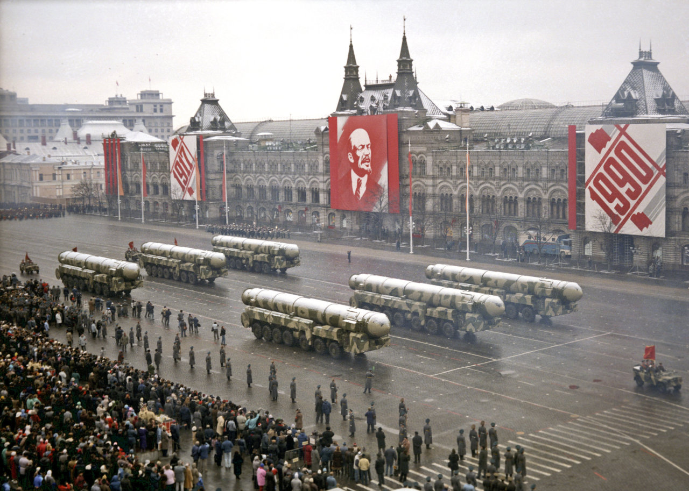

Советская идеология, 70 лет скреплявшая страну, к началу девяностых окончательно обанкротилась. Ей все еще клялись в верности, но фактически в нее уже мало кто верил. Плановая экономика, построенная на распределении товаров из единого центра, стала давать все больше сбоев. Никто уже не понимал, сколько каких товаров производится и где что требуется. Фальсификации в отчетности и воровство на предприятиях стали массовым явлением. 

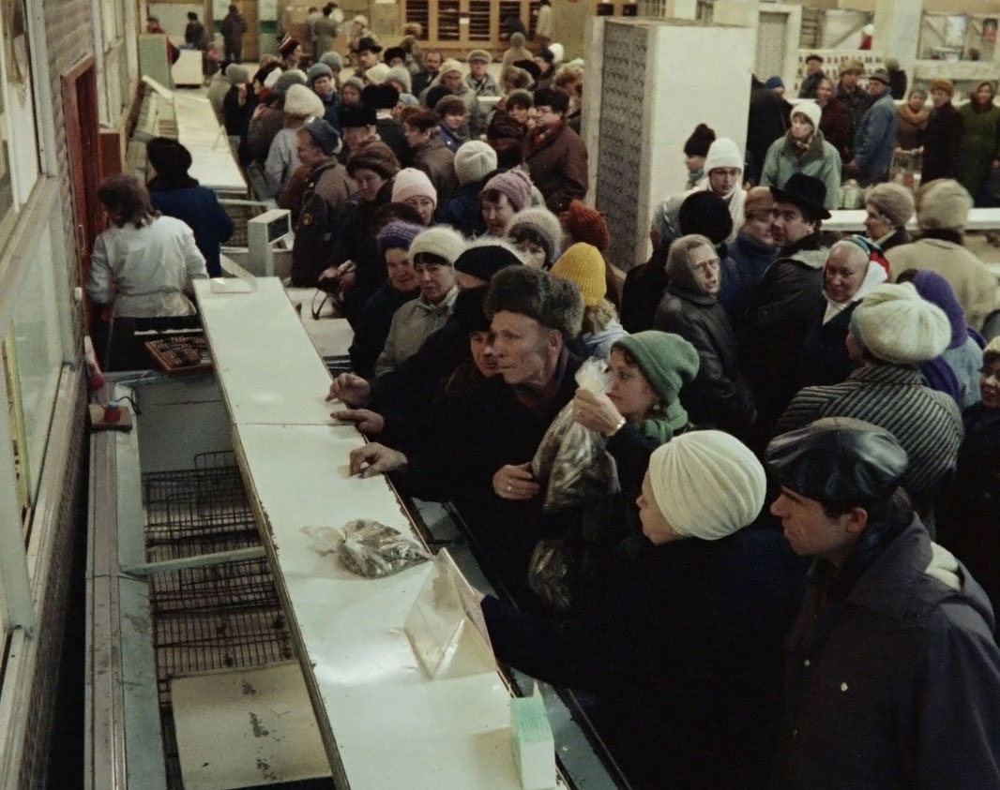

Система управления пошла вразнос. Из продажи стали исчезать самые необходимые вещи: чай, сигареты, туалетная бумага, водка, появились перебои с продуктами. Полки магазинов опустели, в магазины стояли километровые очереди, появилась угроза голода. Необходимо было менять систему на рыночную, но это означало признать ошибочность советского пути.

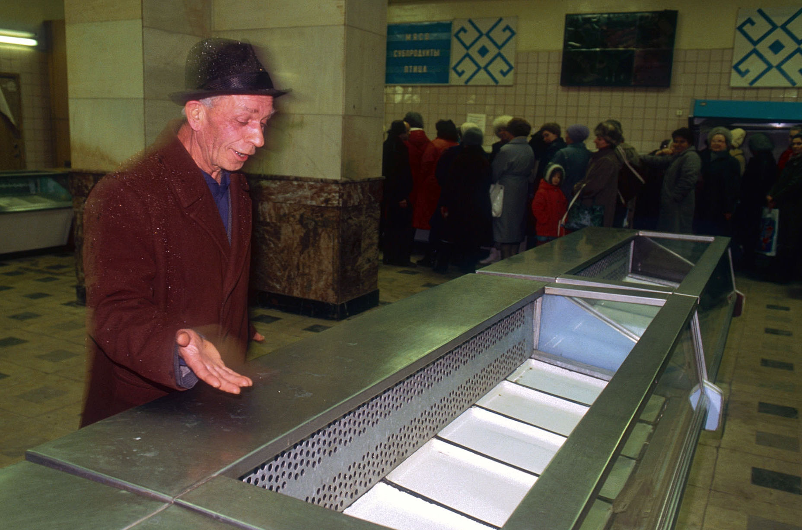

В попытке решить эту проблему несколько лет назад была объявлена Перестройка. По замыслу Горбачева, нового руководителя страны, она должна была поднять мотивацию людей к труду, не меняя экономических основ социализма. Для этого предприятиям разрешили самостоятельно продавать часть продукции, а полученные деньги распределять между работниками или пускать на модернизацию. Также была разрешена мелкооптовая торговля и малый бизнес, за занятие которым раньше сажали в тюрьму.

Переход к рыночной экономике был необходим и неизбежен, чтобы побороть дефицит. Однако в условиях развала системы управления он привел к появлению организованной преступности, облагавшей данью новых предпринимателей.

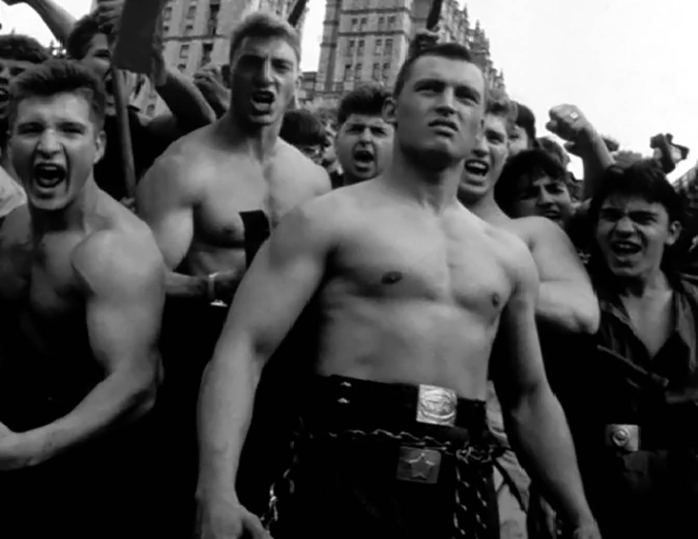

Другой задачей был слом сопротивления старой партийной верхушки, противившейся переменам. Эти люди годами сидели у власти и уходили из нее только по причине смерти. Их власть держалась на страхе и насилии, несогласных отправляли в тюрьмы, клали в психбольницы или высылали из страны. Действовала и цензура: иностранные радиостанции глушили, печатали только одобренную информацию, на выезд за границу нужно было специальное разрешение.

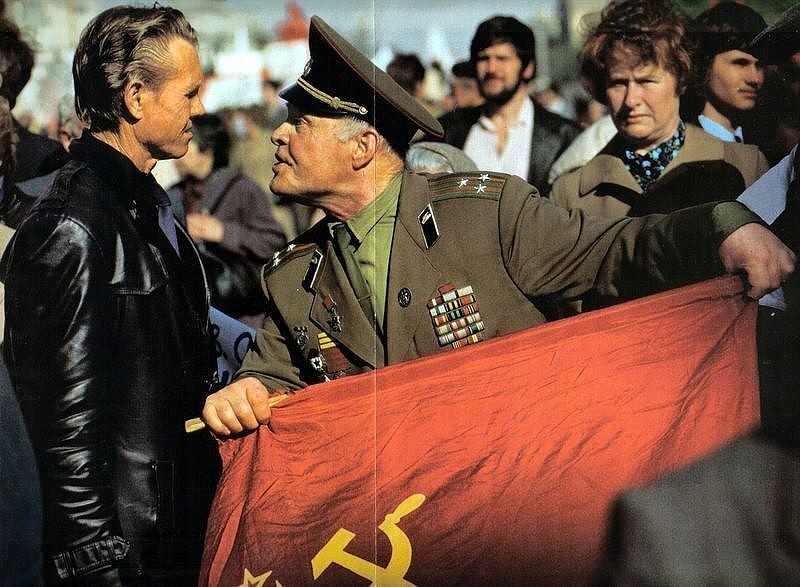

Обладая такой монополией, руководство не считалось с мнением людей и могло принимать самые абсурдные решения. Обратная связь отсутствовала. На мега проекты расходовались огромный ресурсы, а результат оказывался никому не нужен.

Горбачев отменил цензуру, ввел элементы демократии и разрешил свободные выборы, как это принято в развитых странах. Коллективы должны были самоорганизоваться и выбрать себе толковых руководителей, повысив эффективность производства, что на деле обернулось бардаком. Обновление вышло из под контроля. Оказалось, что в нормальных условиях, без цензуры и принуждения, советская власть существовать не способна. 

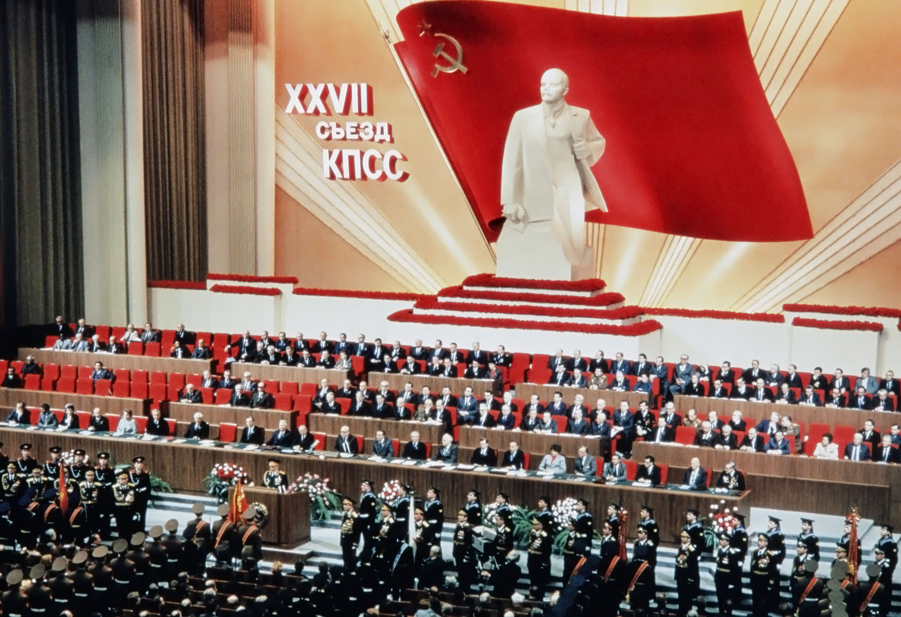

Люди стали массово выходить из коммунистической партии. В странах восточной Европы, ранее подчиненных Москве, коммунисты потеряли власть в результате бархатных революций. Многие республики внутри Советского союза стали требовать независимости. Разгорелись застарелые межэтнические конфликты, между Азербайджаном и Арменией фактически началась война.

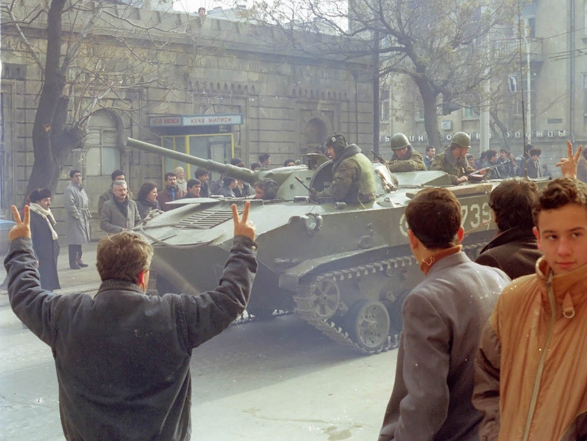

Молодёжь абсолютно не воспринимала советскую идеологию. За последние 10 лет в ее среде вызрела своя контркультура, противостоящая официальной. Люди смотрели на страны Запада, как удобно и сытно там живется, и хотели жить также. Все советское начало ассоциироваться с серостью, отсталостью и убогостью. Вся жизнь стала пропитана духом перемен. Даже в столь юном возрасте я уже улавливал эти ощущения.

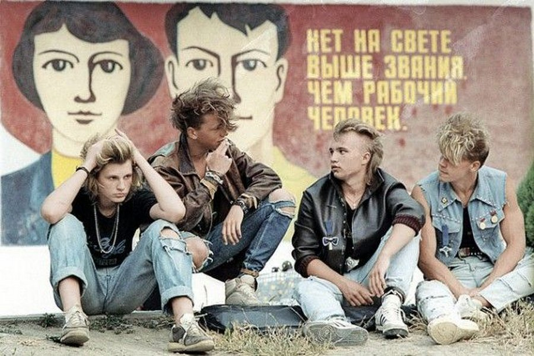

`video:https://youtu.be/PpaM11TX6ww`

## Школа

В сентябре мне исполнилось **7 лет** и я пошел в школу. Школа находилась прямо рядом с бабушкиным домом. Наш класс был расположен на вернем этаже и с него открывался отличный вид.

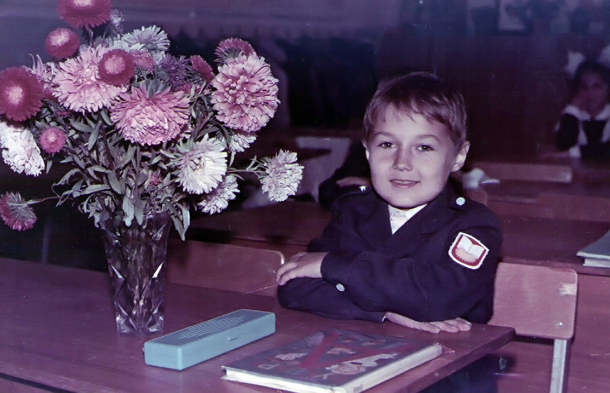 

Я не очень хорошо вижу, поэтому сижу на первой парте с Ленкой Олейничук. Напротив наша первая учительница – Римма Акимовна, грузная пожилая женщина. Она коммунистка и гордится этим. Следующие три года она будет вести у нас почти все уроки.

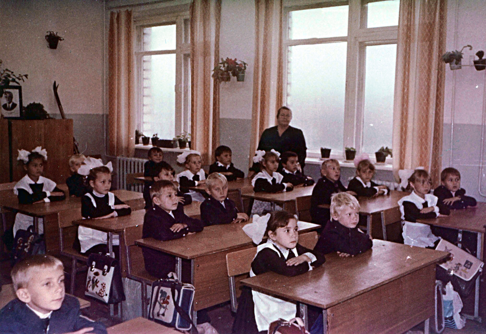 

В классе я дружу с Барсуком (слева в углу) и другими ребятами. Мой друг Женька не попал в мой класс, но мы периодически видимся на переменах. В классах высокие потолки, с которых ярко светят жужжащие ртутные лампы. 

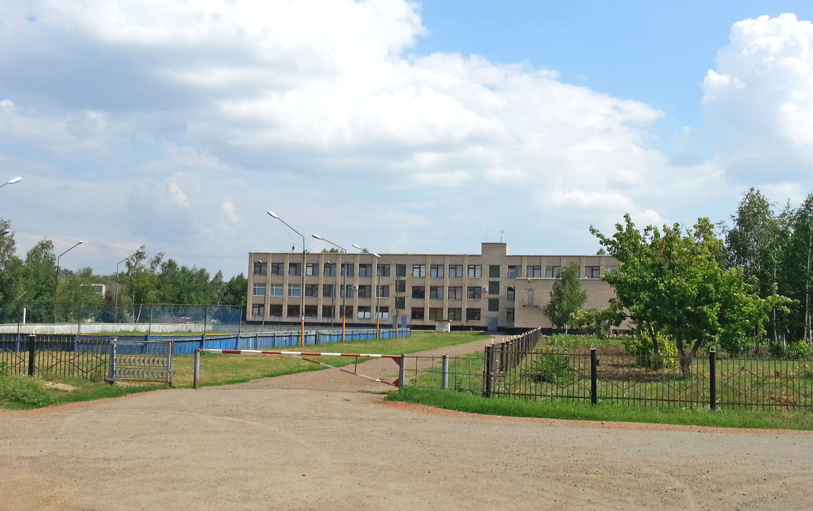

В моем огромном портфеле лежит букварь, прописи, пенал и палочки.

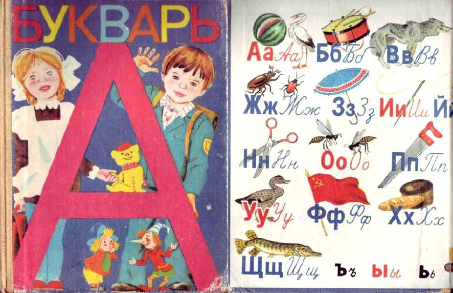

Приходя домой, я пишу страница за страницей одни и те же прописные буквы. Эта дрессировка меня раздражает, я не вижу в ней смысла. Несмотря на все старания, я так и не научился красивой каллиграфии, мой подчерк был ужасен, поэтому к концу школы я наловчился быстро писать аккуратными печатными буквами.

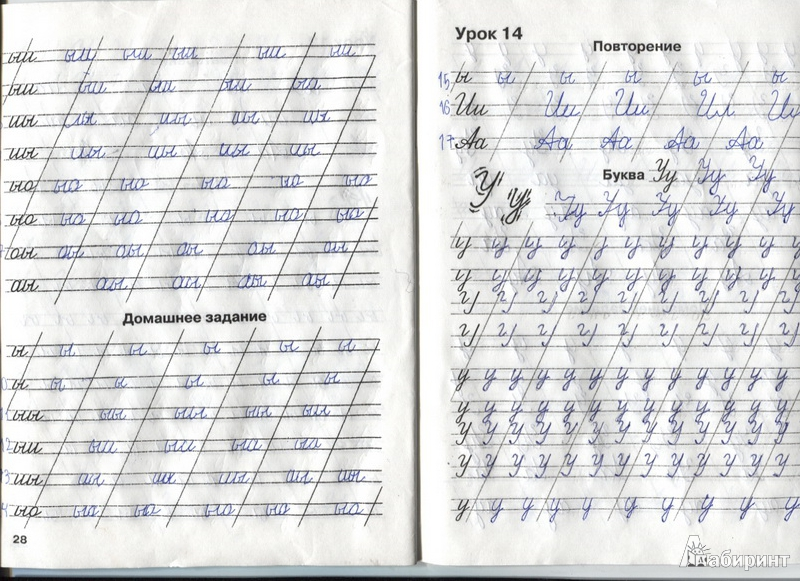

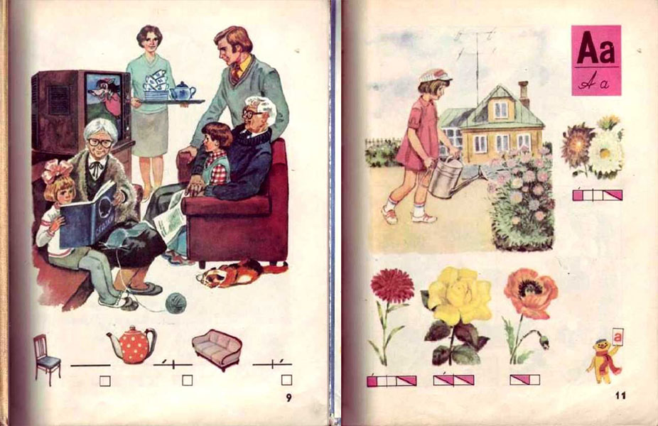

Что мне реально понравилось, так это читать, хотя и не сразу. Чтение открыло для меня новые горизонты. Всю свою жизнь я буду накачивать себя информацией из книг, а потом рассказывать прочитанное другим людям. Поделиться тем, что узнал, станет моей настоящей потребностью. 

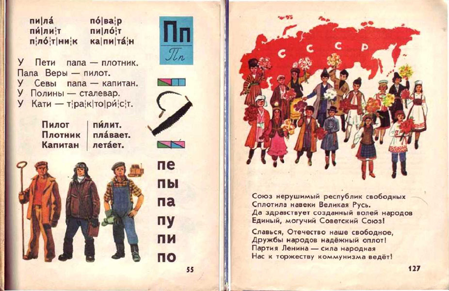

К сожалению окружающим это будет не всегда интересно.

