Январь 1991, мне **7 лет**, я живу в Саракташе и учусь в **1 классе**.

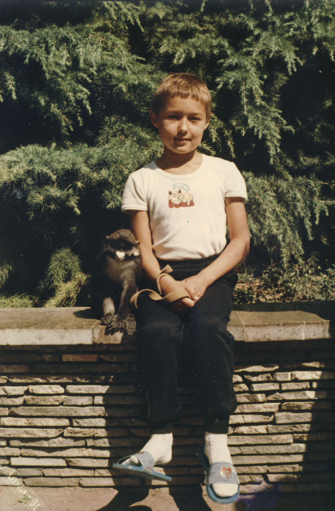

Мои родители почти достроили коттедж и ближе к зиме мы переехали туда жить. Так как бабушка живет прямо возле школы, довольно много времени я также провожу у нее. Во всяком случае, большая часть воспоминаний начала 90х именно про ее квартиру.

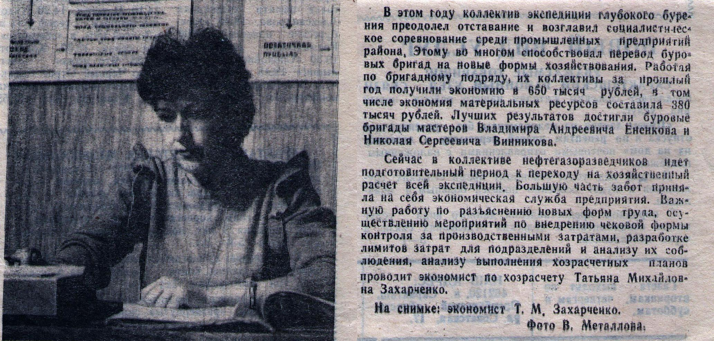

Мама работала экономистом в геологии, а папа был начальником столярного цеха. Теоретически, квартиру можно было когда-нибудь получить, как получили ее бабушка и дедушка. Однако в стране творился полнейший бардак и в очереди на жилье можно было стоять годами, так ничего и не получив. Оставался только вариант строить.

Купить было почти ничего нельзя, но можно было выменять. Для современных людей словосочетание "нельзя купить" звучит очень странно, но для живущих в Советском союзе это было нормой. Можно было утащить что-нибудь с работы, это даже не считалось воровством, главное, чтобы там было что-то нужное. 

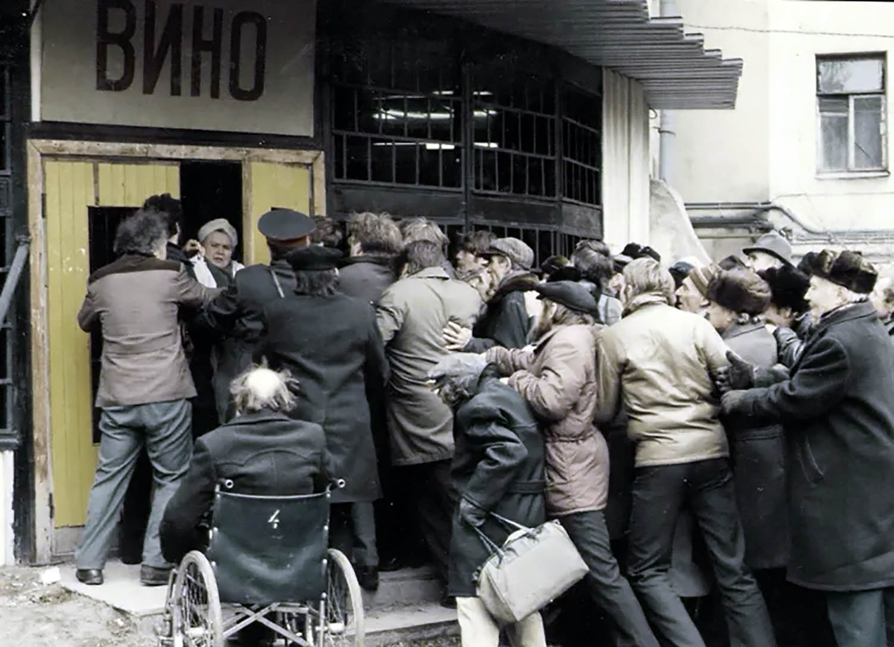

Идеально было работать в магазине или на складе, продавая дефицитные товары втридорога, а вот быть инженером на заводе по производству булавок считалось полным отстоем. Кроме того, в условиях государственной экономики было много бесхозных вещей. Например, вдоль трассы годами валялись большие блоки, которые в итоге пошли нам на фундамент. Для изготовления бетона мы использовали специальный цемент для нефтяных скважин, который потом было невозможно просверлить. 

В качестве помощи на работе выдавали материалы для строительства, но рабочих нужно было нанимать самим. В условиях ограничения продажи алкоголя основной валютой был самогон, которым обычно расплачивались со строителями. Кроме самогона они самостоятельно пили стеклоочиститель, морилку, одеколон и клей БФ. Последний нужно было хорошенько взбить дрелью в ведре, чтобы отделить резину от спирта. 

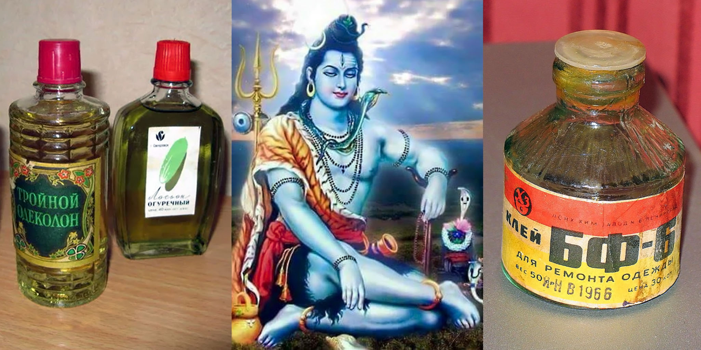

От этих веществ их лицо приобретало умиротворенное выражение, а кожа становилась синей, как у индийских богов. Остаток дня они медитировали, а на следующий день снова продолжали работу. Долгая жизнь не входила в их планы.

Место для дома было хорошее, но дикое. Понадобится еще несколько лет, чтобы довести его до ума. Кроме постройки самого дома пришлось проложить вокруг несколько дорог. Вместо огорода был овраг и чтобы его засыпать понадобилось привезти 50 КАМАЗов с землей. Постепенно мы огородим территорию забором, построим гараж и веранду, посадим вокруг цветы и деревья, станет красиво.

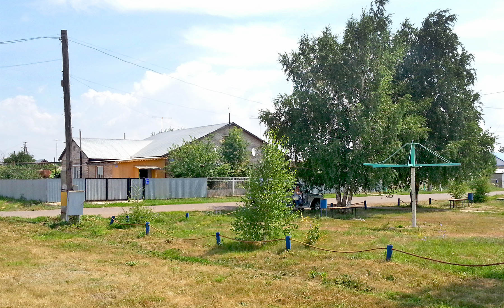

Несмотря на явный прогресс, в нем всегда будут оставаться какие-то недоделки, которые будут меня раздражать. Например, мы так никогда и не достроим баню. А пока мне нравилось жить в атмосфере ремонта: собирать мебель, играться с деталями, осваиваться в новом окружении. 

У меня была своя комната, в углу можно было спокойно разложить игрушки, а со стены смотрели фотообои с космонавтами. Теперь я почувствовал, что живу дома. 

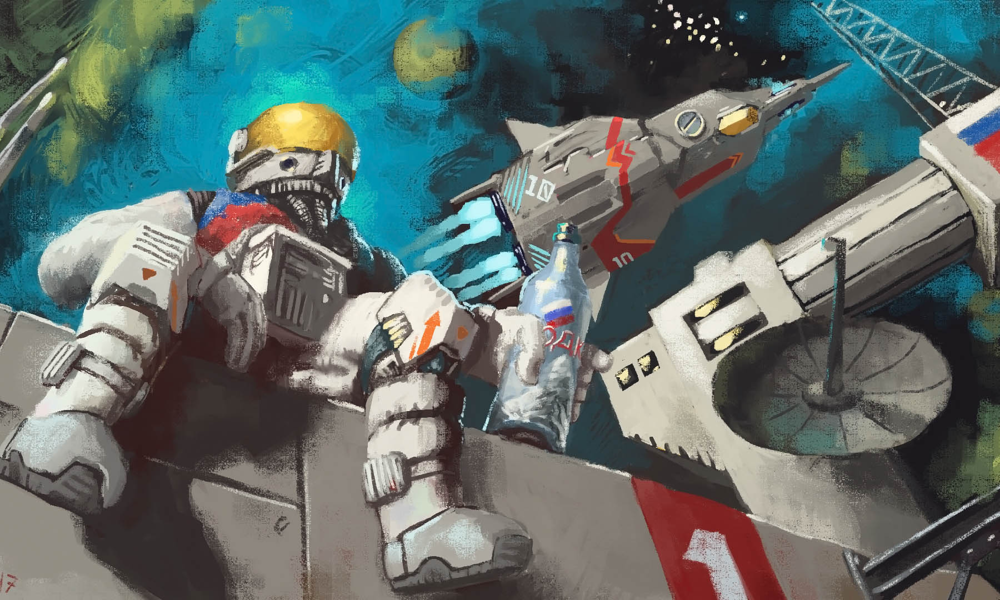

## Ялта 

В детстве я часто болел и периодически задыхался. Поэтому мне дали направление на лечение в Крыму, в Ялте, почти на целый месяц. 

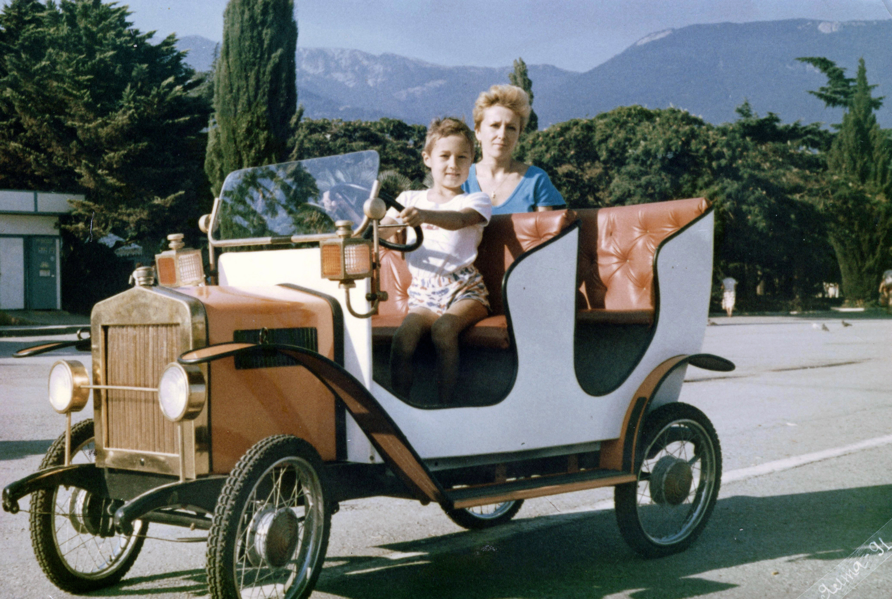

Ялта меня потрясла. Там было столько всего нового, столько интересного, чего в Саракташе я никогда не видел. Но главное там было море. 

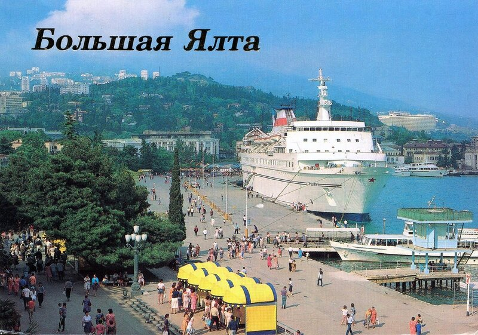

Море, оно такое прикольное, скорее зеленое, чем темно-синее и на нем белые волны. Оно обтачивает битое стекло до полупрозрачных овальных камушков. Мне нравится погружаться в волны и нырять, но я почти не умею плавать. Одно ухо всегда закрыто масляной ваткой, потому что в нем дырка.

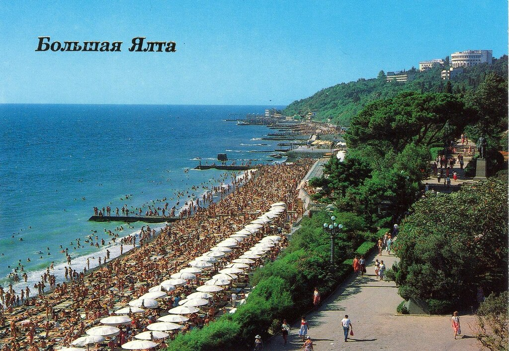

В Ялте еще есть настоящие дворцы и замки. 

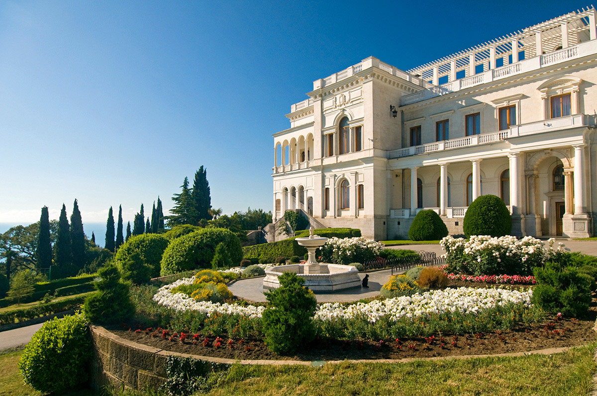

Порт с кораблями и огромные синие горы. 

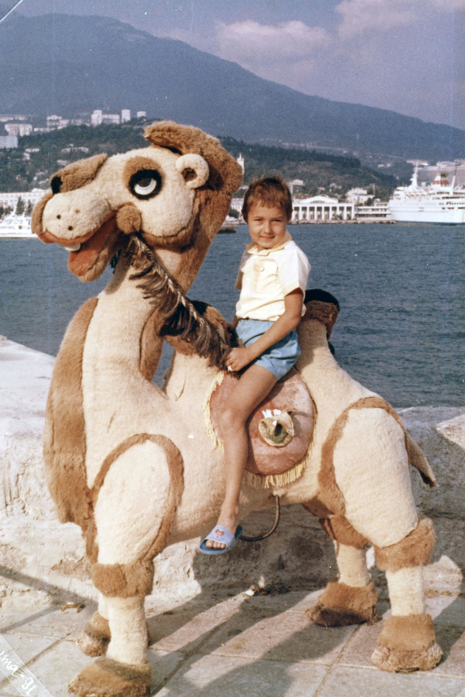

Там растут кипарисы, кедры и туя, которые пахнут елкой, дубы, каштаны и пальмы. Из желудей и веток можно делать человечков, с кедров собирать круглые шишки, а пальма похожа на перебинтованные щепки – на ней нет кокосов, зато растут ягоды. 

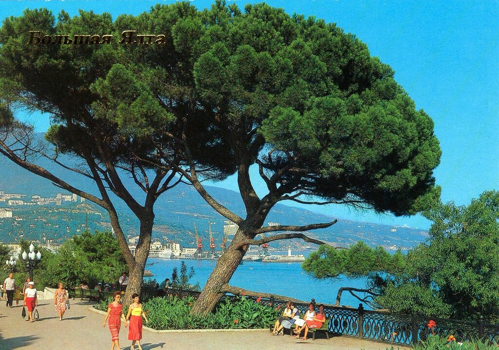

Мы жили в наверху, в санатории Кирова, над кинотеатром Спартак. Из номера открывался отличный вид. Днем я рисовал акварелью пейзажи и читал книжку "Незнайка на луне", а ночью смотрел на маяк и слушал доносящуюся издалека музыку.

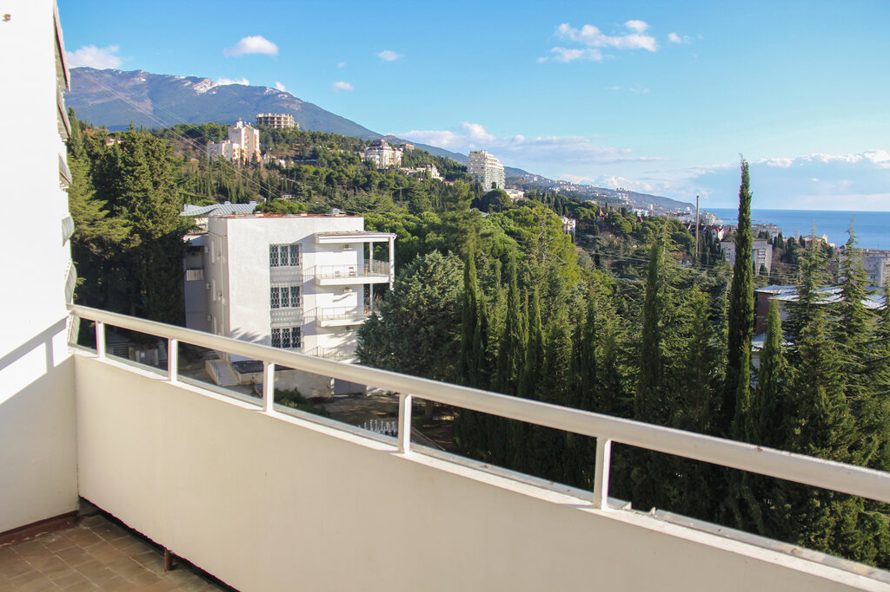

Каждое утро мы с мамой ходили вниз к морю. Там мне делали ингаляции и массаж, поили травяным чаем, а потом можно было идти купаться. 

Однажды я попал на прием к психологу. Она сказала, что мне светит фиолетовая звезда, которая наполняет космической энергией и дает способности к излечению. Спустя 15 лет интерес к таким вещам приведет меня в дурдом. 

`video:https://youtu.be/VT3OfQXLOHM`

Ялта – курортный город, тут много разных развлечений: карусели, игровые автоматы и электромашинки. По вечерам в подпольном кинозале показывают иностранные фильмы и мультики. Кинозалом является просто комната, в которой стоит телевизор с видеомагнитофоном, а вокруг на табуретках сидят люди. Там я впервые посмотрел Бетмена. Ничего подобного я раньше не видел. 

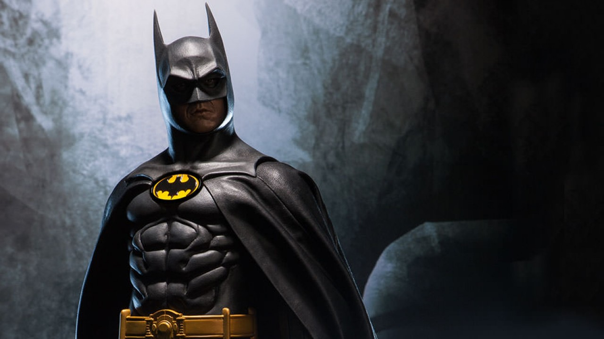

Ялта перевернула мое сознание, я просто влюбился в это место. Но самое главное, после этой поездки я год не не задыхался. И не болел, вообще ничем. Это было настоящее чудо. Теперь каждый год мы будем стремиться вернуться сюда, но сделать это будет уже не так-то просто.

## Обстановка в стране

Экономика на пороге краха, пустые полки магазинов, люди дерутся в очередях. Над крупными городами нависла угроза голода, еду завозят из-за границы. В Саракташе с этим попроще, у всех есть свои огороды, многие держат скотину, а мы выращиваем картошку и овощи на даче.

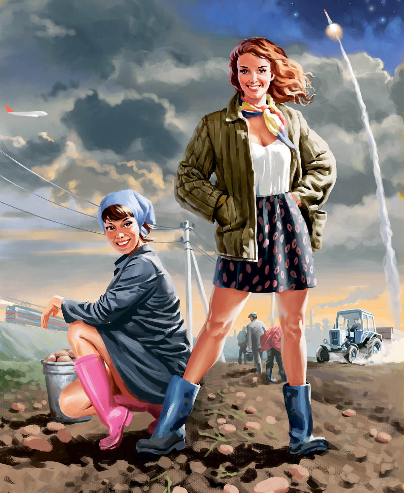

Люди недовольны ситуацией и требуют перемен. Половина республик хотят выйти из состава СССР. Идет острая борьба между руководством СССР, состоящим из старых коммунистов, и новым руководством республики Россия, представленных демократами во главе с Ельциным.  

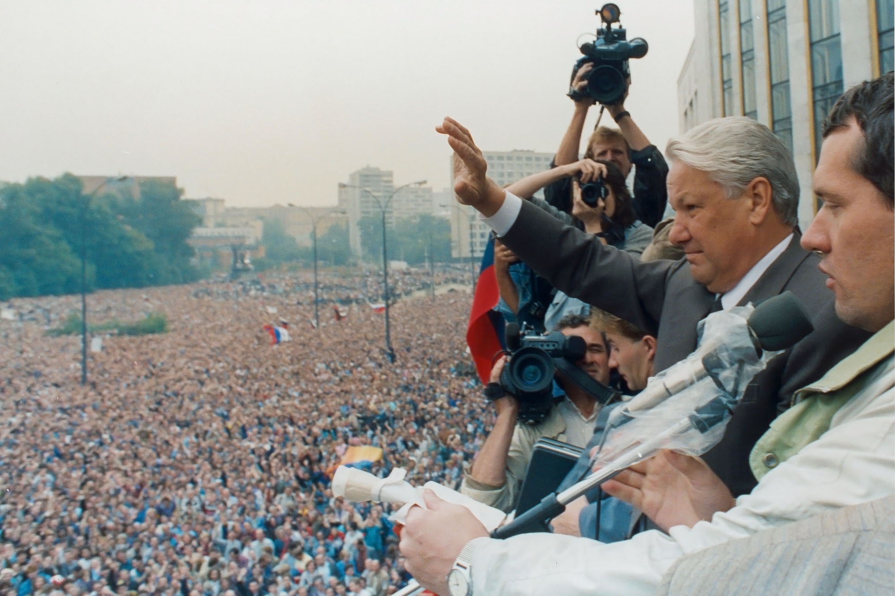

В августе, в попытке остановить изменения, коммунисты организуют государственный переворот – путч ГКЧП. Они вводят в Москву войска, пытаясь арестовать Ельцина и разогнать парламент. 

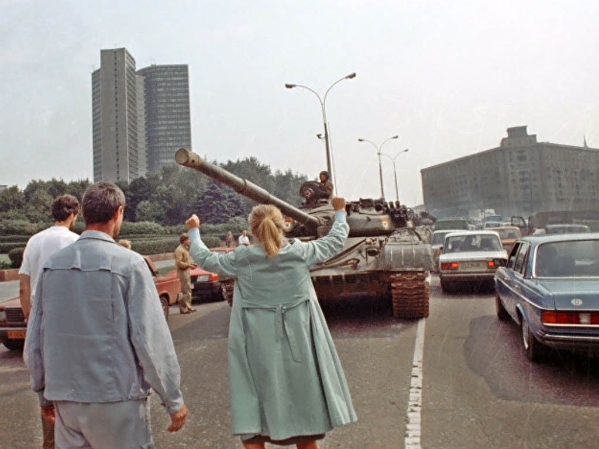

В ответ на это сотни тысяч людей выходят на улицу, чтобы защитить демократию и противостоять коммунистам. Армия переходит на сторону народа. 

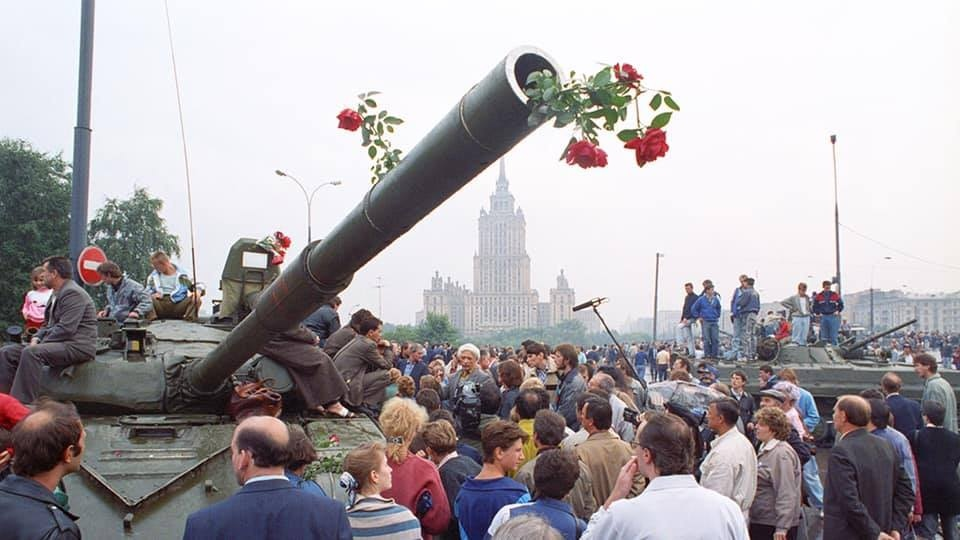

Путч проваливается. Коммунистическую партию ликвидируют. К концу года все республики выходят из состава СССР и он прекращает свое существование. Вместо него на карте появляются 15 новых стран, одна из которых Россия. В стране меняется флаг, герб и гимн. Начинается совершенно новая эпоха.

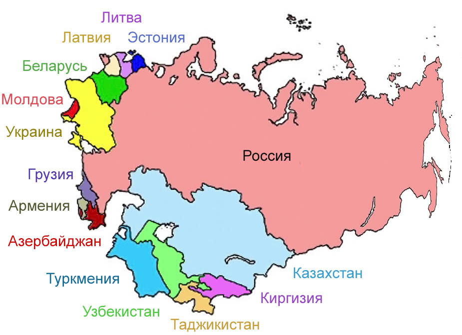

## Культура

В сентябре мне исполнилось **8 лет** и я перешел в **2 класс**. Победа демократических сил вызвала огромный духовный подъем в обществе. Возникло невероятное ощущение свободы. Внезапно стало можно всё.

`video:https://youtu.be/M_XLHP_gBIE`

Несмотря на экономические трудности, многие люди чувствовали себя счастливыми. Еще будучи ребенком, я уже интересовался политикой и знал, на какой стороне нахожусь. В дальнейшем ядро моих взглядов составят [антиавторитаизм](https://ru.wikipedia.org/wiki/Антиавторитаризм), [гуманизм](https://ru.wikipedia.org/wiki/Гуманизм), рационализм, прогрессивизм, ценности [просвещения](https://ru.wikipedia.org/wiki/Просвещение) и классической [либеральной демократии](https://ru.wikipedia.org/wiki/Либеральная_демократия).

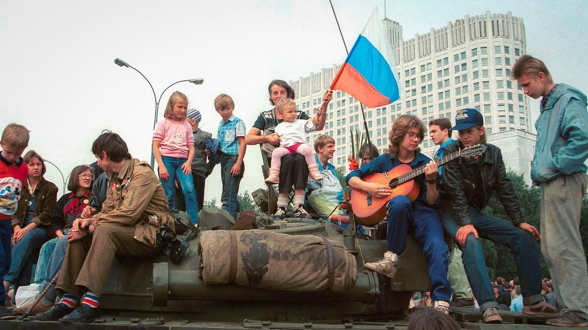

70 лет назад большивики установили полный контроль над страной, определяя, что правильно, а что нет. Была переписана вся предыдущая история: они переименовывали города и улицы, закрывали храмы, взрывали памятники, прятали неудобные факты и жестоко уничтожали всех несогласных. После крушения власти коммунистов начался обратный процесс. 

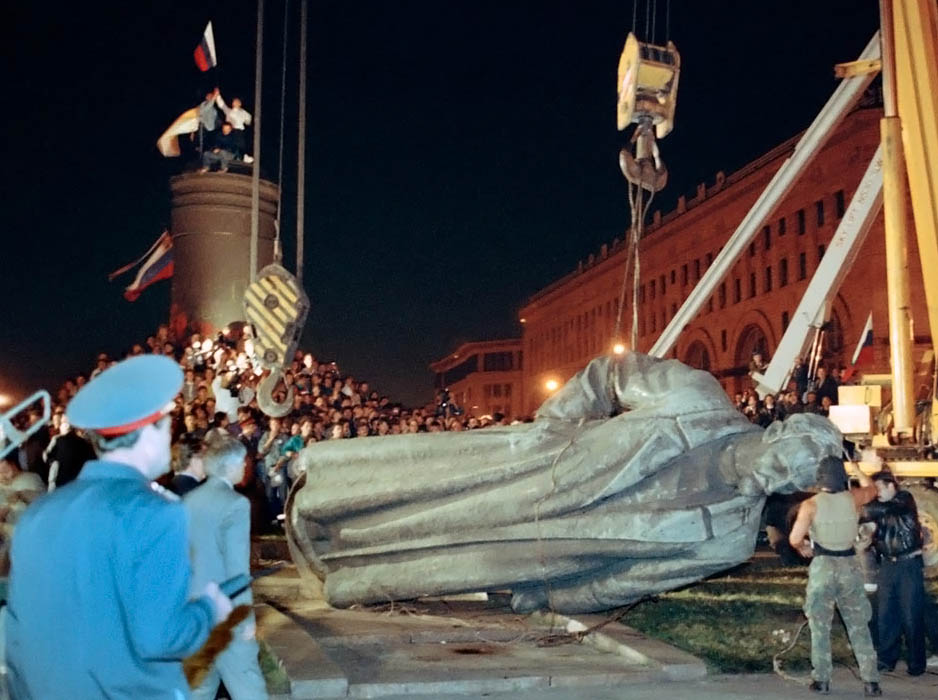

Стало модной ностальгия по Российской империи, которую никто в глаза не видел. Про нее снимали  передачи, писали книги и пели песни. Эфир наполнился казаками, офицерами, царями, героями гражданской войны и т.п. 

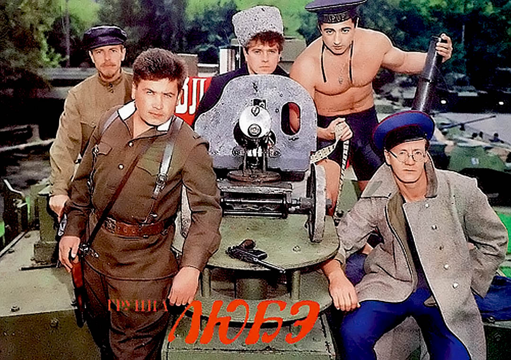

`video:https://youtu.be/Rra5AnfGc5A`

Забавно, но спустя лет тридцать люди также будут ностальгировать по СССР, представляя его просто раем на земле, где все жили дружно и счастливо. Видимо, это особенность человеческой психики, мечтать о фантастическом прошлом. 

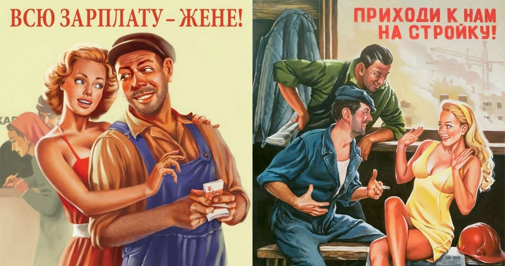

`video:https://youtu.be/DB1dEZdrRHs`

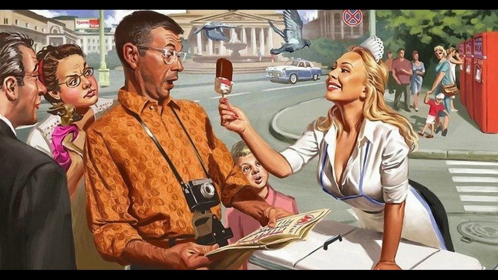

## Фильмы

В советское время почти все фильмы были позитивные и музыкальные (кроме фильмов про войну), снимать недостатки социалистического строя не разрешалось. Поэтому, когда в перестройку это разрешили, стали появляться произведения одно другого мрачнее: про коррупцию, секс, бандитизм, драки, наркоманию и т.п. Сейчас перестроечные фильмы почти невозможно смотреть, там один грустняк и чернуха. Хотя время само по себе было свободное и позитивное.

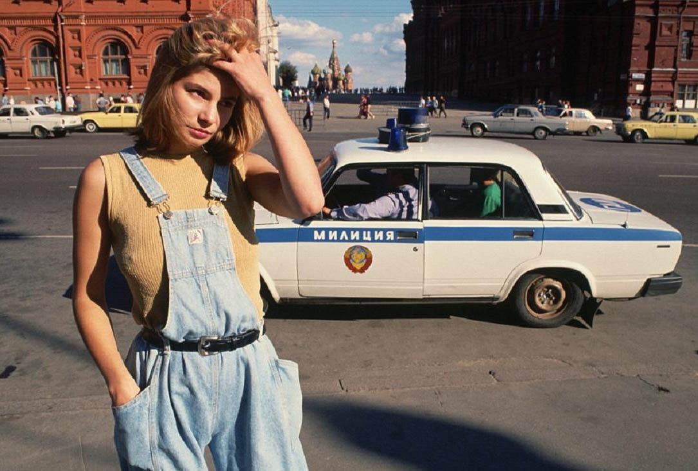

Популярностью пользовались фильмы, подражавшие Голливуду. Мне очень нравились "Пираты 20 века", обычный по нынешним меркам боевичок, который тогда воспринимался как верх крутизны.

`video:https://youtu.be/XTrebs1kpT0`

Союз закупал и некоторые иностранные кино, если они были идеологически правильными, в основном это были комедии. Мой любимый фильм – "Короткое замыкание", про доброго робота. Я несколько раз смотрел его в кинотеатре. В будущем я женюсь на девушке, которая будет очень похожа на главную героиню внешностью и поведением. 

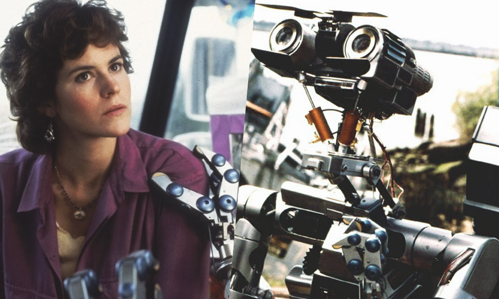

В телевизоре есть только один канал, с этого года прибавился второй, но там редко показывают фильмы и еще реже мультики. Днем на несколько часов эфир выключают на "технический перерыв". По выходным я смотрю "В мире животных", "Утреннюю почту" и появившуюся недавно "Поле чудес". Вечером идут новости, а ночью политические передачи. 

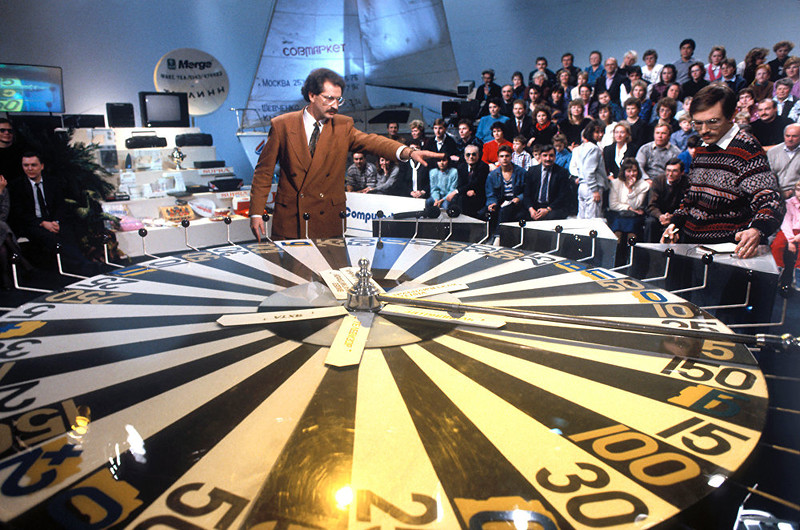

## Мультики

Проблема с советскими мультиками не только в том, что редко показывают. Среди них мало хороших. Чаще всего по телевизору показывали "мультики для взрослых", при создании которых явно не обошлось без тяжелых наркотиков. Отсутствие в них логики просто разрывало мой неокрепший мозг.

`video:https://youtu.be/GL8MW94mVCQ`

На мое счастье с этого года регулярно стали показывать диснеевские мультики. Первыми были "**Утиные истории**" и "**Чип и Дейл**", которые шли по часу в воскресенье вечером. Боже, это что-то невероятное. Они красивы, логичны и интересны.

`video: https://youtu.be/gMKeQM5Xp90`

`video: https://youtu.be/y1aEZDLgdq4`

В конце 1991 единственный раз показали "**Приключения Боско**" – про похищенную принцессу эльфов Абрикотин, которая должна до полного солнечного затмения вернуться в королевство Фонтания, захваченную огромным Скорпионом.

`video: https://youtu.be/DZGWsLTShIk`

Мультик был отличный. Скоро и у нас будет свое королевство Фонтания.

