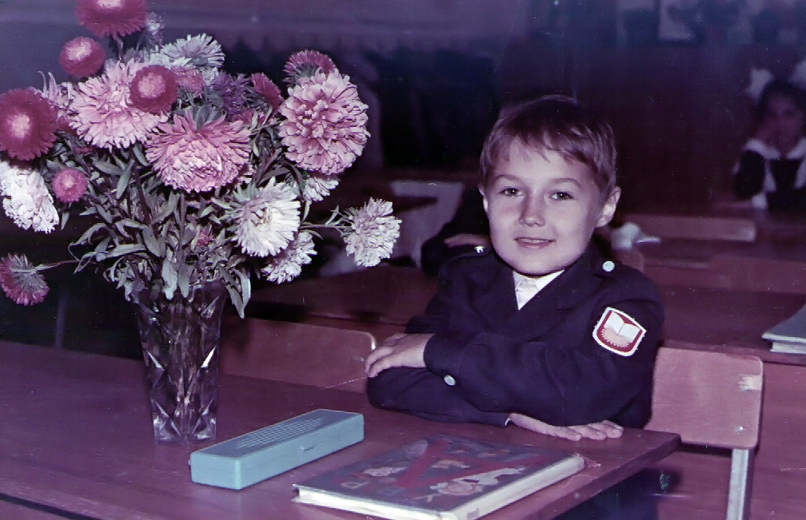
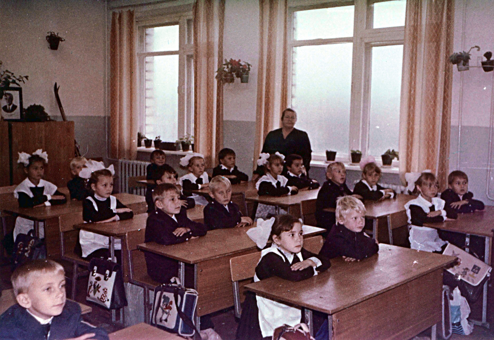
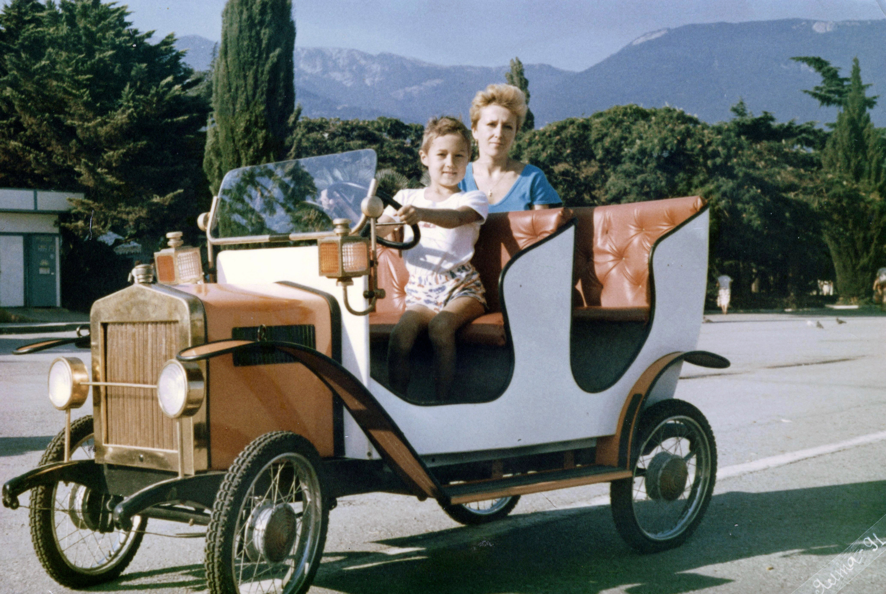
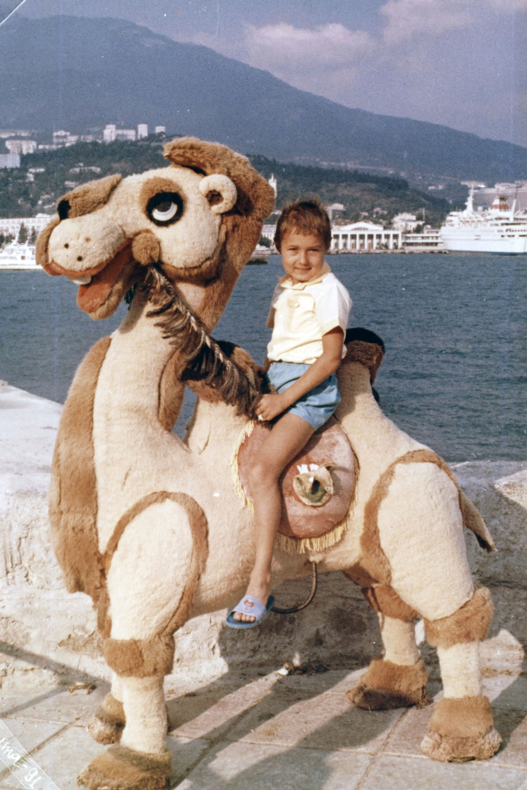
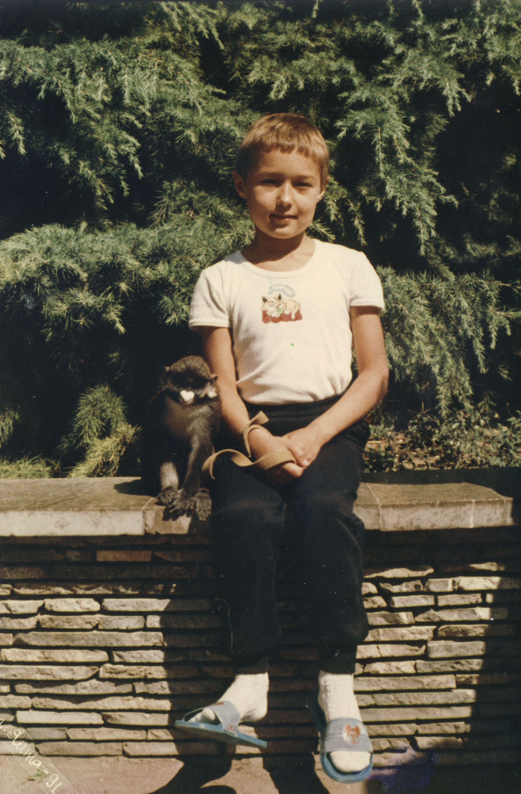

Январь 1991, мне **7 лет**, я живу в Саракташе и учусь в **1 классе**.

 

Школа мне не особо нравится, нужно читать, писать прописи и вставать рано утром. Летом бабушка с дедушкой переехали в новую квартиру в геологах, там мне очень нравится. Мы живем на первом этаже трехэтажного дома, он очень большой и весь из белого кирпича, даже подоконники из бетона и на них можно сидеть. Вторая половина дома еще достраивается, пахнет цементом, много стройматериалов, много людей, мне очень нравится. Мой друг Димка переехал со мноой и теперь живет напротив.

Школа по соседству с домом. Я сижу на первой парте слева с Ленкой Олейничук. Напротив наша первая учительница – Рима Акимовна, грузная пожилая женщина. Она коммунистка и гордится этим. В классе я дружу с Барсуком и другими ребятами. Мой лучший друг из садика Женька не попал в мой класс, но мы периодически видимся.

Я с детства часто болел и иногда задыхался. Поэтому в конце лета мы впервые поехали с мамой в  Крым, в Ялту. Там было столько всего нового, столько интересного. Мы жили в Санатории Кирова, наверху, каждый день ходили на процедуры (фиточай) и на море. Море, оно такое прикольное, скорее зеленое, чем темно-синее и на нем белые волны. Оно обтачивает битое стекло до полупрозрачных овальных камушков. Но я почти не умею плавать. 

В Ялте еще были настоящие дворцы и замки. И горы. А еще там росли кедры, которые пахли елкой, дубы, каштаны, пальмы и туя. Из желудей и веток можно было делать человечков, с кедров собирать круглые шишки, а пальма похожа на перебинтованные щепки – на ней нет кокосов, зато растут ягоды. Вечером в подпольном кинозале показывают иностранные фильмы и мультики. Там я впервые посмотрел Бетмена - очень крутое кино. Ночью очень тепло, можно открыть балкон, смотреть на огни на море и слушать музыку, играющую вдалеке.

В сентябре мне исполнилось **8 лет** и я перешел в **2 класс**. В этом году начали показывать диснеевские мультики, "Утиные истории" и "Чип и дейл", это что-то невероятное. Они красивы, понятны и интересны.

`video: https://youtu.be/gMKeQM5Xp90`

До 91 года по телевизору показывал только 1 канал, да и тот несколько раз в день прерывался на "технический перерыв". Фильмов и мультиков почти не показывали, а те что показывали, вероятно, рисовали психически больные люди. Иногда несколько часов подряд могли показывать человека, бубнящего по бумажке. Это был полный мрак. С конца 91 года стали показывать сериал "Богатые тоже плачут".

`video: https://youtu.be/y1aEZDLgdq4`

В конце 1991 единственный раз показали "Приключения Боско" – про похищенную принцессу эльфов Абрикотин, которая должна до полного солнечного затмения вернуться в свою родную страну Фонтанию, захваченную силами чудовища-Скорпиона.

`video: https://youtu.be/DZGWsLTShIk`

А еще в 91 году развалился Советский Союз, но я по малолетству этого не заметил.

`video: https://youtu.be/St0oI5bRcfY`
