В начале года мне **8 лет**, я учусь во **2 классе** и в целом чувствую себя хорошо. А вот для взрослых наступили самые тяжелые времена. 

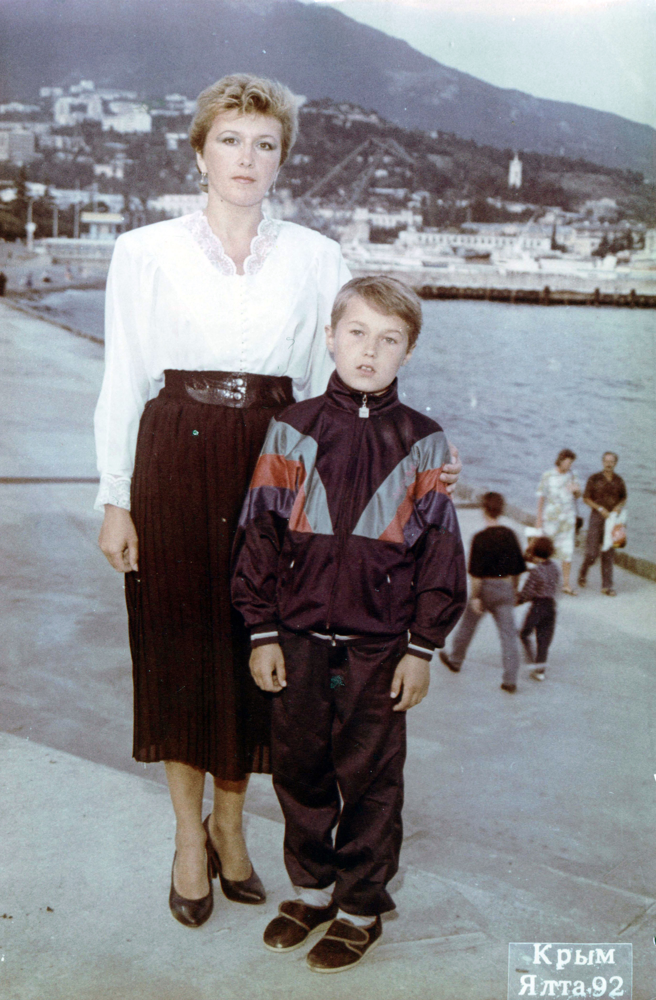

В советское время только государство определяло, что нужно производить, а что нет. Цены на товары устанавливались произвольно и не менялись годами. Такого понятия как прибыль просто не существовало. Большинство предприятий были убыточными и выпускали никому не нужную продукцию. А нужную выпускали мало. Это приводило к дефициту.

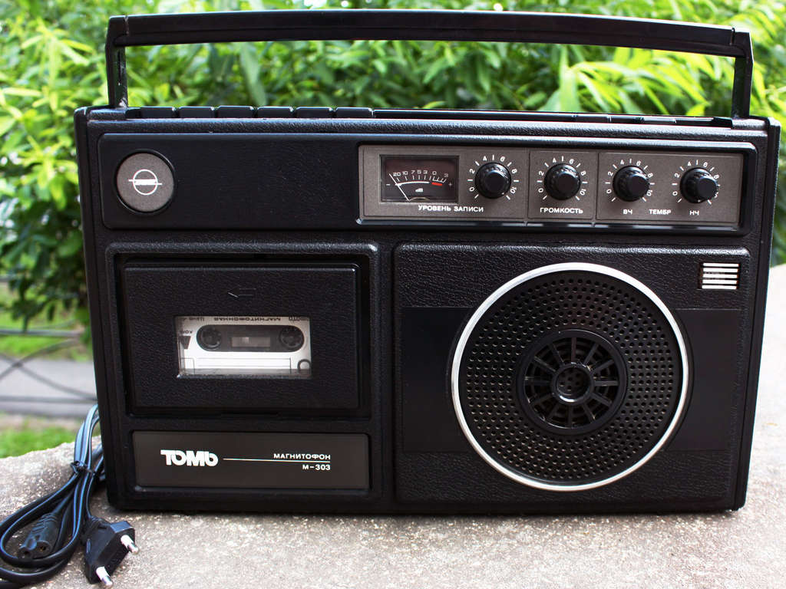

Бытовая техника отставала от общемировой лет на 10 и как правило являлась ее низкокачественной копией. У дедушки был брутальный магнитофон, жующий кассеты, а у нас &ndash; примерно такой телевизор. Некоторые счастливчики могли что-то привезти из-за границы, но таких было единицы.

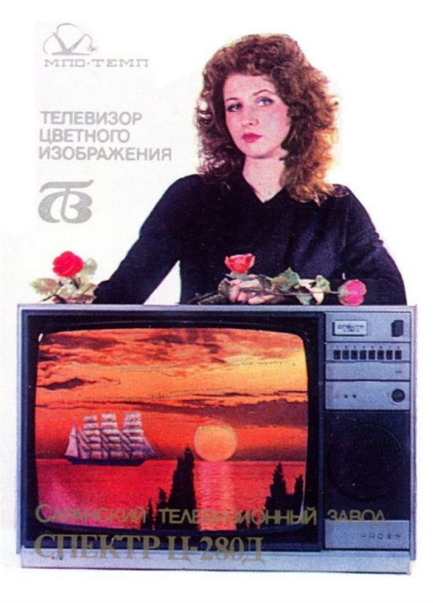

Производить что-то самому или перепродавать было запрещено, за это сажали в тюрьму. Работники государственных предприятий работали для отчета и воровали повсеместно. Собранные овощи сгнивали в хранилищах, в столовых вместо мяса в блюда клали хлеб, жир и жилы, жидкие продукты разбавляли водой. 

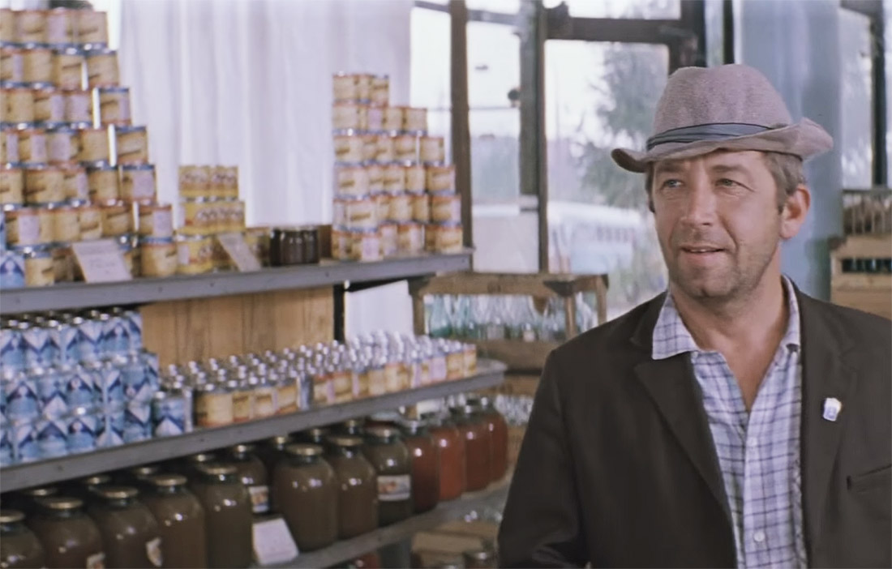

Никакой конкуренции не было, на клиента было всем наплевать. Все равно купят, других вариантов-то нет. И не просто купят, а будут еще стоять часами в очереди, чтобы купить. Потому что даже эти убогие товары редко когда появлялись.

Трудно поверить, но любой обычной супермаркет по качеству и разнообразию продуктов уделывает самые лучшие советские магазины, многие из которых были доступны только партийной элите. Любых товаров, даже кильки или сока, было максимум 1-2 варианта. А что-то получше, типа колбасы, могло вообще не быть месяцами. 

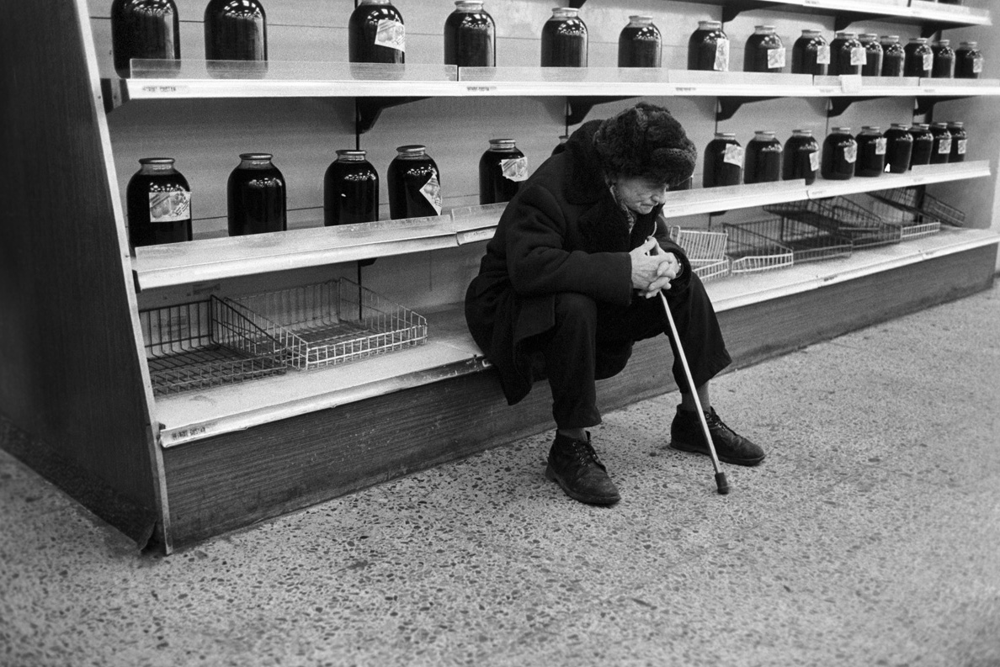

С фруктами была совсем беда &ndash; их не умели хранить. Мандарины появлялись строго на новый год, огурцы &ndash; в марте или летом, а бананы многие видели только в кино. В результате с каждым годом купить какие-то необходимые вещи становилось все сложнее. Появились проблемы даже с едой. Очевидно, что такая система долго существовать не могла.  

Чтобы избежать голода правительство отказалось от регулирования цен и разрешило свободную торговлю. Магазины быстро наполнились товарами, привезенными из-за границы, но цены на них взлетели до космического уровня. 

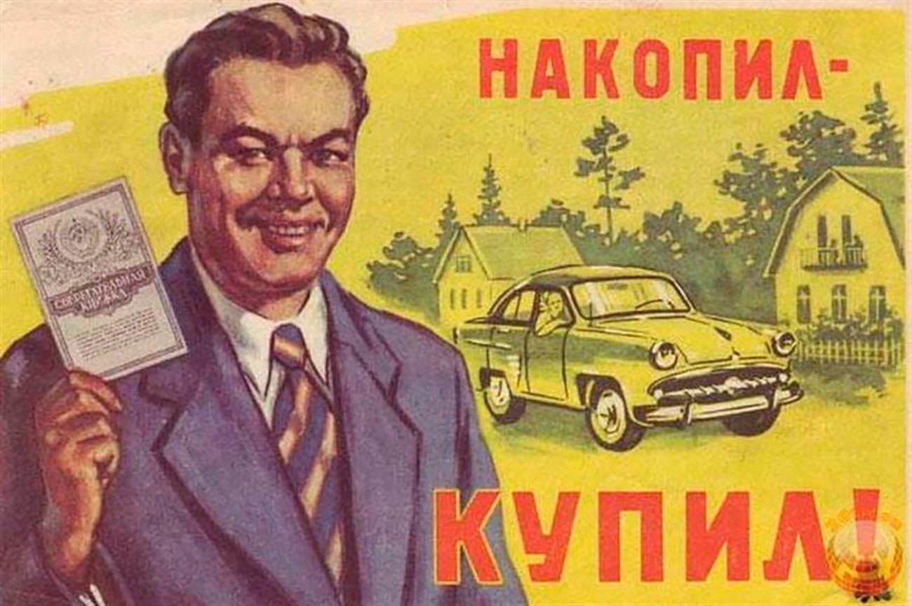

В условиях, когда на деньги мало что можно было купить, люди предпочитали хранить их на сберегательном счете. Например, чтобы купить машину, нужно было ждать своей очереди несколько лет, за это время было вполне реально на нее накопить. Проблема была только в том, что эти деньги не были обеспечены товарами. Как только отменили регуляцию цен, они тут же превратились в фантики.

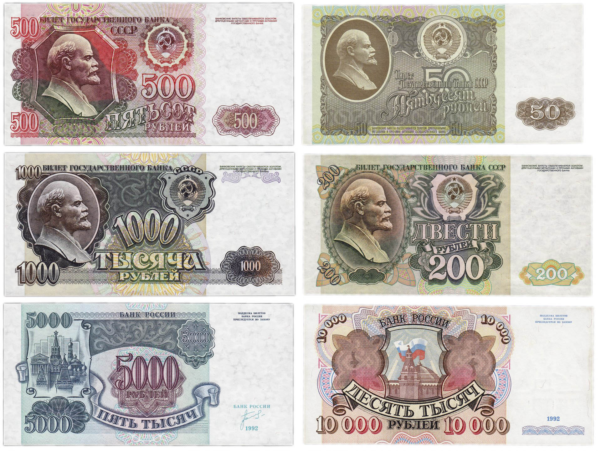

Люди в один момент стали нищими. Инфляция была такая, что на зарплату, выданную в начале месяца, в конце можно было мало что-то купить. Весь мир, в котором советский человек вырос и умел жить, стал совсем другим. От безысходности многие стали спиваться, резко вырос уровень суицидов.

`video:https://youtu.be/dQi7pg9_vPE`

Но меня в то время материальные и житейские проблемы меня особо не волновали, голодать не приходилось, а остальное я воспринимал как должное. Папа работал в столярном цеху, продукция которого была очень востребована, а основу еды &ndash; картошку, мы выращивали на даче. Прямо в доме был большой бетонный погреб, где она хранилась, а рядом в ящиках с песком была зарыта морковка. 

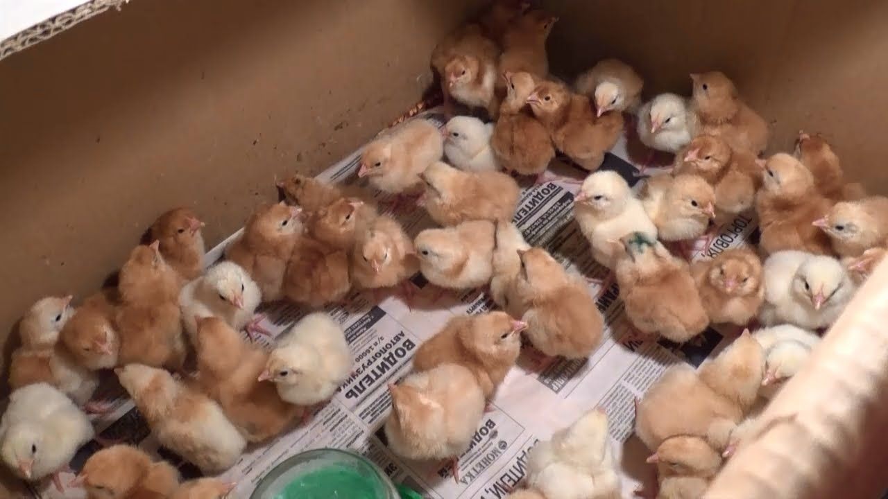

Весной мы покупали цыплят, которые пищали в коробке на кухне, согреваемые большой лампочкой, а летом они жили в сарае. В крайнем случае курицу можно было продать на базаре.

## Лето

Я общался в школе, в основном с Барсуком, после школы мы обычно топали до его дома, а потом я шел обратно домой.

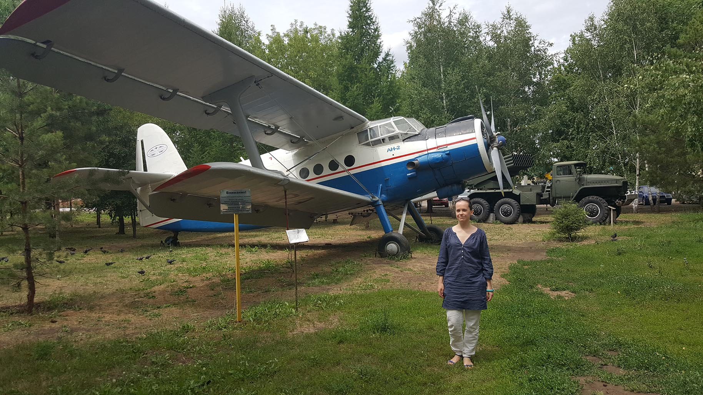

Летом в школу привезли самолет Ан-2, который почти сразу раздербанили, а нам с Барсуком купили одинаковые велики «Кросс». Однажды, учась ездить, я врезался в столб, содрал лицо и пару лет ходил с темной полосой на носу.

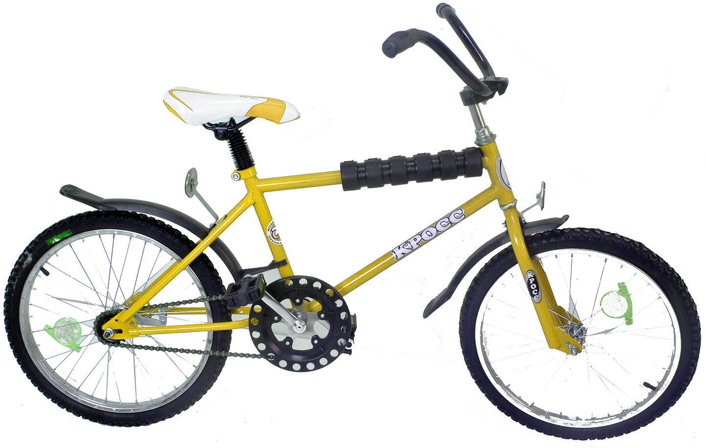

После поездки в Крым в прошлом году у меня почти 9 месяцев не было приступов астмы. Поэтому в конце лета мы снова едем в Ялту. Мы жили на съемной квартире в горах с двумя тетками, это хуже чем в санатории и достаточно далеко от моря. В этот раз мы ездили на экскурсию в Воронцовский дворец и на Массандровский винзавод, где я впервые нахлебался спиртного.

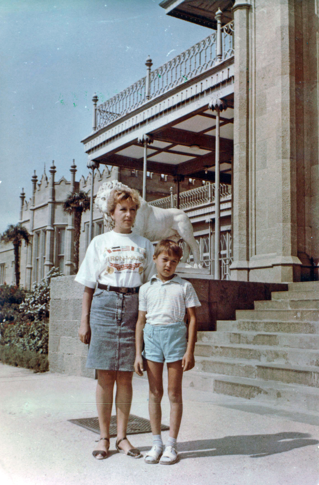

По телевизору стали показывать еще больше прекрасных диснеевских мультиков:

**Чип и Деил** (31.08 — 10.11.1992) 

`video: https://youtu.be/pgIwVivBs6k`

**Мишки Гамми** (1992-1993), даже рисовал картины по нему

`video: https://youtu.be/8Jeh2MUjyyI`

**Чудеса на виражах** (1 января — 21 июня 1992 года), Сашин любимый мультик

`video: https://youtu.be/v0Sme2ve1ug`

**Команда Гуффи** (с сентября 1992)

`video: https://youtu.be/a2oslwdDI5g`

**Денвер, последний динозавр**

`video: https://youtu.be/EkFCfHs8RCU`

Также с лета начался показ «Санта-Барбары», которая будет идти следующие 10 лет. Вообще, 90е — время расцвета мыльных телеопер. Каждый вечер вся страна садится у телевизора, чтобы посмотреть на любовь и страдания девушек из далекой Южной Америки.

`video: https://youtu.be/-CfJdvm1wsw`

В сентябре мне исполнилось **9 лет** и я перешел в **3 класс**. Барсук переехал жить в центр поселка и перешел в другую школу. 

---

Русская музыка 1992

`video: https://youtu.be/JdxM5t7t9yY`

`video:https://youtu.be/x6R1OeoJeV0`

