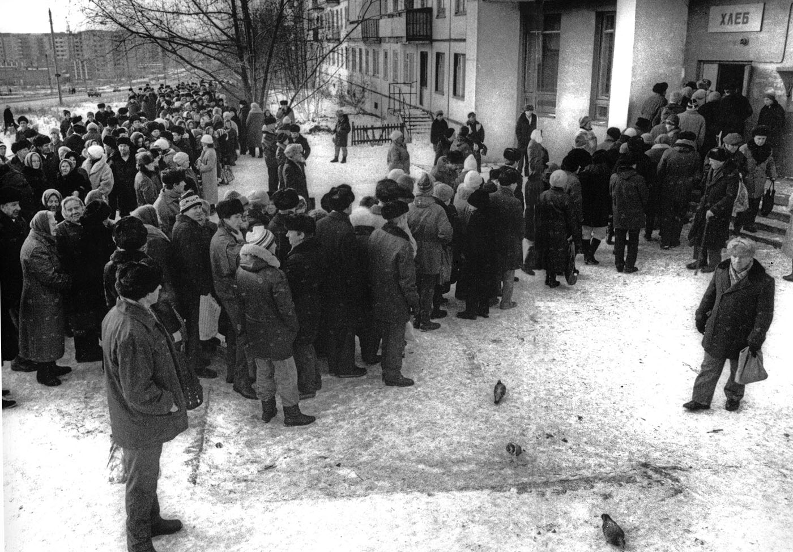

В начале года мне **8 лет**, я учусь во **2 классе** и в целом чувствую себя хорошо. А вот для взрослых наступили самые тяжелые времена. 

## Предыстория

Правила, по которым жили люди в СССР, сильно отличались от других стран. В советское время только государство определяло, что нужно производить. Такого понятия как прибыль просто не существовало. 

Цены на товары устанавливались произвольно и не менялись годами. Большинство предприятий были убыточными и выпускали никому не нужную продукцию. А нужную выпускали мало. Это приводило к дефициту.

Бытовая техника отставала от общемировой лет на 10 и как правило являлась ее низкокачественной копией. Некоторые счастливчики могли что-то привезти из-за границы, но таких было единицы. У дедушки был брутальный советский магнитофон, жующий кассеты, а у нас &ndash; примерно такой телевизор.

Производить что-то самому или перепродавать было запрещено, за это сажали в тюрьму. Работники государственных предприятий работали для отчета и воровали повсеместно. Собранные овощи сгнивали в хранилищах, в столовых вместо мяса в блюда клали хлеб, жир и жилы, жидкие продукты разбавляли водой. 

Никакой конкуренции не было, на клиента было всем наплевать. Все равно купят, других вариантов-то нет. И не просто купят, а будут еще стоять часами в очереди, чтобы купить. Потому что даже эти убогие товары редко когда появлялись.

Трудно поверить, но любой современный супермаркет по качеству и разнообразию продуктов уделывает лучшие советские магазины. В них любых товаров было не более двух вариантов. В основном ассортимент составляли малосъедобные консервы, макароны и подгнившие овощи, а что-то получше, типа колбасы, могло не появлятся в продаже месяцами. 

С фруктами была совсем беда &ndash; их не умели хранить. Мандарины появлялись строго на новый год, огурцы &ndash; в марте или летом, а бананы многие видели только в кино. В результате с каждым годом купить какие-то необходимые вещи становилось все сложнее. Появились проблемы даже с едой. Очевидно, что такая система долго существовать не могла.  

## Обесценивание денег

Чтобы избежать голода правительство отказалось от регулирования цен и разрешило свободную торговлю. Эти реформы назывались "Шоковая терапия". Магазины быстро наполнились товарами привезенными из-за границы, но цены на них взлетели до космического уровня. 

В советское время, когда на деньги мало что можно было купить, люди предпочитали хранить их на сберегательном счете. Например, для покупки машины нужно было стоять очереди несколько лет, за это время было вполне реально на нее накопить. Проблема была только в том, что эти деньги не были обеспечены товарами. Как только отменили регуляцию цен, они тут же превратились в фантики.

Люди в один момент все стали нищими. Инфляция была такая, что на зарплату, выданную в начале месяца, в конце почти ничего уже нельзя было купить. Мир, в котором люди привыкли жить, изменился. От безысходности многие стали спиваться, резко вырос уровень суицидов. Клип ниже хорошо передает эту жуткую атмосферу.

`video:https://youtu.be/dQi7pg9_vPE`

Но меня в то время материальные и житейские проблемы мало волновали, голодать не приходилось, а остальное я воспринимал как должное. Папа работал в столярном цеху, продукция которого была очень востребована, а основу еды &ndash; картошку, мы выращивали на даче. Прямо в доме был большой бетонный погреб, где она хранилась, а рядом в ящиках с песком была зарыта морковка. В этом году мы поставили вокруг огорода забор и засыпали его плодородной землей. 

Каждую весну мы будем покупать цыплят. Сначала они пищат в коробке на кухне, согреваемые большой лампочкой, а потом живут в сарае. Когда совсем не хватает денег, курицу можно зарубить и продать на базаре.

## Лето

В основном я общаюсь с Барсуком, после уроков мы топаем до его дома по весенним лужам, а осенью собираем сладкий лох возле леса. Возле входа в школу установлены металлические карусели и если сильно раскрутиться, можно из нее вылетить на землю.

Летом родители купили нам одинаковые велики «Кросс» и география нашего мира сразу расширилась. Однажды, учась ездить, я врезался в столб, содрал лицо и пару лет ходил с темной полосой на носу.

В школу привезли Ан-2, настоящий самолет, который мог бы стать крутым экспонатом. Однако почти сразу ему оторвали крышу, а в последующие годы местные жители растащили самолет на запчасти.

Как раз в это время по телевизору показывали **Чудеса на виражах**, любимый мультик моей жены про веселых зверей-пилотов.

`video: https://youtu.be/aEqSy09NKbU`

После поездки в Крым в прошлом году у меня почти год не было приступов астмы. Поэтому в конце лета мы снова едем в Ялту, но уже самостоятельно.

Пришлось жить на съемной квартире в горах с двумя тетками, достаточно далеко от моря. Это была огромная многоэтажка, квартиры в которой выходили на общий балкон. В моем сознании они представлялись бесконечными вертикальными фавеллами. Там было очень неуютно.

`video:https://youtu.be/lan-Pjv99Xk`

В этот раз мы поднимались на Ай-Петри, ездили на экскурсию в Воронцовский дворец и Ласточкино гнездо, а также на Массандровский винзавод, где я впервые нахлебался спиртного.

## Осень

Мне исполнилось **9 лет** и я перешел в **3 класс**. Барсук переехал жить в центр поселка и перешел в другую школу. 

`video: https://youtu.be/a2oslwdDI5g`

По телевизору стали показывать еще больше прекрасных мультиков. На первом канале идет **Команда Гуффи**, а на втором &ndash; **Денвер, последний динозавр**, с двойной русско-французской озвучкой.

`video: https://youtu.be/LSWRq7b-k_Y`

Начался показ сериала **Санта-Барбара**, который будет идти следующие 10 лет. Вообще, 90е — время расцвета мыльных телеопер. Каждый вечер вся страна садится у телевизора, чтобы посмотреть на любовь и страдания девушек из далекой Южной Америки.

`video: https://youtu.be/-CfJdvm1wsw`

Экономические реформы продолжаются. Осенью началась ваучерная приватизация. Всем раздали специальные бумажки &ndash; ваучеры, которые можно было продать или обменять на акции предприятий. По задумке это должно было создать многочисленный класс инвесторов-собственников, но в итоге привело к тому, что директора и бандиты получили эти предприятия в собственность.

Наш земляк с саракташского района, Виктор Черномырдин, умудрился захватить контроль над всей газовой промышленностью, а к концу года стал премьер-министром. Людям он запомнился своими шикарными изречениями. Весь итог приватизации можно описать его фразой:

Я уговаривал родителей поменять ваучер на акции Газпрома, но они вложили их в какую-то шарагу и все потеряли. Откуда я знал, что делать? Все просто. В прошлом году я прочитал книгу **Незнайка на луне** &ndash; кладезь мудрости и путеводитель по новому миру.

Книга достаточно хорошо описывала наступившую реальность: акционерные общества, денежные аферы, власть олигархов и беспредел продажной полиции. Мало кто из взрослых считал ее достойной литературой, а жаль. 

Скоро по телевизору начнут крутить рекламу финансовых пирамид и инфантильные советские люди понесут мошенникам все свои деньги. Нас от этого бог уберег. 

`video: https://youtu.be/ZNewE-9-1xc`

Стране срочно требовались толковые экономисты и в следующем году маму пошлют на курсы обучения в Москву. Экономическая тематика так популярна, что даже в детских журналах начали печатать основы финансовой грамотности. Мне это все было очень интересно. 

## Музыка

Основным источником музыки для меня был телевизор. Музыкальных каналов не было, но по выходным шли передачи с выступлениями, такие как "Муз-обоз". Так как школа была возле бабушки, я фактически жил на два дома и мог записывать песни с телевизора на магнитофон. Качество получалось не очень, но мне было норм. 

У дедушки с бабушкой был набор аудиокассет, но в основном это была советская попса, которая мне казалось несколько унылой. 

`video: https://youtu.be/YMWExC8gU38`

В то время было популярно все западное, хотя иностранную музыку крутили редко. Чаще это были русские адаптации новых тенденций. Никогда, ни до, ни после, российские люди так не любили Америку и тот образ жизни, который она олицетворяла. Казалось, нужно еще немного потерпеть и скоро мы будем жить также хорошо как они.

`video: https://youtu.be/W7hAo28NCXc`

Для меня самой интересной тогда была группа Кар-мен. С тех пор мне стала нравится электронная танцевальная музыка с этническими мотивами, любовь к которой я пронесу через всю жизнь. 

`video:https://youtu.be/TuggA0OLSTI`

В следущем году меня ждут удивительные иностранные товары, смертельные опасности и знакомство с тайными знаниями.