В начале года мне **9 лет** и я учусь в **3 классе**.

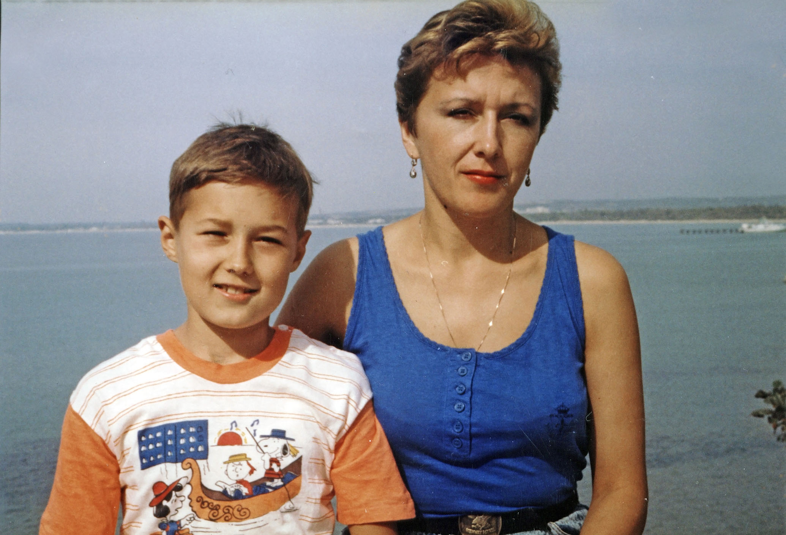

Весной мама уезжала на месяц на курсы в Москву, а я в это время жил у бабушки. Мама привезла с Москвы всяких иностранных вкусностей: конфет, жвачек, концентрированных соков. Соседские дети у меня их выцыганивали, мне было сложно им отказать. В моей жизни впервые появились шоколадные батончики и жвачки с вкладышами, тогда это было очень круто. 

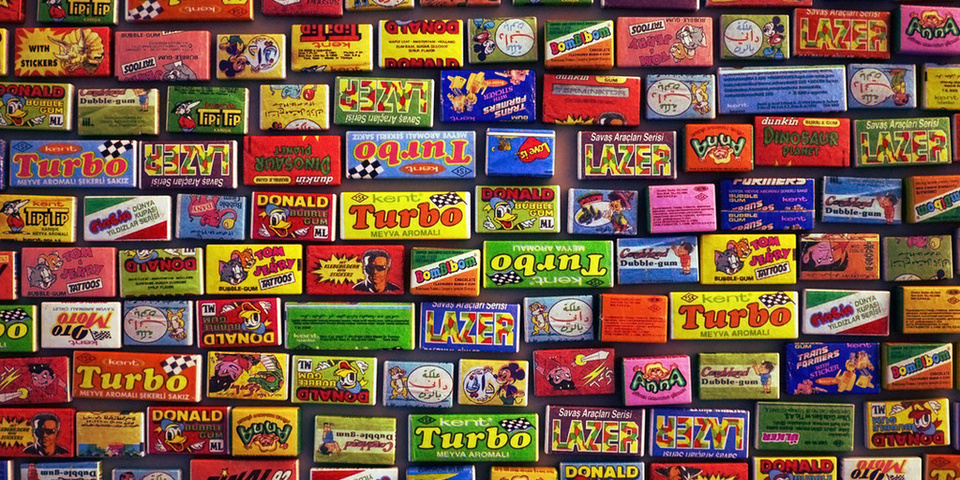

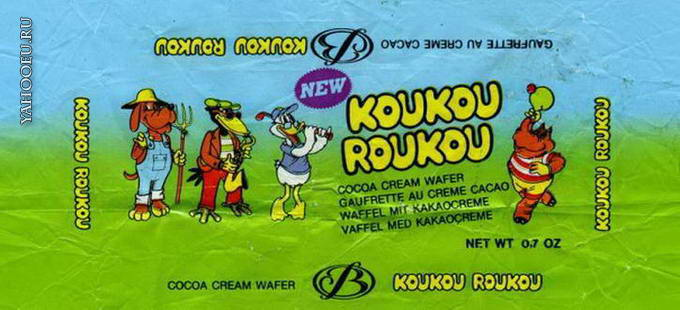

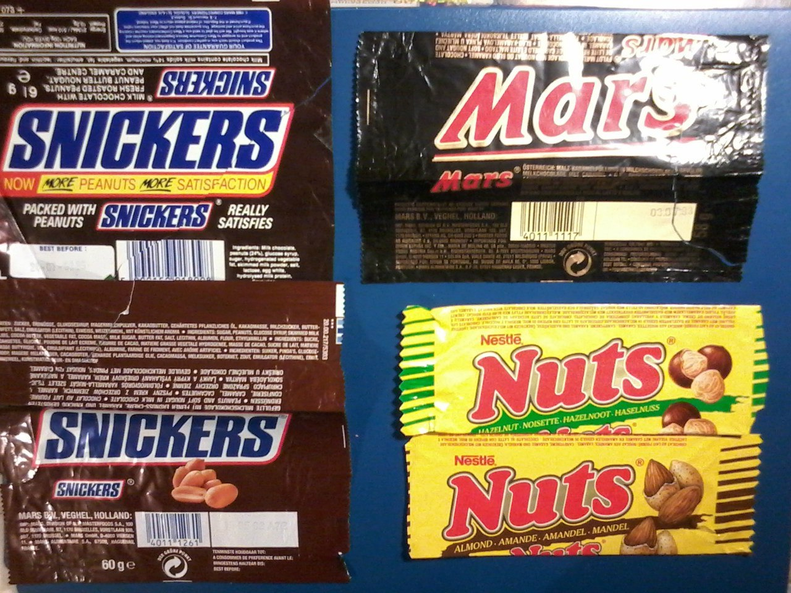

`video:https://youtu.be/t8ENQ5Dgqqw`

В то время было модно собирать пачки от сигарет, красивые банки от пива и прочую ерунду. Однажды в поезде я познакомился с девочкой, которая собирала этикетки от мороженого. Мне стало стремно, что я ничего не собираю, и я начал коллекционировать наклейки от фруктов.

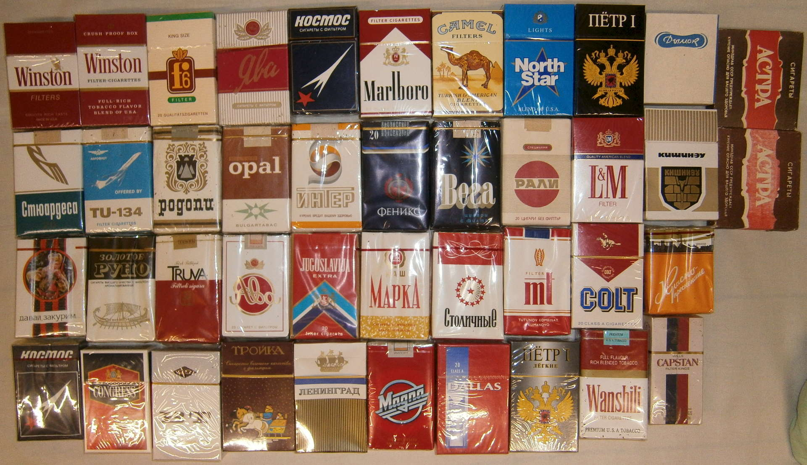

Теперь я живу в коттедже с большим огородом. Перед домом игровая площадка с фонтаном, рядом живет мой друг Женька. 

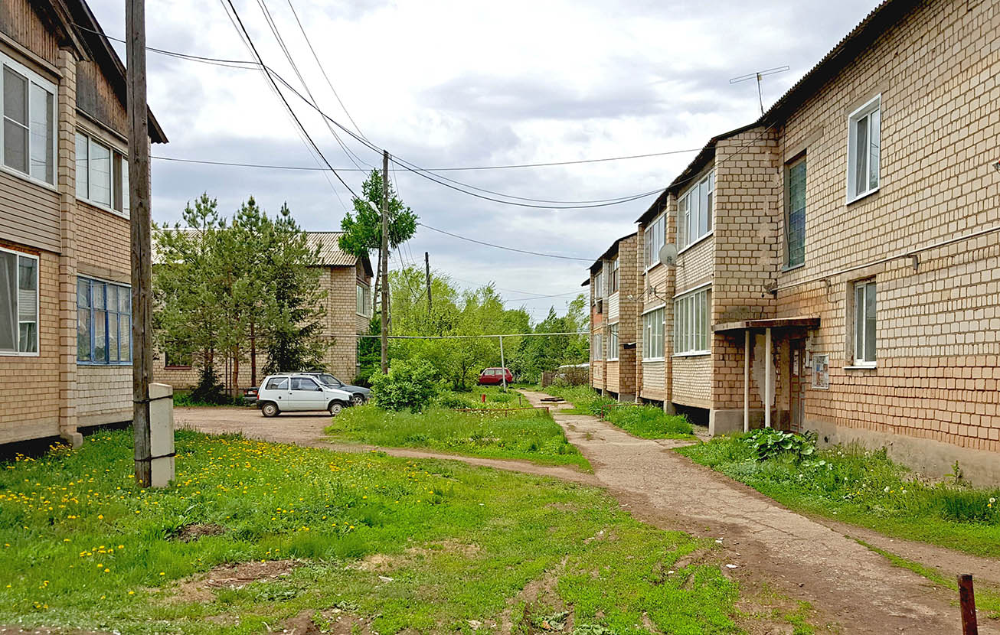

Он с садика учит меня плохому, например, материться. Мы – мелкие пакостники. Как-то мы подожгли в подвале строки толь, в другой раз – открутили вентиль у бака с кислотой и не смогли его закрыть. Однажды я капнул горящей краской на палец и у меня отвалился ноготь. А весной мы ходили с Зародышем кататься на плотах в котловане на стройке и оба чуть не утонули. 

## Лето

Летом я познакомился с Андреем и Анютой, которые приехали к бабушке на каникулы. Иногда они гуляют с нами, но в основном мы сидим на фонтане, потому что им не разрешают далеко уходить. Тогда я в основном общался с Андреем, а Анюта ходила рядом и смотрела на меня своими большими бирюзовыми глазами.

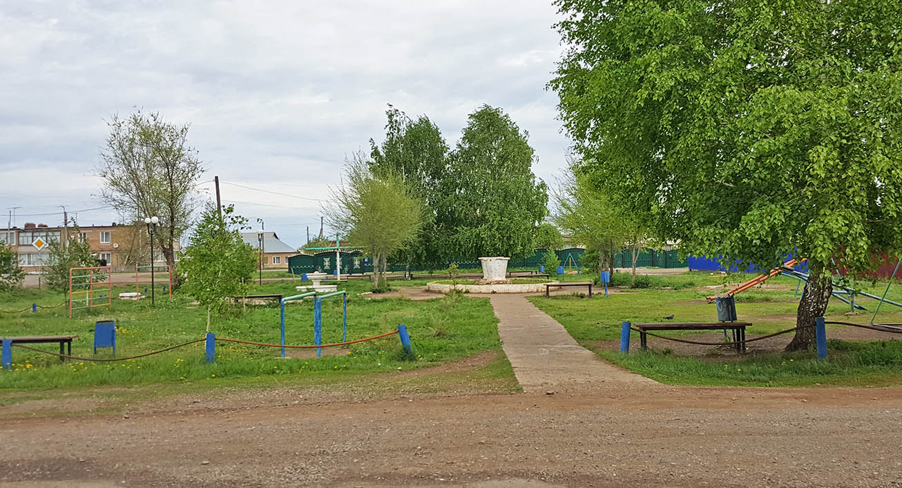

Кроме Жени вне школы у меня практически нет друзей, Барсука я вижу редко. Когда я жил у бабушек, мне  не удалось найти людей, близких мне по интересам. Чаще попытки подружиться заканчивались тем, что меня обманывали или дразнили, а однажды даже украли велосипед, это было грустно.

Мне с детства нравились абстрактные увлечения: вопросы устройства мира, схемы взаимоотношений предметов и явлений, космос, роботы, история, политика, экономика. Научившись читать, я читал много и с удовольствием, в основном фантастику. 

Моей любимой серией книг были фентези «Хроники Нарнии», я собирал их в течение многих лет. Там расказывалось про детей, попавших в волшебную страну говорящих зверей. Книга была написана профессиональным богословом и произвела на меня сильное впечатление. Кроме философского подтекста в ней был красивый романтическо-рыцарский антураж, подаривший мне много приятных фантазий.

`video: https://youtu.be/Gmj7dubG81M`

Еще мне выписывают журналы «Мурзилка» и «Веселые картинки», там печатают советские комиксы. Настоящих комиксов, типа DC или Marvel, у нас конечно нет, но сам формат мне очень нравится. Я беру альбомы, расчерчиваю их на части и рисую свои истории, в основном про космос.

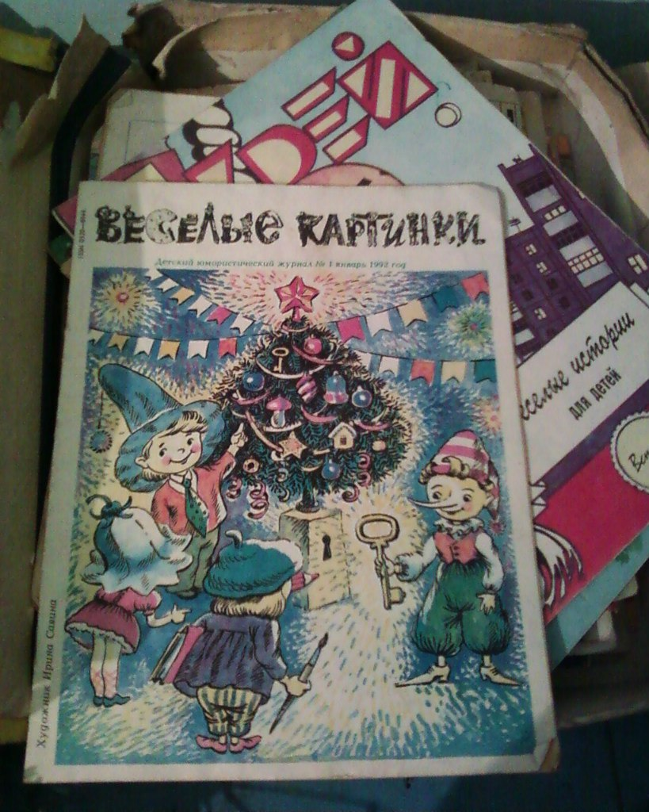

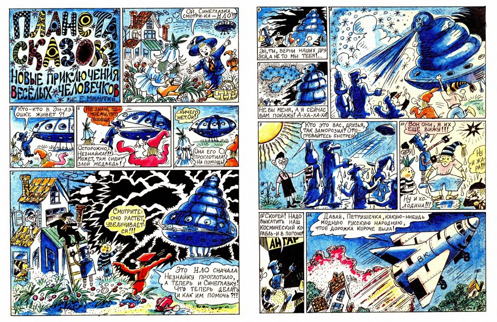

Все, что я читал или видел, я потом воспроизводил в своих играх. Мне нравились мелкие игрушки из твердой пластмассы, из них я организовывал сложные иерархические общества и строил им города. Когда у меня появилась своя комната, эти города могли стоять постоянно в закутке возле кровати.  

## Анапа

В этом году достать путевку в Крым не получилось и мы поехали в **Анапу**, которая оказалась смертельно опасным местом. Во влажном климате приступы астмы стали ежедневными и на третью ночь я чуть не задохнулся. В другой раз я неудачно прыгнул с катамарана и нахлебался воды. Но самая серьезная ситуация случилась, когда я попытался открутить термостат от одиноко стоявшей будки в парке атракционов. 

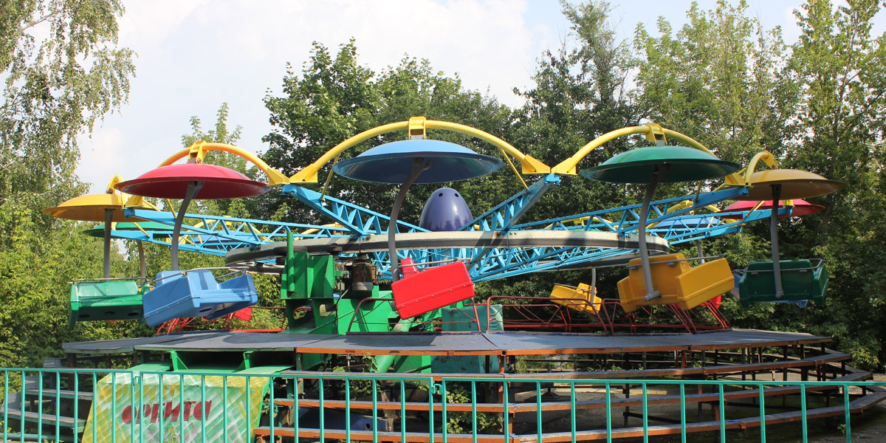

Взявшись за провода, я уперся ногой в стену и потянул. Изоляция лопнула и ток потек через мои руки, сводя мышцы судорогой. Не было никаких тонелей, сцен из жизни, ангелов или прочей фигни. Я думал только о том, что подвел маму и что она очень расстроиться, если я умру. Тело стало падать и расплавившиеся в руках провода порвались, позволив мне разжать пальцы. 

`video:https://youtu.be/HWjCStB6k4o`

Меня всего трясло, края ногтей вспенились и воняли жжеными перьями, а волосы торчали дыбом и не укладывались даже водой. Вернувшись в номер, я тщательно оттер руки пемзой и немного успокоился. В итоге об этом никто не узнал.

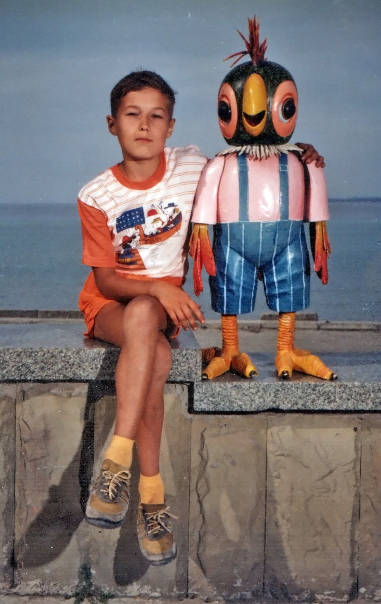

В Анапе был шикарный детский  пляж, но так как я лечился, мне почти не разрешали купаться. В соседнем номере жила Яна Михайлова, с которой мы раньше ходили в садик, а теперь вместе играли. И хотя мы больше никогда не встречались, в будущем она сыграет значимую роль в разработке мистических концепций у Женьки.

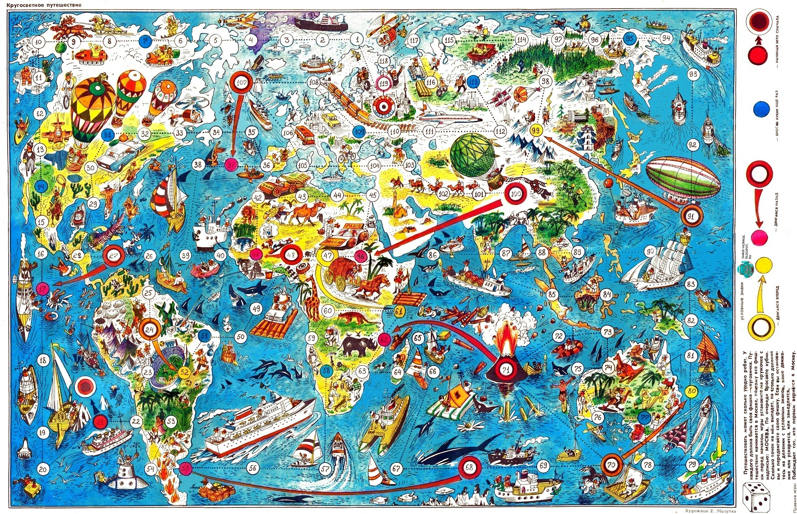

## Осень
 
Осенью мне исполнилось **10 лет** и я перешел из 3 в 5 класс, теперь у нас много разных учителей. Также меня записали в танцевальную школу, чтобы «укрепить организм», т.к. я часто болел и старался избегать нагрузок на уроках физкультуры. Мне танцевать не особо нравилось.

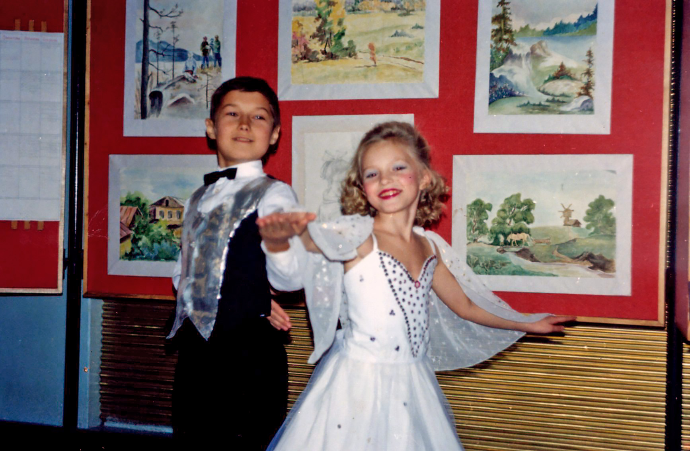

Отменили обязательную школьную форму. До этого мне приходилось ходить в брюках, рубашке и пиджаке с дурацкими алюминиевыми пуговицами. Теперь стало можно носить удобные джинсы, футболки и свитера. С одной стороны каждый мог одевать, что ему хочется. С другой стороны стало видно, у кого родители богаче, а у кого беднее.

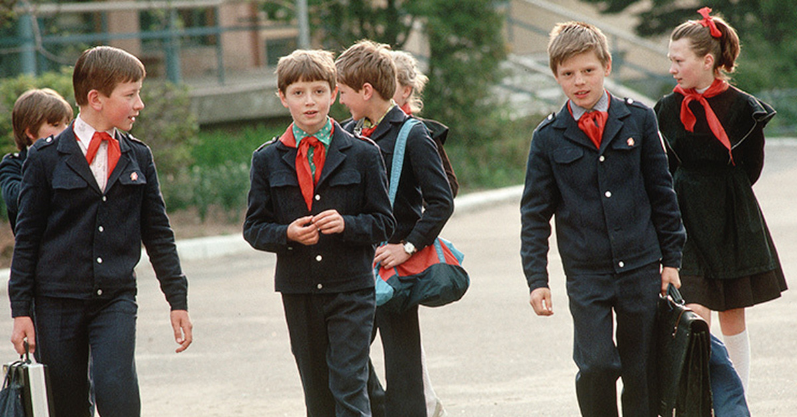

В октябре в Москве провалилась последняя попытка коммунистического переворота, возглавляемая членами парламента. В прямом эфире я смотрел, как вооруженная толпа штурмует Останкино, а потом как танки расстреливают парламент. Зрелище было впечатляющее. По итогу была принята новая конституция, а власть президента значительно усилилась.

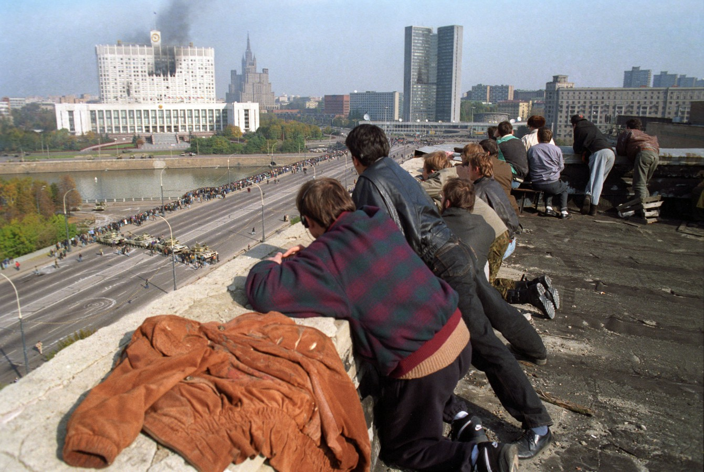

В этом году показывают диснеевские мультики **Мишки Гамми** и **Черный плащ**. По мишкам я даже рисовал наборы карточек с картинками.

`video: https://youtu.be/8Jeh2MUjyyI`

`video: https://youtu.be/RnuPcoaZjd4`

С ноября по телевизору начали показывать очень странный сериал Твин Пикс, а также Охотников за приведениями. Наверное с этого момента я начал интересоваться эзотерикой.

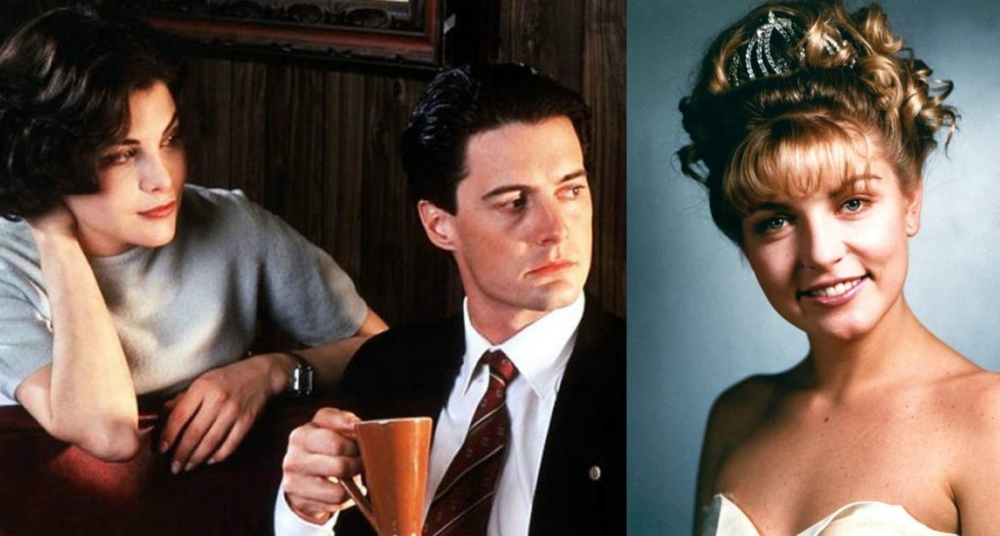

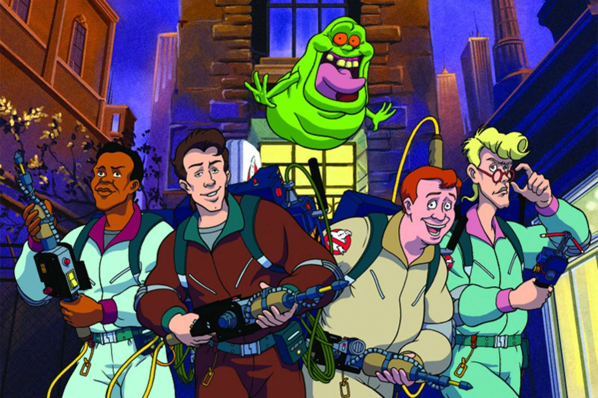

Когда рухнул атеистический CCCP, в страну хлынул поток «чудес»: сект, колдунов, экстрасенсов и т.п., люди сидели вечером перед перед телевизором и «заряжали» воду, ходили с биорамками, обращались к целителям. 

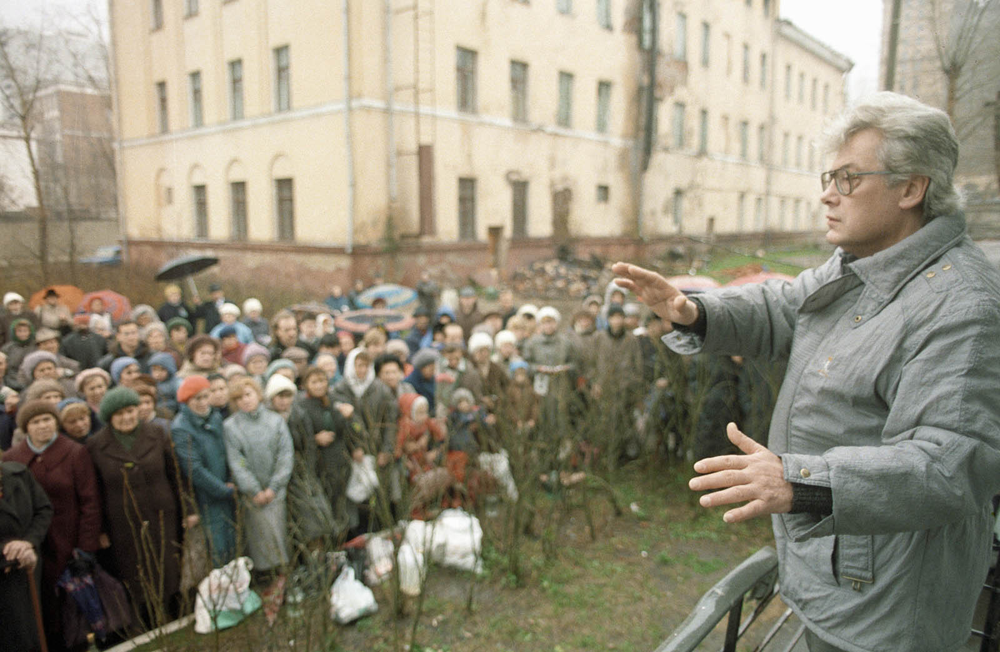

Я не мог пройти мимо такого. По дороге в Анапу мы заехали к родственникам в Краснодар, где я увидел удивительный мультик «Солдат Джо». Оттуда я взял стилистику для нашей будущей тайной организации «Кобра».

 

В следующем году в Саракташе появится свое телевидение, где каждый вечер будут крутить иностранные мультики и фильмы с гнусавыми голосами.