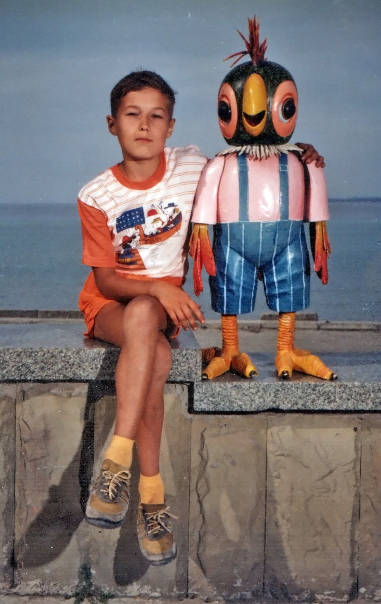
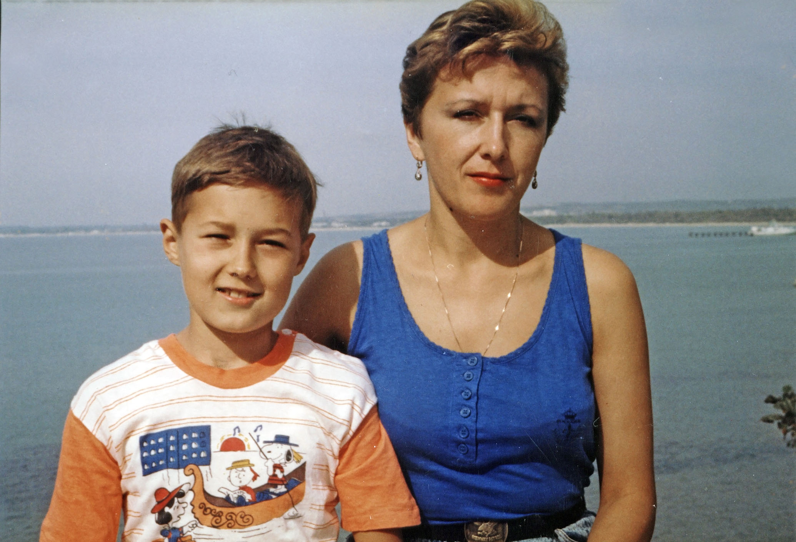
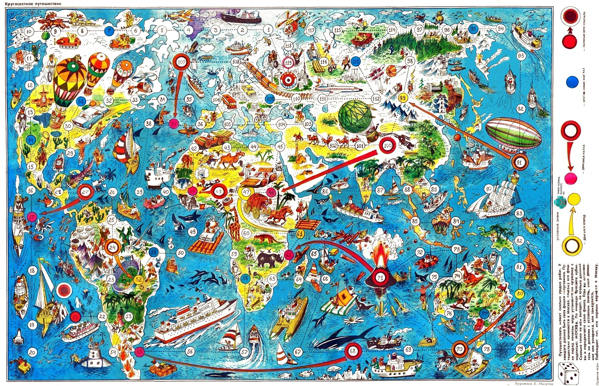
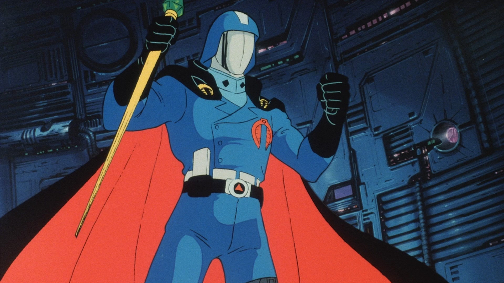
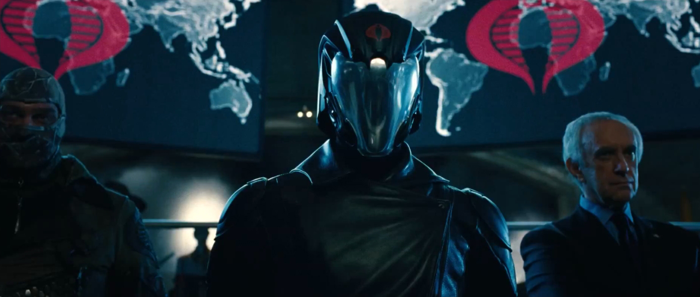

В начале года мне 9 лет и я учусь в 3 классе.

Весной мама уезжала на месяц на курсы в Москву и я месяц жил у бабушки. Мама привезла с Москвы всяких иностранных вкусностей: конфет, жвачек, концентрированных соков. Соседские дети у меня их выцыганивали, мне было сложно им отказать. Тогда только появились марсы/сникерсы и даже жвачки с вкладышами, это было очень круто. В то время было модно собирать пачки от сигарет, красивые банки от пива и прочую ерунду. Однажды в поезде я познакомился с девочкой, которая собирала этикетки от мороженого. Мне стало стремно, что я ничего не собираю, и я начал коллекционировать наклейки от фруктов.

Теперь я живу в новом коттедже с большим огородом. Перед домом игровая площадка с фонтаном, рядом живет мой друг Женька. Он с садика учит меня плохому, например, материться. Мы – мелкие пакостники. Как-то мы подожгли в подвале строки толь, в другой раз – открутили вентиль у бака с кислотой и не смогли его закрыть. А однажды я капнул горящей краской на палец и у меня отвалился ноготь. А весной мы ходили с Зародышем кататься на плотах в котловане на стройке и оба чуть не утонули. 
 
Летом я познакомился с Андреем и Анютой, они приехали к бабушке на каникулы. Иногда они гуляют с нами, но в основном мы сидим на фонтане. Кроме Жени вне школы у меня практически нет друзей, Барсука я вижу редко. Когда я жил у бабушек, мне  не удалось найти людей, близких мне по интересам. Чаще попытки подружиться заканчивались тем, что меня обманывали или дразнили, это было грустно.
 
Мне с детства нравились абстрактные увлечения: вопросы устройства мира, схемы взаимоотношений предметов и явлений, космос, роботы, история, политика, экономика. Научившись читать, я читал много и с удовольствием, в основном фантастику. Моей любимой серией книг были «Хроники Нарнии», я собирал их в течение многих лет. 

`video: https://youtu.be/Gmj7dubG81M`

Все, что я читал или видел, я потом воспроизводил в своих играх. Мне нравились простые мелкие игрушки из твердой пластмассы, из них я организовывал сложные иерархические общества и строил им города. Когда у меня появилась своя комната, эти города могли стоять постоянно в закутке возле кровати.  
 
В этом году достать путевку в Крым не получилось, мы поехали в Анапу, которая оказалась смертельно опасным местом. Во влажном климате приступы стали ежедневными и на третью ночь я чуть не задохнулся. В другой раз я неудачно прыгнул с катамарана и нахлебался воды. Но самая серьезная ситуация случилась, когда я попытался открутить термостат от одиноко стоявшей будки в парке – только расплавившиеся в руках провода позволили мне разжать пальцы. Быть мальчиком опасно.

 
В Анапе был шикарный детский  пляж, но так как я лечился, мне особо разрешали купаться. По соседству с нами жила Яна Михайлова, с которой мы вместе играли. И хотя мы больше никогда не встречались, в будущем она сыграет значимую роль в разработке мистических концепций у Женьки.

 
По дороге в Анапу мы еще заехали к родственникам в Краснодар, где я впервые увидел удивительный мультик «Солдат Джо». Оттуда я взял стилистику для нашей будущей тайной организации "Кобра".

 
Пока мы были на отдыхе, в Москве произошел очередной путч.

 
Осенью мне исполнилось 10 лет и я из 3 перешел в 5 класс, теперь вместо одной у нас много учителей.  Также меня записали в танцевальную школу, чтобы «укрепить организм», т.к. я часто болел и старался избегать нагрузок на уроках физкультуры, но мне там не особо нравилось.

 
Примерно в это время по телевизору начали показывать сериал Твин Пикс 1 (ноябрь1993-1994), очень странное кино, наверное, с этого момента я начал интересоваться эзотерикой. Когда рухнул атеистический CCCP, в страну хлынул поток «чудес»: сект, колдунов, экстрасенсов и т.п., люди перед телевизором «заряжали», ходили с биорамками, обращались к целителям. Я не мог пройти мимо такого.
 
Мультики:
Девер (1992-1993) – французский мультик про динозавра.

 
Черный плащ (1993 янв - 1994 сент)

 
Новые приключения Винни-Пуха (1 января - 26 декабря 1993) 
Настоящие охотники за приведениями (янв 1993 - дек 1994)

