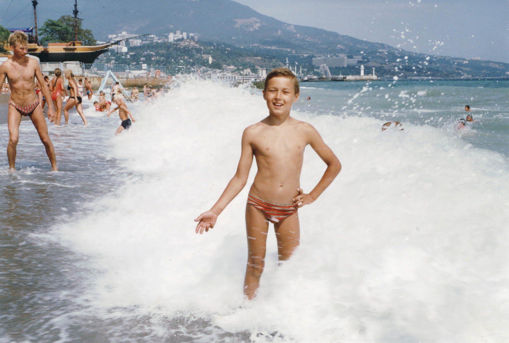

На начало 1994 года мне **10 лет** и я учусь в **5 классе** (в 1 смену). Еще я хожу в танцевальную школу.

Мама из геологии перешла работать в фонд ОМС, последние 2 года в Саракташской геологии почти ничего не платили. На новой работе есть компьютер и матричный принтер, там стоит MS-DOS и можно что-нибудь напечатать, а еще есть игра с вертолетом. Еще компьютер есть у Женьки, «Вектор 06с», он загружается с кассет, там игры про пакмена и лабиринты.

В школе нам преподают историю древнего мира, она мне очень нравится, особенно раздел про Рим и Вавилон. Через 20 лет я построю врата Иштар у себя дома.

`video:https://youtu.be/41c9Tw3HV-U`

Все что мне нравится, я творчески перерабатываю и включаю в свои игры. Мои игрушки уже давно организованы в государство, во главе которого стоит королева Коза (раньше был Кот, но я его потерял после первой поездке в Ялту). 

За кроватью построен дворец, казармы, космопорт, научные лаборатории.

Я не люблю сложные технические изделия, типа радиоуправляемых машинок. Мне нравятся простые прочные пластиковые фигурки, особенно звероботов и человекозверей, и очень хорошо, когда их много. Иногда мои игрушки совершают экспедиции на другие «планеты» – к бабушкам или к Женьке, тогда мы играем вместе.

## Весна

Весной я ездил в Оренбург для лечения в солекамере, жил у тети и смотрел по ночам иностранные мультики. Приступы астмы всё еще сохраняются, но стали реже.

`video:https://youtu.be/1f-oASal95Y`

Этой весной я подружился с соседскими мальчишками, живущими вокруг фонтана. Почти все они младше меня и с интересом слушают мои рассказы. Мы играем в Фонтанную республику, у нас мечи из деревяшек и кастовое деление, как в древней Индии. С ними я чувствую себя очень комфортно, теперь у меня много друзей.

## Лето

Летом я познакомился с Шакиром – странным крупным парнем. Шакир увлекается «магией», пару раз он заколдовывал Женьку так, что тот плакал. 

Также Шакир научил нас делать роботов из алюминиевой проволоки. Я и сам делал простых человечков на заднем дворе, но у Шакира это сложные многокомпонентные создания, а Женька предпочитает делать фигурки из мелкой медной обмотки, добавляя туда запчастей из папиной электроники.

В конце лета мы снова ездили в Ялту. Достать путевку не удалось, поэтому мы жили на частной квартире в центре и сами готовили. 

Поднимались на Ай-петри, ходили на концерт Киркорова. Прочитал там Звездные войны и Проклятых, носил с собой на пляж черепашек-ниндзя и трансформеров, мама подарила мне скейт.

## Осень

**Осенью мне исполнилось 11 лет** и я перешел в 6 класс (во 2й класс ДШИ). Теперь, учеба идет во вторую смену.

Теперь в Саракташе есть свое телевидение, оно работает только вечером. Там показывают иностранные мультики (Том и Джери, Черепашки-нидзя, Химен), поздравления и кино.

`video: https://youtu.be/pttOoTaGrew`

Чтобы принимать его сигнал, к телевизору подключается специальная дециметровая приставка.

`video: https://www.youtube.com/watch?v=VFNRh26TPmM`

Еще у нас есть VHS-видеомагнитофон, но кассет с фильмами мало.

В них все герои разговаривают с характерным гнусавым акцентом.

`video: https://youtu.be/xKdT6fPmhVw`

Мое любимое кино «Космобольцы» &ndash; пародия на «Звездные войны».

Из интересных сериалов по телевизору идут:

Фантагеро (Пещера золотой розы)

Сослан на планету земля

Бегство с Юпитера

Из мультиков – Черный плащ, Охотники за приведениями и Пчела Майя

---

Русская музыка 1994

`video: https://youtu.be/DvOSRZszYzo`

