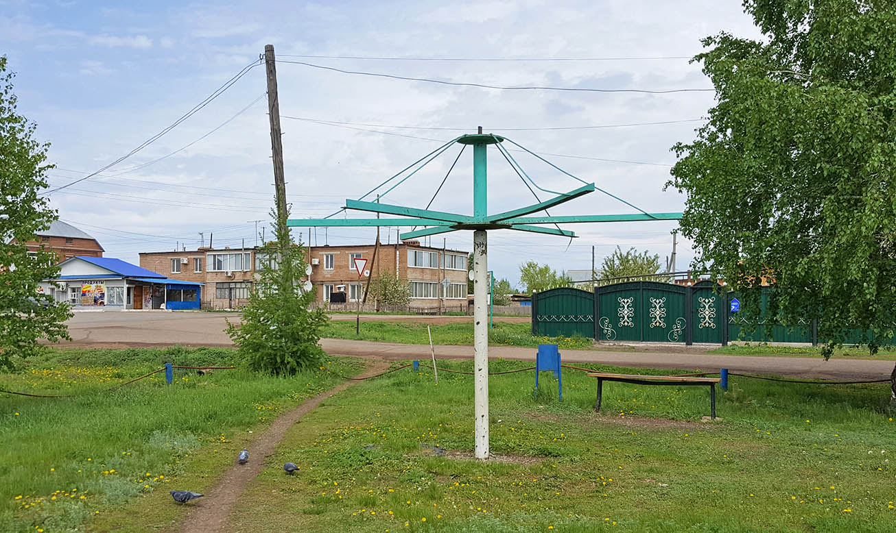
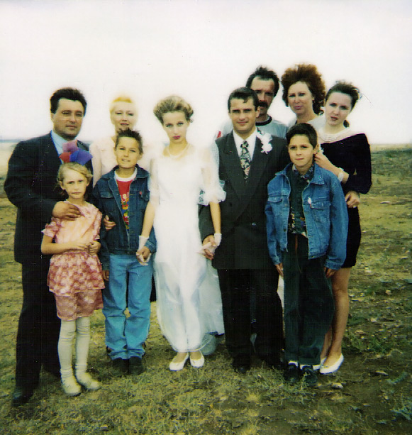
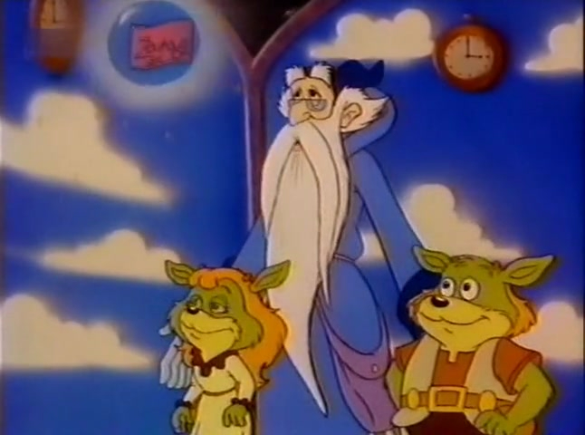

На начало 1995 года мне **11 лет**, я учусь в **6 классе** (во 2 смену) и хожу в танцевальную школу. Периодически мы выступаем с концертами. Мои игрушки живут упорядоченно за кроватью, иногда по утрам ко мне приходит Женька, мы строим баррикады и прыгаем по диванам.

Этой зимой по телевизору показывают сериал «Пещера золотой розы» (Фантагеро), а из диснеевских мультиков – проходные «Русалочка» и «Новые приключения Винни-Пуха».

Гораздо интересней идущие утром до школы мультики «Необыкновенная схватка» (Вандербит) и «Война гоботов» (Трансформеры). 

`video: https://youtu.be/OoTDgC6tlOU`

У меня есть целый альбом, где я рисую акварелью сюжеты из Вандербита, как люди сражаются с инопланетянами внутри человеческого организма.

`video:https://youtu.be/TB8gNVXW8f0`

## Весна

Весной мы купили машину (ваз2109) и перестроили веранду. 

Остатки от строительства были сложены на задний двор, туда же мы с Шакиром и Женькой перенесли наших роботов. Это место носило название Клондайк – укромная часть двора, заваленная кирпичами, деревяшками и разными железками, рай для мальчишек. 

Здесь мы построили для наших роботов города, подземные базы и ресторан-крематорий. Летом Женька и Шакир приходят со своими поделками играть ко мне. Сами роботы сделаны из алюминиевой проволки, они прочны и спокойно переносят зимовку на улице. А обычные игрушки &ndash; только для дома.

## Фонтан

 У нас большой круг друзей и приятелей, живущих вокруг Фонтана, и я у них заводила. Мы играем в Фонтанную империю: сражаемся на мечах, организуем походы в «соседние земли» и прогоняем чужаков с нашей территории. 

У нас оружие из заточенных палок, обувь из лоскутов шкур (из кожевного цеха поблизости), доспехи из аллюминиевой проволоки и деньги из сплющенных пивных крышек, с выгровированным на них фонтаном. 

Истоки такой игры я беру из Нарнии – моей любимой серии фэнтезийных книг и мультика "Приключение Боско", где было Фонтанное королевство. Мы фантазировали, что Фонтан - это наш главный замок. 

Летом мы открывали кран в колодце и включали его. Две белые струи били вверх на пару метров и наполняли бассейн. Он не глубокий, но в нем можно было лежать в теплой воде. Через 20 лет фонтан придет в запустение, краска отвалится и его засыпят зеплей.

## Любовь

В начале лета к бабушке приехали Андрей и Анюта. И хотя два года назад мы гуляли вместе, теперь Андрей почему-то нас боялся и не выходил из дома. А Анюта всегда была очень смелая, мы быстро подружились и вскоре это переросло в первую любовь.

Все свободное время мы проводили вместе: сидели на фонтане, гуляли в обнимку, катались на велосипеде, играли с ребятами в пятнашки, угощали друг друга вкусными м&м-сами, ходили к ее дедушке на насосную станцию, рисовали на бетоне, жгли камыши и были очень счастливы. Я делал для Анюты разные украшения из проволоки, пластмассы и стекла – колечки, сердечки, браслеты, а она их носила.

За все лето мы расставались только раз, когда я уезжал на свадьбу Оксаны в Гай. 

Наше счастье казалось бесконечным, а дружба вечной. В последний вечер Анюта хотела меня поцеловать, но я постеснялся. На следующий день мама увела Анюту за собой, и я ее больше не видел.

## Осень

Наступила осень, мне исполнилось **12 лет.** Огромная угнетающая пустота поселилась в моей душе, мне ничего не хотелось, я был полностью подавлен. Только тогда наступило понимание, насколько она была мне дорога. На этом фоне у меня сильно воспалился зуб, что привело к операции и лечению в больнице.

Только мысль, что на следующее лето Анюта вернется вновь, давала мне надежду. Но годы шли, а её все не было, и надежда постепенно угасала. Можно было спросить адрес у ее бабушки, но спустя несколько лет такая просьба казалась мне очень глупой.

`video: https://youtu.be/3JWTaaS7LdU`

Одержимость Анютой переросла в мою личную религию – культ Ньйя. Основная идея заключалась в том, что внешность и душа человека связаны, что внешне похожие люди должны быть похожи и внутренне, и раз я не могу быть вместе с Анютой, то мне нужно найти человека, в котором обитает её душа. Эта ошибочная концепция принесет мне много страданий в будущем и станет фундаментом моих отношений с Машей Зориной.

А пока я уныло ходил по замерзшему фонтану, смотрел «Камень сновидений» и вспоминал наше чудесное лето. 

Пройдет долгих 18 лет, прежде чем мы увидимся вновь. 

Еще через 3 года, в её 32-й ДР я опубликую этот пост.

---

Русская музыка 1995

`video: https://youtu.be/DlQAC0Vwsew`
