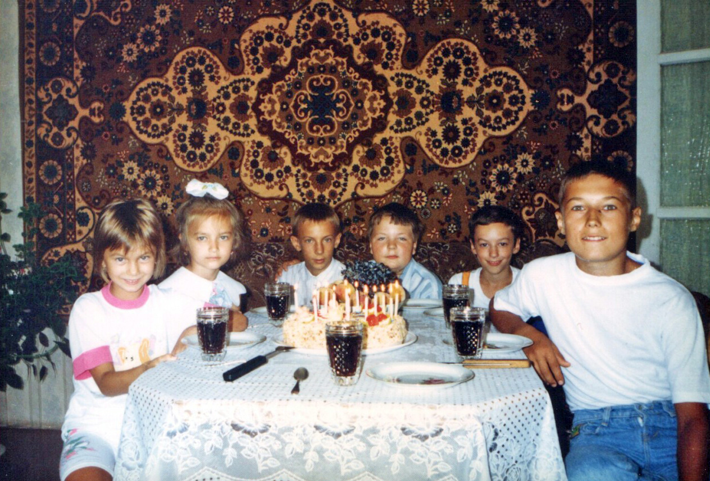

Январь 1996, мне **12 лет**. По утрам я хожу в музыкалку, а после обеда в школу (в 7 класс).

Зимой по телевизору показывают сериал «Агентство «Лунный свет» и прекрасный «Чародей». 

Из мультиков – «Драконы подземелий», «Червяк Джим», «Алладин», «Каспер». 

А на кассетах у меня есть загадочные «Секретные материалы».

Я строю крепости из снега у себя во дворе, рою траншеи в огромных сугробах и катаюсь на льдинах с крыши. Когда мне скучно, например, в гостях или в поезде, я рисую лабиринты между строками печатанного текста в старых журналах, добавляя туда «пушки» и «лазеры». А еще я начал вести дневник.

Сейчас в моде джинсовки, спортивные штаны, свитеры Boys с елочками, часы Монтана, кепки USA California, шагающая по ступенькам радуга.

Мои одноклассницы начинают интересоваться отношениями с мальчиками: обсуждают их, заполняют друг другу анкеты, гуляют по вечерам, слушают «Иванушек». 

Мне и другим пацанам все это кажется глупым, потому что на свете есть  более серьезные дела.

В 1995 года мы видели приземление НЛО возле стройки. Сложно сказать, что это было на самом деле, но на месте посадки был ровный вытопленный во льду круг, огромные следы и смерзшиеся кишки. Мы поняли, что ОНИ уже здесь, и с тех пор вели за этим местом регулярное наблюдение. На выходных мы ходили туда, набрав еды, играть снежки. Вечером же, выкопав себе в снегу укрытие, наблюдали за стройкой издалека.

Для противодействия инопланетной угрозе была создана секретная организация «Кобра», члены которой оставались после уроков и планировали операции. Мы воровали у девчонок анкеты и составляли досье, а с некоторыми из них я общался вечером по телефону и собирал информацию. Нужно было выявить инопланетян, замаскированных под людей или их пособников.

Чтобы вычислить агентов инопланетян, применялись экстрасенсорные методы диагностики – магические предметы и биорамки. Когда мы узнали, что у нашей одноклассницы Вики были старинные книги, к ней был послан секретный агент «Зародыш», который под видом признания в любви должен подарить ей специальное кольцо. Я контролировал этого Фродо. В ночи мы пробирались через кладбище, лес и железную дорогу к дому на самом краю поселка, было темно и очень страшно. А чтобы создать мистическую связь между агентом и кольцом, он всю дорогу нес его во рту.

Однако Зародыш – ненадежный агент. Они с сестрой оба психопатистые и часто дерутся. Зимой мы с ними регулярно ходили по вечерам на горку или на стройку,  а летом ездили в лагерь «труда и отдыха», откуда сбежали на третий день, потому что там все было ужасно. А еще Зародыш совершенно не думает, что говорит, поэтому его бьют все мои знакомые (и даже приходят из других школ). Иногда из-за него и у меня бывают неприятности. Так однажды мы с Барсуком приехали на речку, где были неприятели Зародыша, видевшие нас до этого вместе. Чтобы не быть побитыми, нам пришлось перейти с велосипедами через реку и пробираться по дикому лесу на другом берегу, но это было захватывающее приключение.

Из-за Зародыша наша деятельность не осталась незамеченной. Викины родители пожаловались директору, что мы ее преследуем. К концу года операции пришлось свернуть, архив сжечь, а организация ушла в глубокое подполье, но работу не прекратила.

Весной я начал общаться с Андреем Челищевым и Денисом Сметаниным. Иногда ко мне приезжал Барсук, тогда мы катались на великах и стреляли из воздушки. На чердаке своего дома Барсук оборудовал настоящую полосу препятствий, где мы лазали по балкам и раскачиваемся на тарзанках.

В 2006 году Фонтанная империя достигла зенита своей славы, теперь у нас металлическое оружие и доспехи (из алюминия). Для его создания мы повсюду собираем алюминиевую проволоку и выплавляем свинец из отработанных аккумуляторов. Также очень много алюминиевой проволоки потребляет роботостроительная промышленность Клондайка, на нее за неделю может уходить несколько метров толстого кабеля. Общее количество сделанных роботов переваливает за сотню. 

Этим летом мы с Шакиром и Джоном периодически ходили собирать проволоку, жечь напалм, взрывать карбид, порох и ампулы, но после неудачного раза (когда осколки остались в наших ногах и руках) на несколько лет почти прекратили общение с Шакиром. 

На Фонтане чистота и порядок, потому что мы с ребятами регулярно там убираемся, а в этом году даже посадили деревья. В день летнего солнцестояния мы устроили на грандиозный праздник: включили фонтан и купались в нем, сражались на мечах на велосипедах, играли в регби, а вечером жгли костер и пекли картошку. В созвучии с этим, по телевизору сейчас показывают мультик «Рыцарь — отважное сердце».

Иногда я катаюсь на скейте и пробую изучать кунг-фу, а вечером мы с ребятами читаем журналы, где публикуют письма подростков, желающих познакомиться. Этим летом Анюта так не приехала и потому в моей душе глубокая печаль.  

Осенью мне исполнилось **13 лет**, я перешел в **8 класс** (4кл в танцевальной).
Отношения дома неприятные, отец часто алкоголизируется и бывает агрессивный, от него приходится закрываться в комнате, где у меня подготовлен набор выживания на случай апокалипсиса.

В сентябре мы с мамой снова ездили в Ялту, где я на третий день сломал себе шею и весь отдых проходил в корсете. С тех пор у меня привычка тянуть голову вперед. Там я побывал на итальянском крейсере и даже ходил на разборки. Астматические приступы стали реже, но часто бывают гаймориты, осенью я опять лежал в больнице, где мы по ночам ходили в соседние палаты болтать с девчонками.

По телевизору показывают сериал «Багз – электронные жучки» и «Эхо-взвод лейтенанта Марша» – один из лучших мультфильмов моего детства.

Под его влиянием я строю дома макеты космических кораблей, используя коробки из под копировальной бумаги. Они набиты всякой самодельной техникой – солдатами, танками и боевыми роботами, с ними я иногда хожу к моему другу Женьке. Еще я клею парусники из бумаги и пишу фантастические рассказы про «Вечно зеленое лето».

`video: https://youtu.be/BshxCIjNEjY`

К концу года у нас появляется музыкальный центр, который вызывает у меня глубокий восторг. Теперь я начинаю регулярно слушать музыку, сначала из репертуара родителей, а потом и современные модные хиты.

---

**А в это время в стране:**

`video: https://youtu.be/Uls-aqJd6gs`

Русские хиты 1996

`video: https://youtu.be/UhoxR-uQsv8`