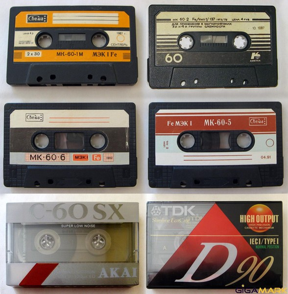

Январь 1997, мне **13 лет**, я учусь **8 классе** (во вторую смену) и 4-й год хожу в танцевальную школу.

В начале года мои интересы с собственно игр смещаются в сторону прикладного творчества. Я строю великолепные «Звездные крейсера» и игрушечные дворцы, клею модель парусника из Нарнии, создаю словарь Клондайского языка (пиктографической письменности) и пишу фантастические рассказы про приключения подростков – «Скорпион» и «Вечно зеленое лето».

Также я собираю наклейки от фруктов, вкладыши и подарочные фигурки из жвачек, круглые фишки (кепсы).

Теперь у меня есть возможность регулярно слушать музыку. Раньше магнитофон (Томь) только у дедушки, музыкальные предпочтения которого были сосредоточены вокруг унылой эстрады конца 80х – начала 90х. 

Потом дядя подарил мне магнитофон Электроника, на котором я изредка (качество было не очень) слушал песни из мультиков и некоторые группы (Твой день, Roxette, West18). Радио в Саракташе тогда не было, музыкальных каналов тоже. 

`video: https://www.youtube.com/watch?v=VFNRh26TPmM`

С покупкой музыкального центра все поменялось. Он умеет проигрывать лазерные диски и на нем можно переписывать песни с кассеты на кассету. 

Сначала мой репертуар составляли хиты 80х: Donna Summer, Abba и Boney M, которые нравились родителям.

`video: https://www.youtube.com/watch?v=AqS4aNi0HQY`

А затем визитная карточка 90х – стиль Eurodance (тогда его называли «техно-рэп»), безумно популярный в подростковой среде.

`video: https://youtu.be/OFdgK2GbHmo`

Спустя пару лет стиль Евроденс, как метеор, ярко осветит и отечественную эстраду, прежде чем сгинуть в небытие. Летом я буду выставлять колонки в форточку и вещать любимые песни на весь Фонтан, а к зиме у меня появится первый неказистый плеер.

`video: https://www.youtube.com/watch?v=EO-xzenCFOU`

Весной, до появления листьев, мы с Барсуком и Джоном ходим в лес за березовым соком и катаемся на велосипедах – теперь у меня оранжевый Таир. С этого года я начинаю замечать, что в весной-осенью мое настроение обычно становится неустойчивым, начинаются конфликты с родителями и, на какое-то время, я ухожу жить к бабушке.

В начале лета мы с Андреем и Денисом ездили на велосипедах к Лене Фауль и другим знакомым, пару раз даже пили шампанское, но мы поссорились, я сломал руку в  драке с их другом и целый год мы не общались. Тогда же я чуть не отрезал себе палец.

Империя фактически уже в прошлом, хотя я еще делаю некоторое оружие и роботов. Теперь мы с мальчишками чаще просто тусим на фонтане.  Я все также тоскую по Анюте, но ее по-прежнему нет. Этим летом я познакомился с Аней Захаровой (будем какое-то время буду переписываться) и Настей Тюркиной, с которой мы надолго станем хорошими друзьями. 

Еще в этом году мы держали летом улики с пчелами, но из-за аллергии на пчел у отца перестали. У нас в доме 2 кота, а вот собаки совсем не приживаются (только одна живет у бабушки). На огороде растет почти все, особенно мне нравится виноград, который поспевает ближе к сентябрю. Летом к нам приезжают мамины друзья и родственники.

Из путешествий была только поездка на свадьбу к Свете в Туру, там было скучно и холодно.

С весны я стал плотно общаться с  Дандиком и познакомил его с Барсуком.

Мы ходили к Даньдику играть в Doom, катались на велосипедах, иногда пили пиво и немного курили, потом организовали у его бабушки в огороде балаган с электричеством и слушали там музыку. Наши любимые группы тогда – «Мистер Кредо» и матерный «Сектор газа».

`video: https://youtu.be/CPBvn2v4UoM`
 
Летом мы повстречали в центральном парке очень забавных мелких девчонок и какое-то время ездили к ним в гости кататься на лодочках.

Осенью мне исполнилось **14 лет** и я перешел в **9 класс**. Мы с Дандиком, Джоном и Барсуком стали кататься по заброшенным предприятиям и складам, собирали всякие детали, взрывали нитроглицерин, а однажды сожгли на стройке огромное колесо от трактора К700. Когда мы ходили в депо смотреть на паровозы, меня поймал сторож и отвел в милицию, было очень стрёмно.

Используя музыкальный центр и песни «Сектор газа», мы с Дандиком записывали ироничные сценки – «Шоу дяди Бобби», где высмеивали некоторых одноклассников, за что мне до сих пор стыдно. В это время в классе началась настоящая травля двух беременных девчонок и Зародыша. С Зародышем у нас оставались противоречивые отношения, мы то дружили, то жестоко дрались.

Наша секретная организация перестала активно ловить инопланетян, зато мы всем составом периодически остаемся после уроков с учителем физики и новым психологом, чтобы поговорить о необычном. Я регулярно хожу на олимпиады по биологии, химии и истории, некоторые из которых даже выигрываю. Зато в танцевальной школе мне очень дискомфортно, мелкие девчонки дразнят меня, и я их тихо ненавижу.

  

После окончания 8 класса мне подарили Денди. Боже, какое это счастье, этот новый удивительный виртуальный мир. До этого у меня была только портативная электроника и появившийся тогда модный томагочи – живущий в брелоке электронный зверь, которого я так и не смог вырастить. 

У всех моих друзей уже есть приставки и даже компьютеры, теперь с ними можно обмениваться картриджами с играми.

Игр мало, они все сложные и в них нет возможности сохраниться, но у меня есть куча времени и огромное упорство, со временем каждая из них проходится до конца.

Среди игр особо выделяется NinjaGaiden – она моя самая любимая. По ней, используя камеру, мы с Дандиком будем пытаться снять фильм, эта игра будет жить на всех моих телефонах, а музыку из нее я буду слушать еще долгие годы.

`video: https://youtu.be/NDaHFnwIozo`

Даже на в последний день года, сходив с Джоном и Барсуком ненадолго на елку в центр, мы всю ночь играли в Денди у папиной бабушки. Я мечтаю, что когда-нибудь все мои идеи и творческие желания можно будет реализовать с помощью компьютера.

---

**А в это время в мире:** 

`video: https://youtu.be/y3kdft70Amo`

Русская музыка 1997

`video: https://youtu.be/8LlAqNqDFnU`