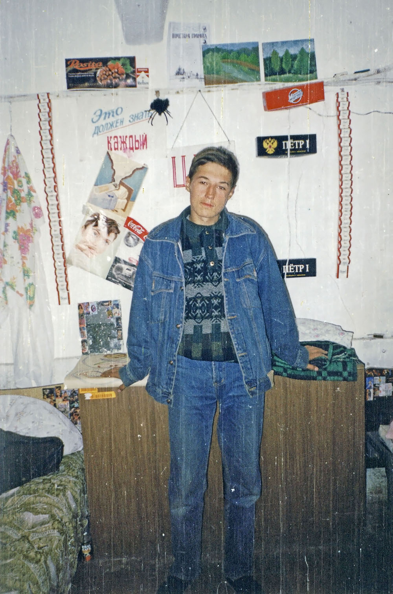
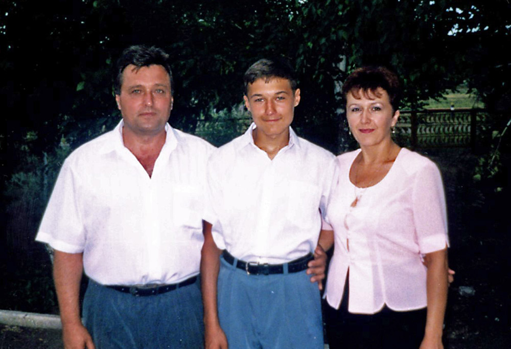

*Что такое в детстве лето?  
Много красок, много света.  
Вода в озере нагрета.  
Посиделки до рассвета.*

Лето, это маленькая жизнь, наполненная важными и интересными событиями. И&nbsp;если такой период длиться большую часть года, то это «Долгое лето». 

На начало 1998 мне **14 лет**. В этом году я заканчиваю **9 класс** и танцевальную школу.

Благодаря танцам я в хорошей физической форме, но психологически мне там некомфортно. Только одна девочка общается со мной, остальные конфликтуют или игнорируют.

С одноклассниками у меня хорошие отношения, но в классе в целом агрессивная атмосфера, над двумя девочками смеются и издеваются, регулярно бьют Зародыша. Наша секретная организация иногда еще остается после уроков поболтать о неизвестном с психологом или учительницей физики, но никакой оперативной работы мы уже не ведем.

Скоро выпускные экзамены, и не понятно, в каком направлении мне дальше идти. Когда проводили профессиональное тестирование, мой друг Женька нарисовал повесившегося на дереве человека и ему рекомендовали идти к психиатру. У меня неплохо с биологией и химией, хотя больше нравится история и политология. По этим всем предметам я даже регулярно хожу на олимпиады, а вот с математикой и геометрией все печально. Редкие уроки информатики проводятся без компьютеров, там мы просто рисуем в тетрадках блок-схемы.

Мой отец считает, что мне нужно стать медиком, раз у меня такие задатки. В нашем поселке на фоне остальных врачи живут относительно неплохо, по крайней мере, им регулярно платят зарплату. Для подготовки к мед. институту я заочно поступил в школу при МГУ, где буду учиться еще 2 года. Теперь раз в месяц мне по почте приходят материалы и задания, я их решаю и отправляю обратно. Задания сложные, но интересные. Приходится основательно думать головой – интернета то нет, да и спросить не у кого.

Весной у меня снова колебания настроения и раздражительность, и чтобы не конфликтовать с родителями, ухожу на время жить к бабушке. После школы я периодически гуляю с Зародышем и его сестрой, а на выходных – с Барсуком и Дандиком. Мы переписываем клипы на VHS-кассеты, слушаем techno, играем у Барсука в компьютер или хулиганим по телефону, а когда сходит снег – катаемся на великах и ходим в лесопосадку жечь костры и собирать березовый сок. Стройка также в списке наиболее посещаемых мест.

`video: https://youtu.be/FwMXNa3Hy60`

После года игнора мы миримся с Андреем, он знакомит меня со своими соседками – Олесей, Наташей и их подругами. Весь день я готовлюсь к экзаменам, а вечером мы устраиваем посиделки с девчонками возле Андрея, это очень весело. В начале июня, когда стоит самая жара, мы начинаем ездить купаться, сначала на озера, а потом и на речку.

В этом же месяце мы сдаем экзамены и проводим выпускной. Ура, каникулы!

На летних каникулах в Саракташе собираются ребята из разных городов, родственники или соседи тех, с кем я дружу. У нас огромная компания. Днем мы занимаемся огородом, играем в Денди, ездим купаться на речку и объедаемся черемухой, а вечером гуляем и тусим все вместе на Фонтане. Самая модная среди нас Настя Тюркина, со своими лиловыми волосами и ботинками на огромной платформе.

Сейчас популярны Руки вверх, Иванушки и в целом Eurodance. A я в этом году открыл для себя стили Techno и Euro-progressive. 

`video: https://youtu.be/tO91c8vbT7A`

`video: https://youtu.be/lvCErYl62Zs`

По телеку показывают сериал «Чародей-2» и «Титаник», фантастические боевики «Судья Дредд», «Спаун» и «Черри 2000». 

Мое любимое кино – «Смертельная битва», стене висят плакаты из этого фильма, а у Барсука есть такая игра на приставке. Иногда он привозит ее ко мне и мы играем в драки всей компанией.

`video: https://youtu.be/ROfYRGQeIsc`

В начале августа мы с Зародышем снова поехали в лагерь, только уже отдыхать, а не вкалывать на правах крепостных. Каждый день был насыщен множеством событий, оставивших яркие воспоминания. Меня назначили командиром одного из двух отрядов. Мы ездили в горы рисовать, соревновались в различных играх и ходили на дискотеку, а вечером мазались зубной пастой. Это было очень весело.

Наступила осень, мне исполнилось **15 лет** и я перешел в сформированный заново **10 класс**, где оказался среди малознакомых мне ребят. Мои бывшие одноклассники либо ушли из школы, либо продолжили учиться параллельно. В новом классе у меня только один друг.

Андрей решил сделать качалку в подвале у своей бабушки. В подвале два помещения, из которых большое мы обустроили под спортзал, а маленькое – под комнату отдыха. На улице еще достаточно тепло и по вечерам мы ходим к девчонкам, с которыми я был в лагере, но мы им не особо нравимся. Прошло три года, как потерялся контакт с Анютой, я чувствую себя одиноким и надежда на нашу новую встречу становится все более призрачной. У меня есть теория, что души похожих людей связаны, и скоро ей предстоит проверка реальностью.

В прошлом году возле Женьки поселился Марат. Он младше нас и не глуп, но ему нравится уголовная романтика и простые удовольствия. Периодически мы тусили вместе с ним, Джоном и нашими общими друзьями, ездили на речку, пересекались возле дома. Осенью они стали общаться с компанией девчонок во дворах и мы с Андреем, возвращаясь с прогулок, иногда заглядывали к ним.  

Однажды Марат познакомил меня со своей подругой Машей. Вот это поворот! На меня смотрела Анюта. Неужели я нашел, что так долго искал?

Реальность оказалась печальнее. Маша была значительно младше и не воспринимала меня как ровесника, я ей не нравился и у нее были совсем другие интересы. После некоторого времени стало понятно, что отношения у нас никак не складываются.

Долгое лето плавно перетекало в осенний кошмар, с депрессией и делинквентным поведением. Мне было тоскливо и одиноко, я начал пропускать школу, конфликтовать с родителями, мог весь день лежать в кровати, смотреть в потолок и слушать Линду, в голову стали приходить нехорошие мысли. Местами, я ощущал себя как во сне, но к счастью, длилось это недолго. Родители заметили, что с ребенком творится неладное, стали мной заниматься и вскоре я пришел в норму.

`video: https://youtu.be/VxnASd0Pl-E`

Нельзя сказать, что именно неразделенная любовь стала причиной такого поведения. Скорее это сочетание факторов: рабочий поселок, социальная неустроенность (в августе этого года произошел дефолт), осенний период, пубертатный возраст с ощущением одиночества, непонятости и ненужности. 

Многие мои друзья в это время думали о том, чтобы убежать из дома. Решились только Дандик и Джон, но, впрочем, неудачно – через три дня родители забрали их из приемника-распределителя.

После этого мы с Андреем и Дандиком стали увлекаться видеосъемкой и откликнулись на предложение сделать передачу для создававшегося тогда молодежного ТВ. Наша работа так понравилась руководству, что Дандик потом еще 2 года вел на канале новости.

`video: https://youtu.be/cbB3iGRHtqA`

К началу зимы мы настолько хорошо обустроили подвал, что решили отмечать Новый Год там. Все прошло весело и пристойно. Это был первый раз, когда мы справляли Новый год сами, без родителей. Кажется, мы стали чуточку взрослее.

---

**А в это время в мире:**

`video: https://youtu.be/L89Dn6rj0lA`

Русская музыка 1998

`video: https://youtu.be/45PDYVheLCI`

