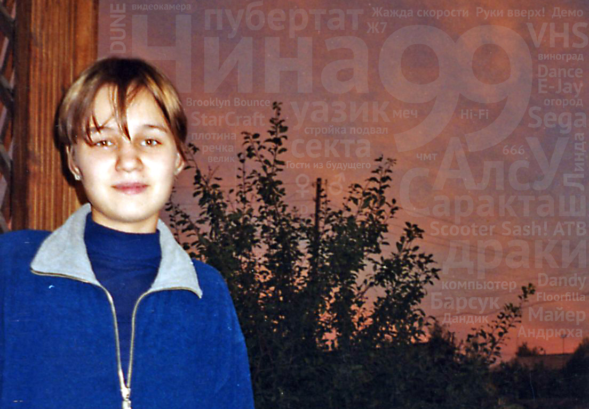

Все новогодние праздники провели в подвале у бабушки Андрея, где мы сделали типа спортзала с зоной отдыха. Сначала вызывали пиковую даму, зажигая свечи, читая заклинания и гремя цепями за шкафом в дальнем углу с помощью скрытой веревки. В результате один наш друг чуть не получил инфаркт, а второй пытался пробежать через стену, как в диснеевских мультиках.

Затем мы стали приводить девчонок, которые динамили и стравливали нас между собой, что вызывало нешуточные драммы. Под конец в подвал начали приходить одноклассники Андрея, бухать и устаивать дебоши, в результате чего бабушка всех разогнала.

Сейчас мне **15 лет** я учусь в **10 классе** среди малознакомых ребят, там только один друг – Зенур.

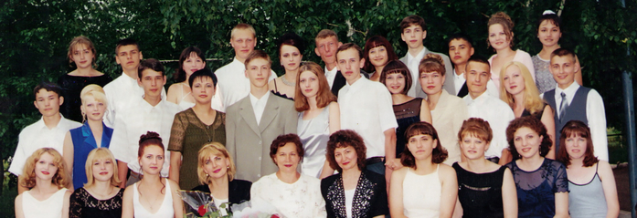

Я также делаю задания для биологической школы МГУ и хожу на олимпиады. Моя жизнь наполнена творчеством: я рисую комиксы и записываю песни про одноклассников и учителей. Треки создаются при соединении звука из проигрывателя пластинок, музыкального центра и скольких микрофонов при синхронной записи на кассету.

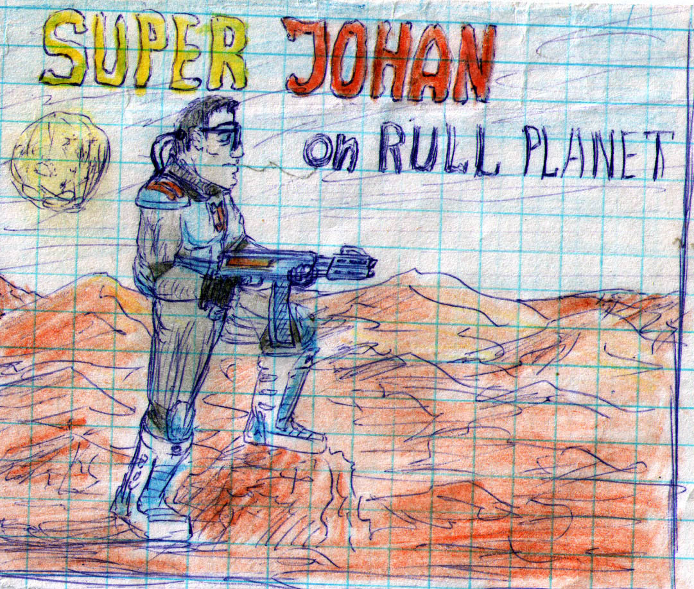

На фоне схожих общих интересов я подружился со своим соседом Женей Майером и с Димой Городиловым. Сейчас в моде стили DreamHouse и Еuroprogressive trance, выходящие на мегакрутом сборнике Жажда скорости. Еuroprogressive станет моим любимым стилем на следующие несколько лет. 

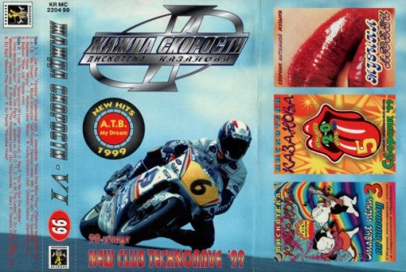

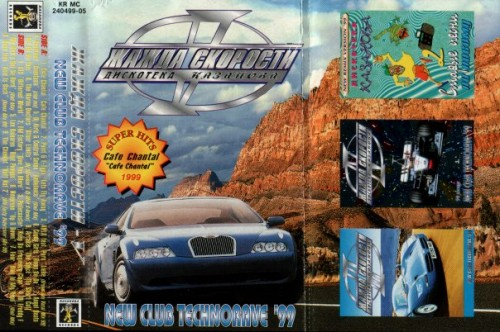

Музыка очень важна для подростков, это способ их самоиндефикации. Но получить ее непросто, интернета нет, скачать ничего нельзя. Нужно ехать на базар, ходить между прилавками, тщательно выбирая покупку, ведь скопленных денег хватит только на одну кассету. В большей степени это лотерея, тк продавец может поставить тебе только первый трек, в остальном приходится ориентироваться на названия групп.

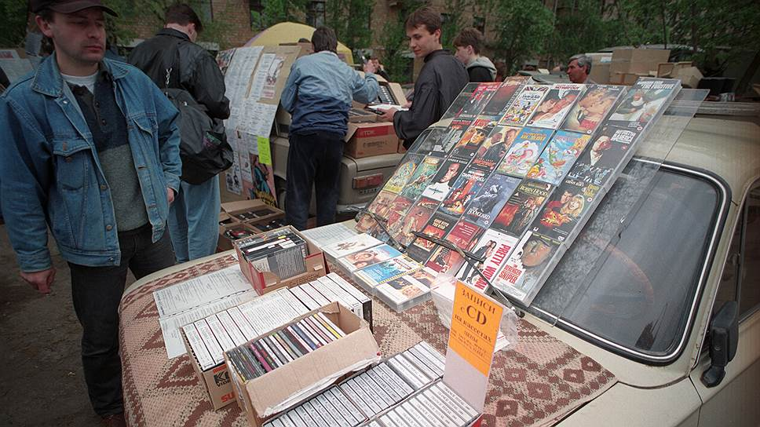

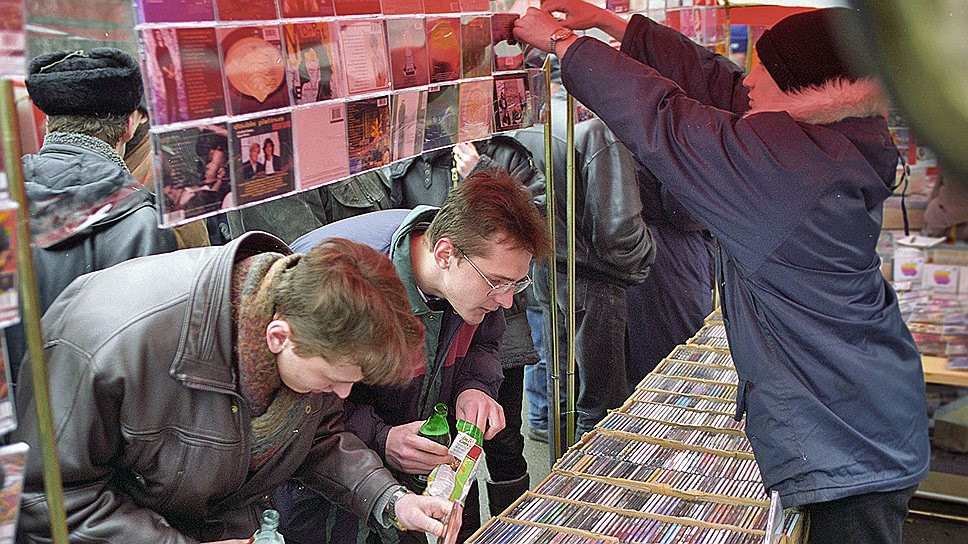

То же самое касается книг, фильмов и игр для приставки. Поэтому среди ребят очень развит обмен. Понравившиеся треки можно переписать на чистую кассету, создавая свои подборки. Иногда взятые на время вещи не возвращают, "затирают", ты про них забываешь и они "уходят". Так у меня ушли скейт, воздушка, пневматический пистолет и куча всего помельче.

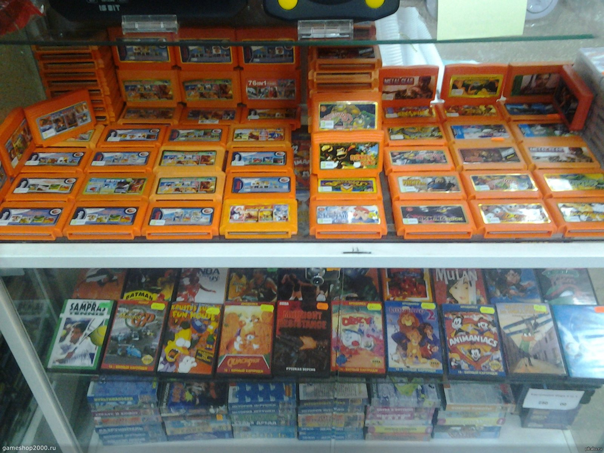

В целом, у меня в школе с ребятами нормальные отношения, хотя пубертат дает о себе знать повышенной подростковой агресивность. Мы также периодически бъем Зародыша (всегда заслуженно), у меня весной-осенью все также отмечаются колебания настроения.

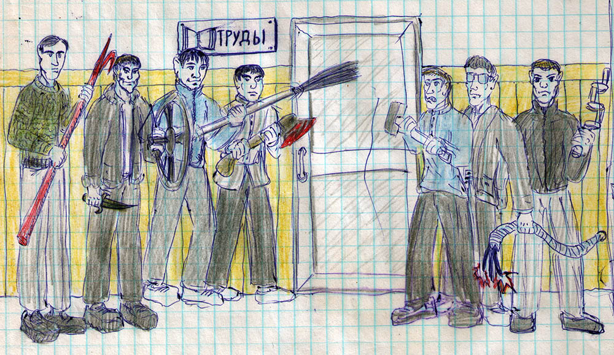

У нас в классе есть маленький эпилептоидный психопат Эльнар, самоутверждавшийся через драку. Однажды мы встретились на улице, в итоге у меня сотрясение и сломан нос, у него разрыв перепонки. Будучи человеком необузданных страстей, лет через 10 он взорвет себя вместе с домом. Мой нос останется слегка кривым навсегда.

С девушками мне не везет. Я помню Анюту, но шансы что мы встретимся, тают с каждым годом. Меня никто не понимает, и если в моей жизни и появляются девушки, то все не то. Для меня важно, чтобы человек был моим другом и разделял мои интересы, но такого и близко нет.

Однажды мне позвонила девушка Настя и предложила встречаться. Мы погуляли несколько дней и даже ходили на дискотеку, пока я не понял, что она встречается еще с кем-то. А через пару месяцев Эльнар с восторгом рассказывал мне, как трахал эту Настю на стройке, не зная про наши отношения. Было грустно.

Мне нравится Маша, потому что она похожа на Анюту, но я ей не нравлюсь. Летом мы вместе с ней и моими одноклассниками ездили в лагерь, где днем участвовали в конкурсах, а ночью пьянствовали и слушали Руки вверх, но даже это нас не сблизило.

Секретная организация по поиску инопланетян превратилась в секту Семи Богов (почти как в Игре престолов). У каждого бога есть старший и младший жрец из числа моих друзей. Я в ней главный идеолог, а мой друг Джон пишет нам тексты.

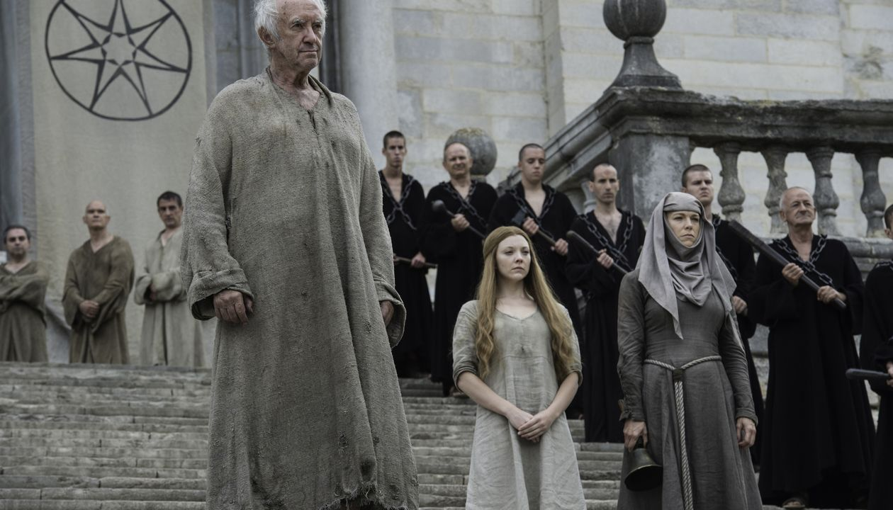

Мы обустроили храм в подвале где справляем обряды – жгем костры, пьем вишневую наливку, поем песни на непонятном языке, а потом играем в пятнашки на крыше. В дальнем углу подвала выкопана яма для грешников, а сама стройка вся разрисована сатанинскими символами, чтобы там поменьше шастали.

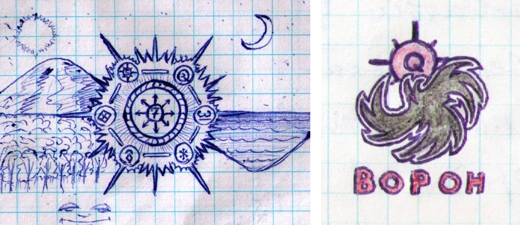

Летом на каникулы в Саракташ снова съезжаются ребята из других городов.

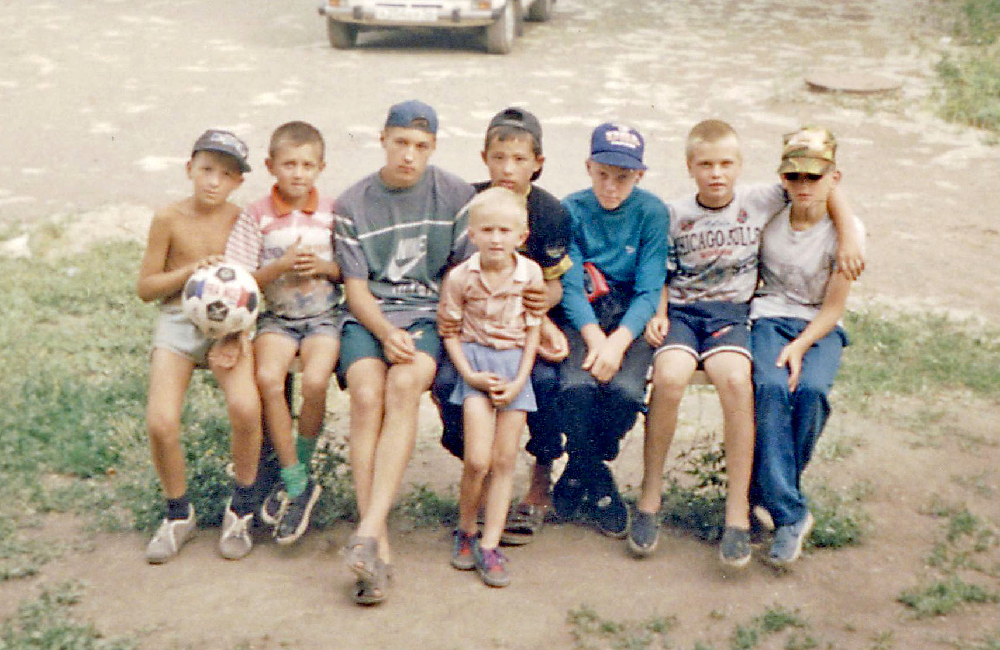

В этом году главная звезда – Нина из Питера. Нина пацанка, с ней легко находить общий язык, она всем нравится. Когда Барсук и Дандик починили военный уазик, мы вчетвером объездили почти весь район. Нина любит простые удовольствия, утром она приходит ко мне покурить, днем мы ездим на речку или Плотину, а вечером тусим на лавочках или гуляем.

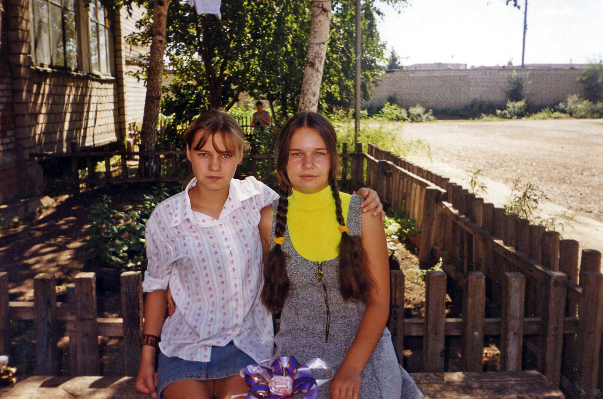

У меня с ней были чисто дружеские отношения, но периодически ее приходилось спасать – принести с дискотеки, помочь протрезветь, дать алиби для бабушки. Тогда она была мне как сестра. Следующие пять лет мы будем плотно общаться. Потом наши интересы разойдутся и мы не будем встречаться даже уже живя в одном городе. Ее жизнь сложится неудачно: без образования, без работы, она будет жить с дочкой у мамы, пока в 2018 году не погибнет, вероятно, от интоксикации. Мне будет очень жаль.

В 1999 я еще живу в коттедже напротив фонтана, хотя мы больше его не включаем. Вокруг дома большой огород, где растет почти все. Летом его нужно ежедневно поливать, а осенью - консервировать обильный урожай. Ребята часто приходят ко мне в гости, мы снимаем на камеру смешные ролики и едим яблоки, сливы и поспевающий виноград.

В моей комнате, как и положено в 90х, на стене висит ковер, на нем меч, напротив во всю стену фотообои с космонавтами. В шкафу верхняя полка отдана творчеству: там диорама планеты динозавров (я собирал фигурки и наклейки из жвачек), рисунки игрушек на штукатурке, модели кораблей, роботы, фигурки из глины. Весь шкаф забит фантастическими книгами. На столе музыкальный центр и старый телевизор, на нем я играю в денди.

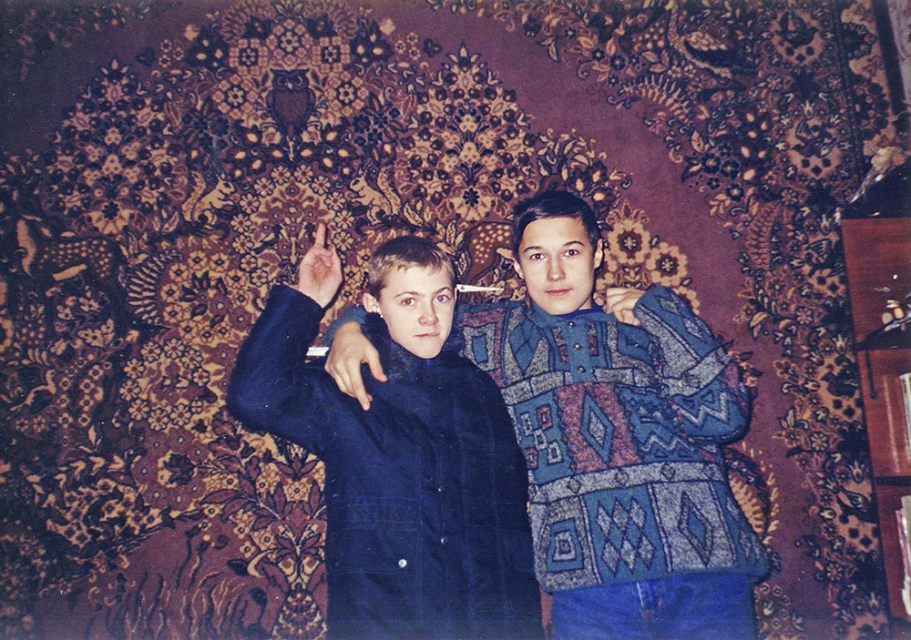

Денди прикольная, но хочется большего. В начале августа мама привезла мне на месяц компьютер, на котором мы с Майером проходили Дюну, попеременно обедая и поливая огород.

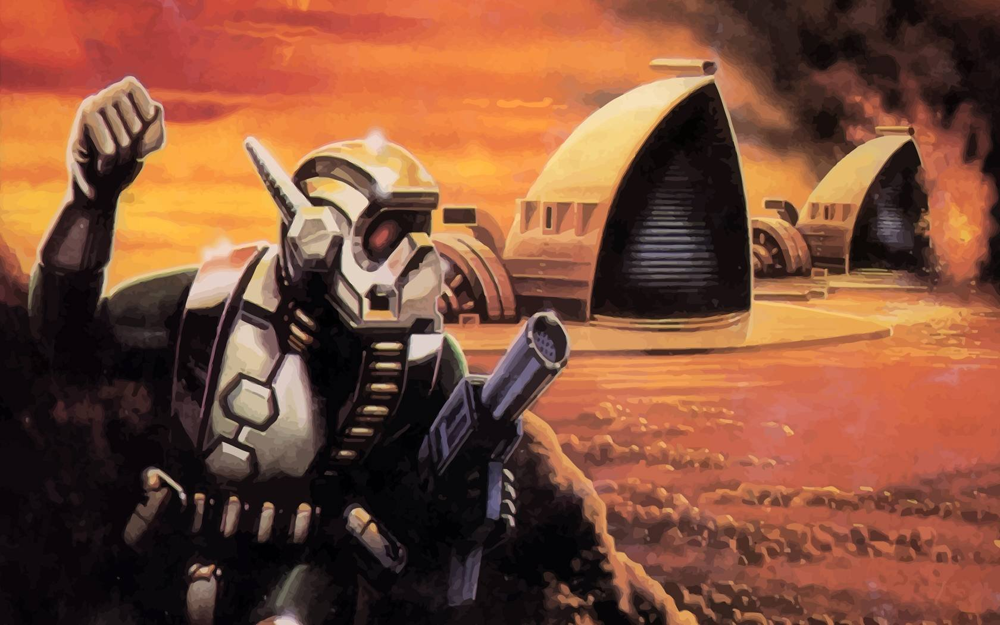

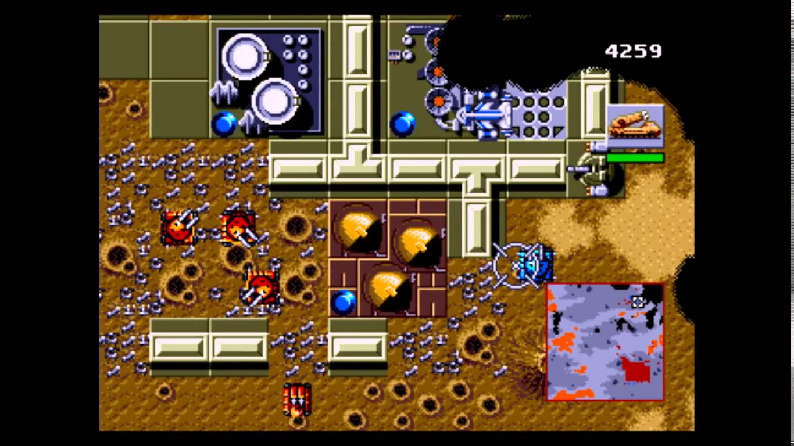

Затем мне удалось поставить туда Стар Крафт – божественную игру, ставшей нашей любимой на долгие годы.

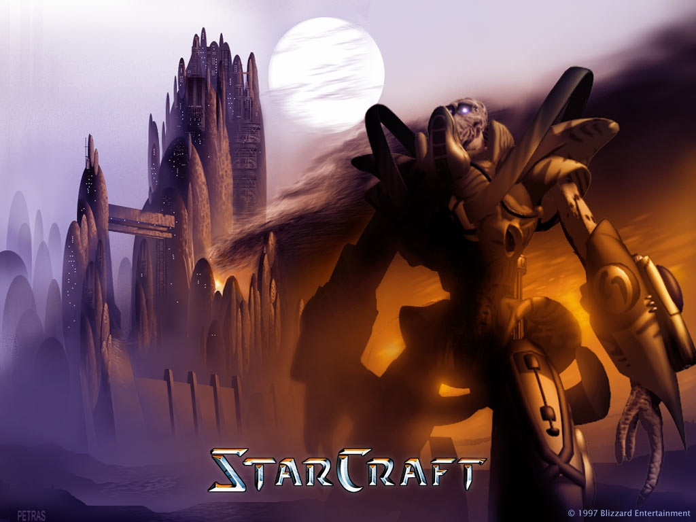

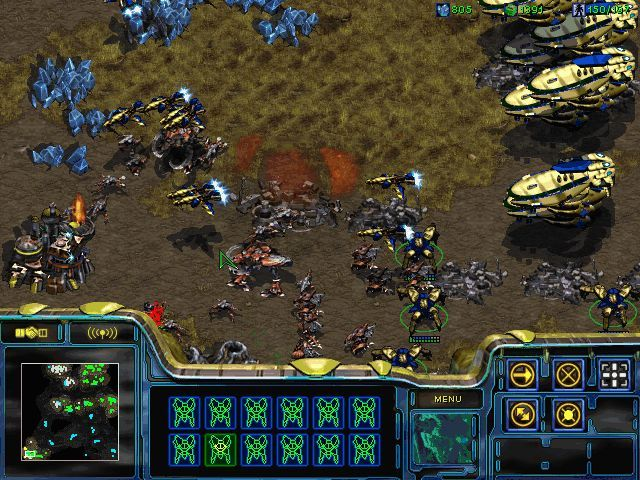

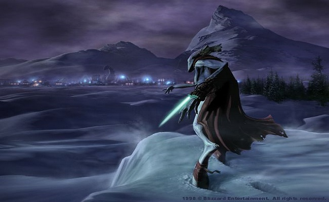

Мои залипоны не прошли незамеченными. Родители сделали однозначный вывод, что компьютер мне покупать нельзя. До 2002 года мне придется ходить к маме на работу или в компьютерный клуб, чтобы что-то на нем поделать.

Среди тех, с кем мы сидим до утра на лавочках, есть скромная девочка Алсу. Постепенно у нас начинаются романтические отношения. Мне почти 16, ей 14, ее родители строгие ортодоксальные татары. Но это не проблема. Гораздо хуже были Андрюхины одноклассники.

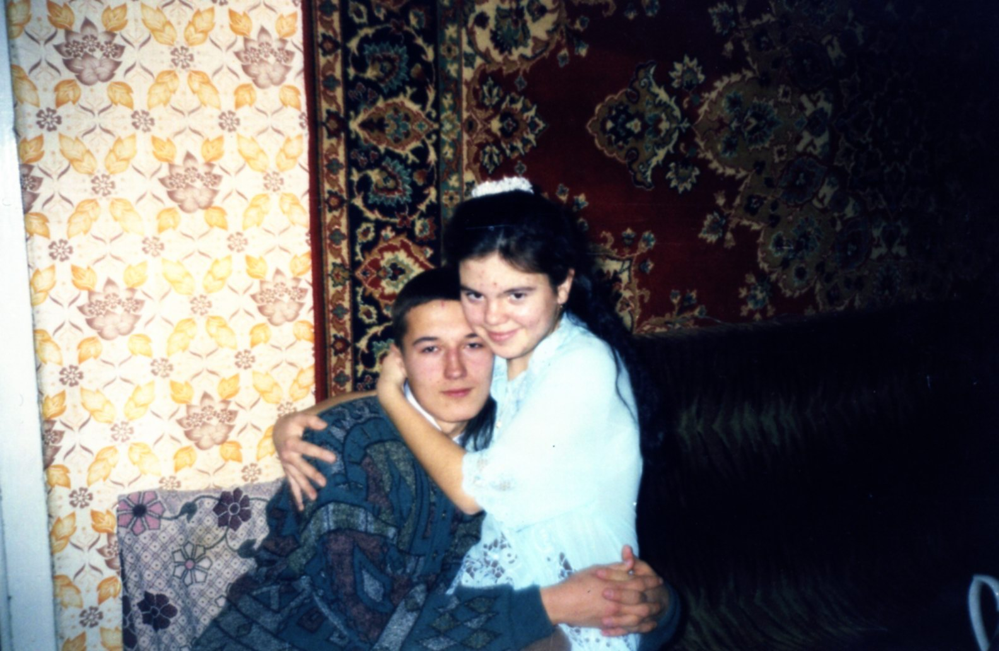

Однажды Андрюха решил устроить разборки на дискотеке, но не расчитал силы. Его друзья убежали, а его жестоко избили. В это время мимо проходили его одноклассники, и узнав в чем дело, тоже стали его бить. Просто так, за компанию. При этом он считал их своими приятелями.

Будучи туповатыми и трусливыми, но при этом агрессивными, они всегда нападали толпой. С ними были проблемы у многих моих друзей. Избив кого-нибудь, через пару дней они прибегали с мамками мириться, предлагая деньги, чтобы на них не завели уголовное дело.

Мне они предложили платить выкуп за дружбу с Алсу и естественно были посланы. Драка один на один превратилась в драку все на одного. Потом они приходили мириться. Мне не хотелось устраивать все эти дела с милицией и я согласился. Тогда мне казалось, что это может повредить моей репутации и вообще ломать жизнь людям из-за драки перебор. Сейчас я понимаю, что тогда стоило попробовать их посадить, потому что безнаказанность раззадоривает шакалов и почувствовав вкус крови, они будут продолжать делать это снова и снова.

В результате ситуация через пару месяцев повторилась. Правда там уже была относительно честная драка один на один, но я сильно ударился головой об землю и получил очередную ЧМТ. Мои друзья как и я не обладали особыми боевыми навыками, чтобы устроить облаву, а тратить здоровье на отморозков мне надоело. Поэтому я сходил к знакомому криминальному авторитету и с тех пор они меня обходили за версту.

В конце лета мы с Димой Городиловым ездили в Оренбург на концерт Руки вверх. Это было самое крутое выступление, что я видел, весь концерт зал пел стоя. 

`video: https://www.youtube.com/watch?v=TmLEypzhcKY`

В этом году из отечественного популярны Руки Вверх, Иванушки, Демо, Вирус, Гости из будущего, Hi-Fi, Линда, Русский размер, т.е. русский евроденс.

`video: https://youtu.be/NUMgDHnsvNU`

Из зарубежного - EuroProgressive trance. Мои любимые композиции:

* [666 - Bomba](https://www.youtube.com/watch?v=jlKlPqLHJg0)
* [Brooklyn Bounce - Canda](https://www.youtube.com/watch?v=bqCQ6qDEAsA)
* [Sash! - Adelante](https://www.youtube.com/watch?v=9xUEF3HgDgY)
* [Floorfilla - Anthem 2](https://www.youtube.com/watch?v=JNeEwrHi4zs)
* [Darude - Sandstorm](https://www.youtube.com/watch?v=y6120QOlsfU)
* [ATB - 9 PM (Till I Come)](https://www.youtube.com/watch?v=5A9OIIapSko)
* [Scooter - Faster, harder](https://www.youtube.com/watch?v=j0LD2GnxmKU)

Мне тоже хочется делать что-то подобное. Теперь у Барсука появилась программа Dance E-Jay, которая позволяет собирать музыкальные композиции как мозаику из отдельных семплов. Это очень круто. Каждые выходные я хожу к маме на работу, чтобы пописать музыку или поиграть во второй Варкрафт. 

`video: https://youtu.be/uhFcW3RmwrE`

Эти композиции мы слушаем в школе или включаем на дискотеке. Ребята предложили мне быть диджеем, но я постеснялся и отказался. Мне больше нравится творить, а не быть в центре внимания.

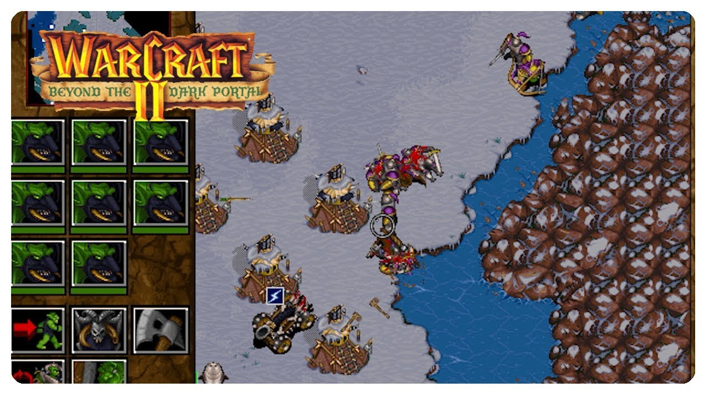

Новый год в этот раз мы справляли у Джона вместе с Алсу, посмотрев обалденную "Матрицу".

В следующем году Путин станет президентом, 90-е закончатся, я поступлю в мединститут и уеду жить в Оренбург.

---

**В это время в мире:**

`video: https://youtu.be/_7X0djao3G0`