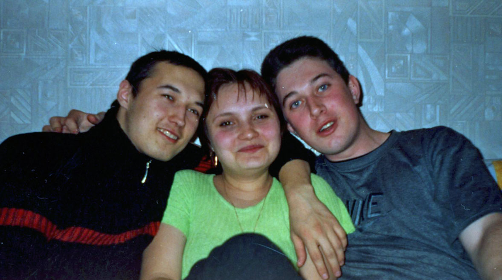
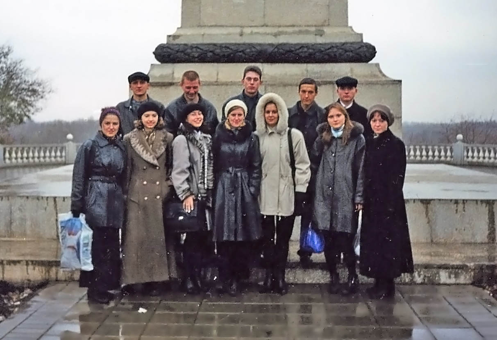

На начало 2000 года мне 16 лет и я заканчиваю 11 класс. Смену тысячелетий мы отметили у Джона, смотрели "Матрицу", ходили на ёлку. Девяностые завершились, Путин стал президентом, началась война в Чечне. 

`video: https://youtu.be/YihPA42fdQ8`

У нас с Алсу романтические отношения. Мы гуляем снежными вечерами с ее подругами, иногда после школы зависаем у меня дома, долго целуемся и занимаемся легким петингом. Сексуальная тематика у неё под запретом. Однажды ее родители уехали и мы три дня провели вместе, потом было трудно даже ненадолго расстаться.

На выходных я хожу к маме на работу, чтобы пописать музыку в Dance Е-Jay, поиграть в Старкрафт или второй Варкрафт. Этой весной в моде Гости из будущего, а по телевизору показывают сериал "Вавилон 5", я его обожаю.

`video: https://youtu.be/OZHmrseau_4`

В школе дело идет к выпускным экзаменам. Один я сдал в прошлом году, два других мне зачли за олимпиады, поэтому к началу лета оставалась только два. На выпускной мы ездили на речку встречать рассвет, а перед этим гуляли с ребятами даче. Все, конец школы!

Весной мы съездили в гости в Тольятти, после чего мне нестерпимо захотелось уехать из Саракташа, огни большого города манили меня. Перед поступлением я месяц жил в Оренбурге у тети в Южном, ездил на троллейбусе, готовился к экзаменам и познакомился с Леной Пряхиной. Одновременно со мной Барсук готовился к поступлению в зенитное училище.

Остаток лета мы с ним провели в Саракташе. Как и в прошлом году тусили с Ниной, катались на уазике и ниве, ездили купаться на плотину. А вечером собирались на лавочках большой компанией и сидели до утра. 

В Саракташ на лето приехали ди-джеи, помогали им обустраивать дискотеку. Сейчас в моде музыка с ломаным ритмом - Electio и Drum and Bass, а танец под нее называется BreakDance.

`video: https://youtu.be/FBDn_7ehveQ`

`video: https://youtu.be/ymNFyxvIdaM`

В этом году популярен русский Евроденс: Авария, Демо, Вирус, Руки Вверх, HiFi, Тату. Сначала у меня был маленький радиоприемник, на котором я слушал музыкальные радио, а потом появился один из лучших кассетных плееров. 

Еще в Оренбурге показывает музыкальный канал, и понравившиеся клипы можно записывать себе на видеокассету. В Саракташе МузТВ  и FM-станции недоступны.

`video: https://youtu.be/_8SvIvHm2OE`

`video: https://youtu.be/gxLKrLqXGoM`

##Оренбург

С началом осени жизнь круто меняется. Мне исполняется **17 лет**, я поступаю на первый курс медицинской академии и покидаю Саракташ. Мои родители разводятся и выставляют дом на продажу, мама переезжает в Оренбург и устраивается в геологию. 

Мы живем в съемной квартире на Туркестанской, в одном дворе с бабушкой Барсука. Барсук учится рядом в зенитном училище, иногда я тайком пробираюсь к нему в гости. По соседству живет мой одногруппник Леша Ганеев. С ним и Леной Пряхиной мы организуем свою маленькую компанию.

Все вокруг дышит опьяняющим чувством новизны. В нашей институтской группе 16 человек (6 мальчиков и 10 девочек), некоторые медалисты, некоторые откровенно тупы. Поначалу все дружны и вежливы. Мы занимаемся в двух местах: в главном корпусе напротив моста через Урал и возле Караван-сарая, где работает моя мама.

Учеба отличается от школы, хотя это становится понятно не сразу. Оказывается, у студентов не должно быть несданных или пропущенных занятий, если такие есть, то их нужно "отработать" - найти после учебы преподавателя и рассказывать ему тему снова и снова, пока он ее не зачтет. Наличие хотя бы одной отработки означает недопуск к сессии и ведет к исключению из института к концу семестра.

Просто "понимания" недостаточно, большую часть информации приходится заучивать наизусть, особенно, что касается латинских названий. Приезжая домой после занятий, я спал часа 3, потом до поздней ночи учился. Иногда ко мне в гости заезжал Шакир и рассказывал маме странные истории, как он выучится в меде и будет подключать свой мозг к компьютеру.

Кроме обычных занятий, есть специфические, например, анатомия, где нужно мыть и резать трупы, или химия, где нужно самим проводить реакции. Трупы плавают в ваннах с формалином или лежат на столах, они похожи на мумии цвета вареного мяса. Сначала было брезгливо, а потом мы привыкли, одни могли резать труп, а другие кушать пирожные за этим же столом.

Чтобы получить зачет по анатомии, нужно было или принести череп или выучить все отверстия в нем. Осенним пасмурным днем я поехал в овраг, возле старого деревенского кладбища, в надежде найти череп, но так и не нашел, пришлось учить. Зато Лешик Ганеев попросил на кафедре череп для подготовки, положил его на полку и до 4 курса перед обедом он нас радовал своими двумя оставшимися  зубами.

Иногда мы с Лешей ходим в ДК - типичную дискотеку 90х, где быковатые пьяные ребята сидят по стенам в надвинутых на глазах шапках, а девочки танцуют в центре. В конце осени у нас проходило посвящение в студенты, где мы весь вечер танцевали медляки под быструю музыку.

В свободное время размышляю на тему отношений в группе, рисую одногруппников и записываю свои мысли клондайской письменностью. А на выходных езжу в Саракташ, ночую у бабушки и гуляю с Алсу. 

В это время Барсук делает все, чтобы его выгнали из зенитки, и под конец года ему это удается. Его новая подруга Ксения провоцирует всех на разные безумства. В следующем году мы хлебнем с ней по полной.

---

**В это время в мире:**

`video: https://youtu.be/LKuUV7L-ipU`