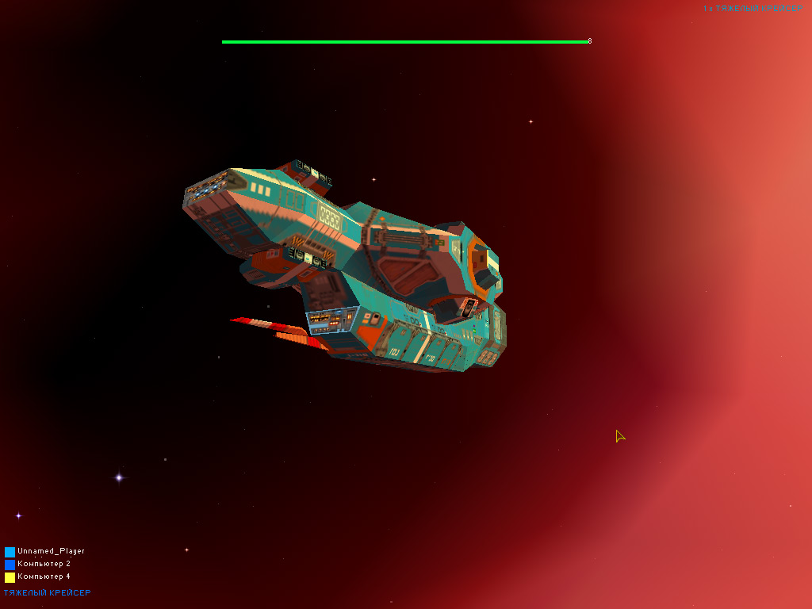
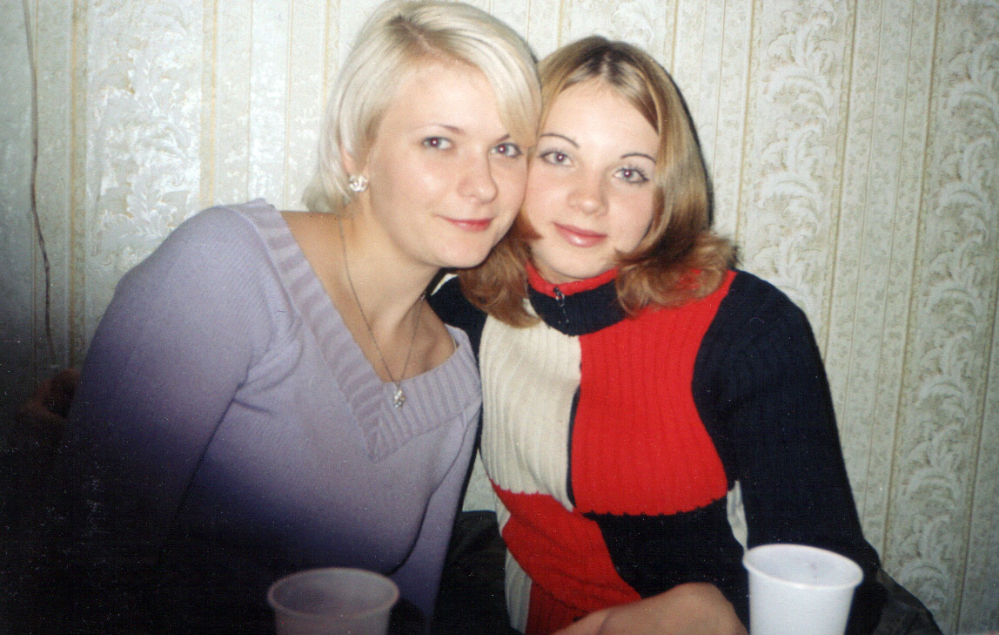

На начало 2003 мне 19 лет, я живу в Оренбурге учусь на 3 курсе мед. академии.

Новый 2003 Год встретили у меня дома в Оренбурге, с Джоном, Лешиком, Наташкой, Ленкой Пряхиной и ее подругой. Было очень весело: мы гуляли по улице, ходили к соседям и на елку, смотрели Масяню, а под утро у меня сгорел комп.

На зимних каникулах ездил к Инке в Казахстан и жил там неделю. Семь часов автобус ехал по бескрайним казахским степям, у него не закрывалась дверь и не работала печка. Водитель не стал утруждать себя поездкой до вокзала, а просто высадил всех на рынке. На мое счастье таксист докинул меня до нужного адреса, но тут оказалось, что инкины родители не знали о моем приезде.

Мама не выказывала особой радости, а вот Инка была счастлива. Вечера мы проводили вместе, а днем, пока она была в школе, мама приседала мне на уши, какой я не хороший. Это меня заметно напрягало и я даже почувствовал облегчение, когда уехал. Через некоторое время после возвращения от Инки пришло письмо, что я плохо отношусь к ее маме и что наши дальнейшие отношения бесперспективны. Больше она мне никогда не писала.

`video: https://youtu.be/5llcBScGuAE`

После этого мы стали встречаться с Наташкой. Она была замечательным человеком и отличным другом, но любви у меня к ней никогда не было. Наташа училась и параллельно работала в хирургии, виделись мы не очень часто.

Еще весной я познакомился со странной девочкой Зиной, которая училась на психолога, хотела заразить себя спидом, отрезать грудь, и в целом была загадочно-готично-депрессивной. Мы какое-то время общались и даже несколько раз с Шакиром ездили к ней в гости с ночевкой, впрочем, без всяких интимов.

В конце прошлого года Леша познакомился со своей будущей женой Ириной, я помогал ему печатать красивые письма на компьютере. Леша жил в общаге при институте, на этаже с иностранцами. На выходных они устраивали в холле пакистанские дискотеки, готовили острую еду и пили газировку. А Леша пытался научить их пить водку.

Мои друзья периодически приезжали к Леше потусить, а Майер даже жил у него, вместо учебы в колледже. На вахте внизу сидела злая тетка, поэтому ночью ребята залезали и спускались через балкон на втором этаже. Порою нам удавалось собраться у кого-нибудь из одногруппников, но группа так никогда и не была особо дружной.

Иногда собирались у меня. Пару раз нам с Барсуком приходилось ночью искать Лешу, который брал топор и убегал навстречу приключениям. Барсук заезжал ко мне по дороге в ночной клуб, где он работал ди-джеем и оставлял диски с музыкой, которые я переписывал.

После нескольких лет господства мой любимый стиль euro progressive trance стал распадаться на различные ветки. В моду вошел hands up, 2step garage, progressive с элементами хип-хопа, а также различные виды транса:

* [Paffendorf - Crazy Sexy Marvelous](https://youtu.be/PCblub_M_Hc)
* [Dj Alligator - Bounce 2 This](https://youtu.be/Xzy1jaqYayc)
* [Floorfilla - Bad boy](https://youtu.be/a36gCqlz--c)
* [Brooklyn Bounce - X2X](https://youtu.be/DP7LYo8LdC0)
* [Andre Visior - Speed Up](https://youtu.be/g3vVT35FAIU)
* [Martillo Vago - Por Que No](https://youtu.be/8AnMokPT9Do)

Сессия выдалась тяжелой &ndash; патан, патфиза и топочка. Леша чудом удержался в институте.

Я же достаточно удачно сдал экзамены и приехал в Саракташ. Вечером мы обычно гуляли с Нинкой, Рустамом и Шакиром, ездили на природу с ночевкой, а днем я был на практике. Это был последний год, когда летом приезжала Нина. Майера отчислили из колледжа, он работал на заводе и его почти не было видно, а Джона Мироненко с Андрюхой до ноября отправили на отработку в колхоз, где у них приключилась история с соляркой.

Получилось так, что я опять помирился с Машей Зориной и меня снова поглотила любовь. Я мечтал быть с Машей с самого первого раза, когда ее увидел, но раньше Маше я особо не нравился и наши отношения никак не складывались. Мы ездили отдыхать в Оренбург и Соль-Илецк, это было по настоящему круто.

Была только одна проблема &ndash; в начале августа я должен был ехать на 2 недели в Сочи с Наташей и мамой.

Планируя эту поездку, я не предполагал, что у меня снова возникнут отношения с Машкой. Отказать Наташе я уже не мог, она много для меня делала и я это ценил. Однако в дороге появились некоторые проблемы. Наташка, узнав про Машу, очень расстроилась и почти весь отпуск я ходил весь в напряжении. 

 

В остальном было неплохо. Это была первая Наташкина поездка на море, мы много гуляли, купались, ездили в аквапарк и ходили на концерт Dr. Alban. После возвращения наши отношения с Наташей закончились, но мы оставались друзьями.

В сентябре мне исполнилось **20 лет** и я перешел на **4 курс мед. академии**. Перед ДР у меня нагноилась челюсть, поэтому я ни есть, ни разговаривать не мог, только головой кивал.

На выходных я периодически ездил в Саракташ, гуляли с пацанами, пили пиво, играли в Старкрафт и Quake3. На моем компьютере появилась Windows XP. Я активно изучал программы, особенно графические, немного писал музыку, но в основном играл в игры, такие как: Rim Battle Planet, Battlezone II и Homeworld: Cataclysm.

В прошлом году мама отдала мне свой мобильник &ndash; легендарную нокию 3330. На ее черно-белом экране помещаются 4 строчки текста, есть пара игр, а мелодии для звонка набираются текстовыми кодами. Зато с мобильником можно всегда быть на связи и даже отправлять смс в другие города.

В этом году появились модели с цветным экраном, которые могут проигрывать пищащие полифонические мелодии. Но у всех этих телефонов есть серьезный недостаток &ndash; они беспросветно тупы. Чтобы закачать в такой телефон картинку или мелодию, нужно его перепрошить, используя уникальный кабель и специальную программу. Такое можно сделать только в специальных салонах за отдельную плату.

Летом мама купила нокию 3650 &ndash; один из первых в мире смартфонов. Боже, это какое-то чудо! В этот аппарат можно спокойно добавлять картинки и музыку, но и даже устанавливать программы, расширяющие его возможности до невообразимых пределов. Он умеет проигрывать mp3, делать фото и даже выходить в интернет. Телефон пока у мамы, но со следующего года она отдаст его мне и я буду фиксировать жизнь вокруг себя.

Несмотря на возобновление отношений с Машей, моя личная жизнь оставалась непонятной. Машка жила в Екатеринбурге, училась в училище, формально встречалась там с парнем и не испытывала ко мне особо сильных чувств. Мы регулярно писали друг другу письма и планировали встретится на зимних каникулах.

А в декабре в Саракташ приезжала Настя Тюркина.

В этот раз мы собрались отмечать НГ у Джона, с Машей, Лешиком, Иринкой и всей нашей большой компанией. 

Следующий год запомнится интересной летней практикой, появлением интернета и началом ведения онлайн-дневника.