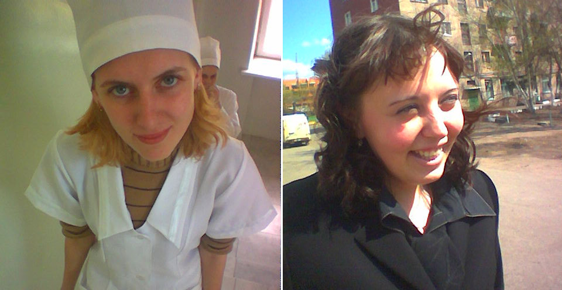
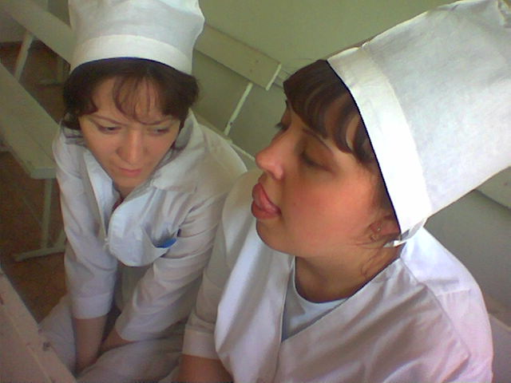
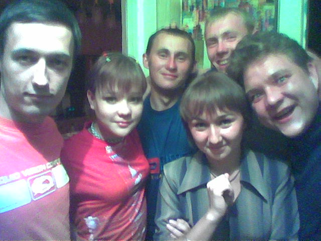

Мне **20 лет** и я учусь на **4 курсе** мед. академии. В начале года мама подарила мне телефон с камерой и я стал регулярно фотографировать жизнь вокруг, а в конце – начал вести онлайн-дневник, благодаря чему появились эти мемуары.

Новый год отметили в Саракташе у Джона большой веселой кампанией: Лешик с Иринкой, Маша с подругами, Джон, Майер, Барсук, Шакир. 

После новогодних праздников мама уезжала на месяц в Москву, на это время я пригласил к себе пожить Барсука и Наташку. Наташка в основном была на работе, а мы с Барсуком объединили компы в сеть, чтобы играть в ночами Quake3 Arena и вместе управлять звездолетом.

`video: https://youtu.be/TL-UC6fxt_s`

Весной дважды приезжал в Саракташ: сначала на ДР Майера, потом на майские праздники. 

`video:https://youtu.be/57GJzNqfZOQ`

Гуляли по Саракташу, пели караоке, ходили жарить шашлыки на речку. 

На майские праздники приезжала Маша, отношения с ней оставались не очень понятными. 

`video:https://youtu.be/KmO35FyqpKQ`

Наш друг Шакир пропал на пару месяцев, а потом объявился с новой подругой Таней. Летом они поженились. 

В институте группа раскололась на 2 лагеря, с драками и разборками. 

А еще в эту сессию выдались совершенно удивительные экзамены по фарме (когда мы всю ночь сидели в сауне) и акушерству (куда я пришел перевозбужденный и которое потом пришлось пересдавать). 

###Лето

Летом у меня началась практика в больнице, сначала на кардиологии, а потом на скорой помощи. Гуляли с Шакиром, Тосей и Диляркой, снимали видео на стройке. 

`video:https://youtu.be/F_S-2e5yQkM`

После приезда Маши делали у нее ремонт, тусили на турниках, смотрели флеш-мультики (Масяня, Шесть с половиной) про таких же балбесов как мы.

`video: https://youtu.be/V7Aef7JsiME`

Пару раз ездили на речку с Андрюхой и всей нашей большой компанией, ходили к Шакиру на свадьбу, делали абсент, учились ездить с дедушкой на машине.

`video:https://youtu.be/UJMclbWWEnE`

В это время в стране бурно развивалась связь. Появлялись новые сотовые операторы, мобильники были уже почти у всех. Получили распространение sms-чаты, а у имееющих интернет – мессенжеры (icq), онлайн-чаты и сайты знакомств. 

В начале года, чтобы выйти в интернет, я дозванивался по мобильному телефону на специальный номер. Скорость была никакая, картинка могла грузиться минуты, а час стоил около 30 руб. Летом в Саракташе у бабушки я подключил проводной диал-ап интернет, с оплатой по карточкам, и сидел в нем ночами. А в конце года такой же интернет появился у меня в Оренбурге.

В интернете много всякой информации, например, онлайн-библиотеки. Я читаю много, в основном фантастику (Лукьяненко, Зан) или околоэзотерическую литературу (буддизм, Тимоти Лири, раста, Пелевин). 

Я помогаю своим знакомым настраивать компьютеры. Для этого у меня есть специальный диск с программами – Adoon Neo System, интерфейс к которому я сделал самостоятельно. Он написан на языке HTML и чтобы разобраться в нем, я начал изучать верстку. Через 12 лет это станет моей основной профессией.

###Осень

После отъезда Маши и окончания лета начались серые будни. Мне исполнился **21 год** и я перешел на **5 курс**.

Осенью часть группы помирилась и мы ездили с ночевкой на турбазу отмечать пропущенный "экватор", когда Леша жарил сосиски, разобрав на дрова крылечко у домика, а Сережа словил "сумерки" и всю ночь шел пешком до города.

`video:https://youtu.be/puvfGUddYJU`

Осенью мне провели телефон и я начал вести дневник. На выходных мы обычно ходили зависать в компьютерные клубы (Завод), там тогда еще можно было пить пиво, играли в Quake и контр-страйк. 

Из музыки в этом году я слушал в основном разные виды транса и начинающий входить в моду электро-хаус, а также энигматик:
* [Galaktika Project - Galaktika '98](https://youtu.be/KmO35FyqpKQ)
* [Kai Tracid - Liquid Skies](https://youtu.be/hMq7nru7dwY)
* [DJ Tonka - She Knows You](https://youtu.be/57GJzNqfZOQ)
* [Alizée - J'ai Pas Vingt Ans (Benny Benassi Remix)](https://youtu.be/F_S-2e5yQkM) 
* [Global Deejays - What A Feeling (Flashdance)](https://youtu.be/w2ohwM9iO6k)
* [Ana Flora - Cores (Bomb & Bass Mix)](https://youtu.be/puvfGUddYJU)
* [Amethystium - Dreamdance](https://youtu.be/UJMclbWWEnE)

Бандитское казино "Розовая пантера", в которой работал Барсук, переделали под танцевальное заведение. Открылся легендарный клуб Амнезия и мы потихоньку начали туда ходить. Приближался шебутной 2005 год.

