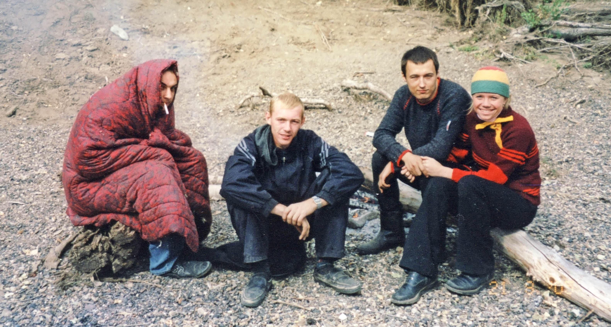
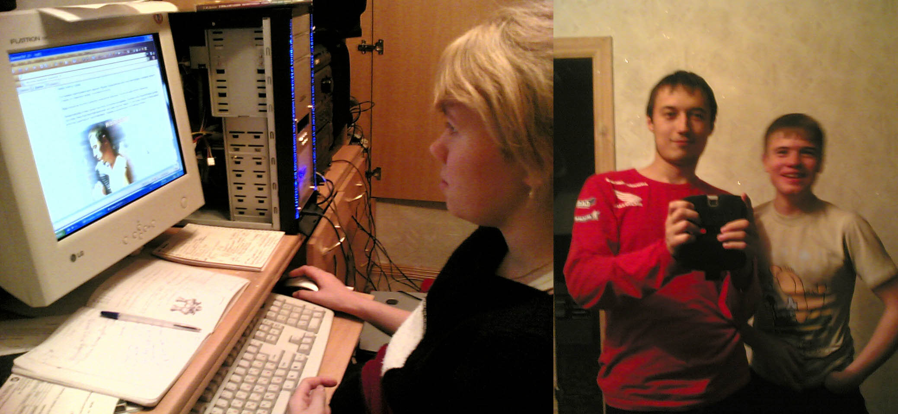

На начало 2005 года мне **21 год** и я учусь на **5 курсе** мед. академии. Этот год стал одним из самых веселых в моей жизни. Мы еще были достаточно молодыми, чтобы хотеть тусить, и уже достаточно взрослыми, чтобы такие тусы организовывать. Это было торжество электро-хауса.

`video: https://youtu.be/WNnD2MWoPNI`

Новый год отметили у меня. Перед новым годом мне провели телефон, я подключил диалап-модем и мы всю ночь резались в Старкрафт по интернету. Девочки остались недовольны. В связи с появлением интернета у меня появилась возможность заниматься созданием сайтов.

Учеба в институте шла на автомате. Предметы в основном повторялись и нам уже не приходилось зубрить ночами, как это было на первых курсах. Пришло время для зажигательных вечеринок.

Первым таким событием стал «Питерский десант» &ndash; фестиваль электронной музыки, проходивший в ледовом дворце, гиганская арена которого была застелена резиновыми ковриками.

`video:https://youtu.be/ny_zk9_wvmI`

Мероприятие шло всю ночь, наша подруга Светка жила рядом и мы бегали раздетые по морозу до ее дома, чтобы отдохнуть и подкрепиться. Нас было около 15 человек, а общая стилистика чем-то напоминала "Криминальное чтиво" с их дикими танцами. Это было очень круто.

С мая у нас с Барсуком вообще начался бесконечный праздник. Мы занимались всякой ерундой: ездили в Саракташ, тусили у Шакира, ходили на речку фотографироваться в корнях. 

`video:https://youtu.be/N3kkNfH4yco`

Я в то время читал Пелевена и Ирвина Уэлша, а также интересовался различными медитативными практиками. Однажды мы с ребятами весь день просидели на поле, жаря шашлыки и медитируя по теплым весенним дождиком. 

###Лето

В начале лета Машка закончила училище и переехала жить ко мне в Оренбург. Шесть предыдущих лет я безуспешно бегал за ней и вот наконец у нас что-то стало получаться. Я был просто счастлив. 

`video:https://youtu.be/HPssThWONWk`

Мы ездили на военные сборы к моим одногруппникам, ходили в Дали и регулярно зависали ночами в компьютерных клубах. А потом открыли для себя волшебную "Амнезию". 

Дискотеки, куда мы ходили ранее, обычно проходили в залах кинотеатров или домов культуры. Из колонок играла попса, девочки танцевали в кругу возле сцены, а вдоль стен сидели их пьяные друзья в надвинутых на глаза шапках. Молодежь напивалась до блевоты, хамство и драки были нормальным явлением, а вокруг постоянно патрулировала полиция. У меня такие места вызывали отвращение. 

Наш друг Стас прилагал большие усилия, чтобы превратить Саракташскую дискотеку в хорошее место: покупал оборудование, привозил современную музыку, учил ребят сводить пластинки. Постепенно там даже сформировалось сообщество молодых ди-джеев, но в плане поведения посетителей больших сдвигов не было.

Розовая пантера, где работал Барсук, была заведением гораздо приличнее. Здесь в основном собирались братки после тяжелых трудовых будней. Даже после того, как там поменяли концепцию, добавив клубу танцевальной направленности, вокруг него все равно сохранялся бандитский ореол. Мои пацаны приезжали туда играть в казино и пить бесплатное пиво.

Амнезия же была клубом нового типа, сделанным на западный манер. Там практически не было пьяных. Клуб был разделен на 2 части: основную с танцполом и баром и зону отдыха, где играла тихая музыка и можно было всю ночь валяться на креслах-подушках. 

В Амнезии крутили модный тогда электро-хаус. Мощный пульсирующий электронный бас и четкий ритм в сочетании с лазерами и стробоскопами создавали глубокий гипнотический эффект. Электро-хаус стал наиболее заметным танцевальным стилем 2000х, во многом определив дальнейшее развитие популярной электронной музыки.

`video:https://youtu.be/li_YrAgoVCc`

Летом в Саракташ съехались наши многочисленные друзья из других городов. Марина, Миша, Рустам, Шакир с Тоськой, главный промоутер всех движух – Барсук, оба Джона и мы с Машкой.

Мы провели две большие вечеринки ночью на реке (на ДР Марины и Маши) – зомби-апокалипсисы, когда народ ночью бродил в темноте вдоль берега, а Барсук бегал утром, завернувшись в ватное одеяло.

`video:https://youtu.be/fmoz1ru3Y1k`

На ДР Барсука мы вытащили Марину с собой в Амнезию и ей там даже понравилось, несмотря на религиозность. А утром, после ночи на танцполе, мы ездили утром купаться на пруд в кузове грузовой газели. Это было прикольно.

Кульминацией вечеринок стал мой ДР, на который в Амнезии собрались все мои друзья, за исключением Насти Тюркиной, которую мы в этот день провожали домой. Туса была что надо и завершила самое веселое лето, которое мы еще долго потом вспоминали.

`video:https://youtu.be/N3qCSlgBXn0`

Кроме организации вечеринок мы еще много гуляли, лазали по всяким стройкам/заводам, настраивали спутниковый интернет и тусили в магазине у Стаса. 

Я изучал программирование и к концу лета выложил в интернет сайт Саракташа.

###Осень

Осенью мне исполнилось **22 года**. Началась уже порядком надоевшая учеба, к нам в группу пришел Шакир. Шел последний **6 курс**.

У меня появился новый смартфон – эксперементальная Нокия 7710 с сенсорным экраном. С ним я прохожу следующие 5 лет.

`video:https://youtu.be/2fZow8S1GfM`

Мама переехала в другую квартиру, оставив нас вдвоем. Ребята и сосед периодически приходили к нам в гости потусить, мы никогда не отказывали.

Машка заочно училась в институте и работала в Амнезии, мы регулярно ходили в танцевальные и компьютерные клубы, играли в Варкрафт и занимались холотропным дыханием. 

В конце ноября я ездил на свадьбу к Андрюхе, приезжала Нина. 

Последнюю вечеринку года мы провели у Маши в Саракташе, с Диляркой, Лешиком и всей нашей традиционной компанией. Было очень весело.

> Поздравляю всех с Новым 2006 Годом!!!! Т.к мы с Маськой уезжаем в Саракташ, а потом в Екатеринбург, появимся здесь не раньше 10 числа. Еще раз всех поздравляю :) !!!

написал я в дневнике, когда отошел от долгих ночных брожений по улицам Саракташа. Начинался 2006 год.

### Хорошая музыка из 2005 года:

- [Havana Funk – Bakiri Ban (major boys remix)](https://youtu.be/ny_zk9_wvmI)
- [Decl And Benzina – Legalize(Dub Uplifto Edit)](https://drive.gybka.com/song/48003353/Decl_And_Legalize_-_Benzina_Dub_Uplifto_Edit/)
- [KID Q – Save Me (acrylite remix)](https://ru235.iplayer.info/song/78765603/KID_Q_-_Save_Me_acrylite_remix/)
- [Michael Gray – Can't Wait For The Weekend](https://youtu.be/N3kkNfH4yco)
- [C-MoS – 2 Million Ways (Axwell Remix)](https://youtu.be/HPssThWONWk)
- [Benny Benassi – Love Is Gonna Save Us](https://youtu.be/ORRRKqn39o4s)
- [Global Deejays – Flashdance](https://youtu.be/w2ohwM9iO6k)
- [MAN-RO – Bambarbia (Lead Radio Mix)](https://youtu.be/N3qCSlgBXn0)
- [Катя Чехова – Я робот](https://youtu.be/fmoz1ru3Y1k)
- [Чугунный скороход – половинка (buzz_mix)](https://youtu.be/8cV6ndTWZns)
- [Casteam – I Don't](https://youtu.be/XP-7RpLnShM)
- [Whitelabel – Not With You](https://youtu.be/2fZow8S1GfM)
