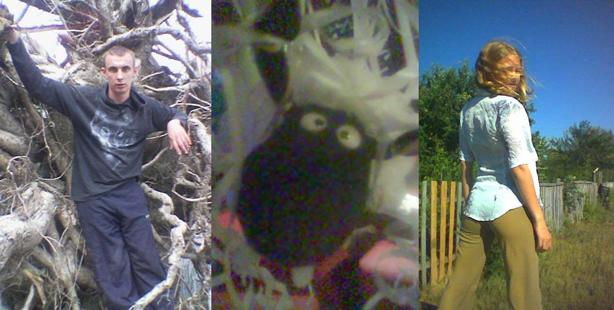

На начало 2005 года мне **21 год** и я учусь на **5 курсе** мед. академии. Этот год стал одним из самых веселых в моей жизни. Мы еще были достаточно молодыми, чтобы хотеть тусить, и уже достаточно взрослыми, чтобы такие тусы организовывать. Это было торжество электро-хауса.

Новый год отметили у меня. Перед новым годом мне провели телефон, я подключил диалап-модем и мы всю ночь резались в Старкрафт по интернету. Девочки остались недовольны. В связи с появлением интернета у меня появилась возможность заниматься созданием сайтов.

Первым крупным и действительно запоминающем событием стал «Питерский десант» в ледовом дворце, проходивший, если мне не изменяет память, 11 февраля. Нас посетили Dj-и Врунгель, Pasha Like, Майор и ещё кто-то.

`video:https://youtu.be/ny_zk9_wvmI`

Мы напечатали дополнительных билетов, квартировались у Светки и бегали голыми по морозу от ее дома арены. Было очень круто.

На выходных мы ездили с Барсуком в Саракташ. На майские праздники праздники жарили шашлыки у Шакира, когда я сидел и слушал музыку под дождиком на футбольном поле. На Джоновский ДР ходили на речку фотографироваться в корнях.

`video:https://youtu.be/N3kkNfH4yco`

####Лето

В начале лета Машка закончила училище и переехала жить ко мне в Оренбург. Я был просто счастлив.

Мы ходили в клуб "Дали", ездили на военные сборы к моим одногруппникам или зависали ночами в компьютерных клубах. А потом открыли для себя клуб "Амнезия".

`video:https://youtu.be/HPssThWONWk`

Летом в Саракташ съехались наши многочисленные друзья из других городов. Марина, Миша, Рустам, Шакир с Тоськой, главный промоутер всех движух – Барсук, оба Джона и мы с Машкой.

Мы провели две большие вечеринки ночью на реке (на ДР Марины и Маши) – зомби-апокалипсисы, когда народ ночью бродил в темноте вдоль берега, а Барсук бегал утром, завернувшись в ватное одеяло.

`video:https://youtu.be/fmoz1ru3Y1k`

На ДР Барсука мы вытащили Марину с собой в Амнезию, ей очень понравилось в клубе несмотря на религиозность, после чего мы ездили утром купаться на пруд в кузове грузовой газели. Это было прикольно.

`video:https://youtu.be/li_YrAgoVCc`

Кульминацией вечеринок стал мой ДР, на который в Амнезии собрались все мои друзья, за исключением Насти Тюркиной, которую мы в этот день провожали домой.

`video:https://youtu.be/N3qCSlgBXn0`

Кроме этого, мы много гуляли, лазали по всяким стройкам/заводам, настраивали спутниковый интернет, тусили в магазине у Стаса, запустили сайт Саракташа.

####Осень

Осенью мне исполнилось **22 года**. Началась уже порядком надоевшая учеба, к нам в группу пришел Шакир. Шел последний **6 курс**.

`video:https://youtu.be/2fZow8S1GfM`

Машка заочно училась в институте и работала в Амнезии, мы периодически ходили в танцевальные и компьютерные клубы, играли в Варкрафт, занимались холотропным дыханием.

В конце ноября я ездил на свадьбу к Андрюхе, приезжала Нина. А еще меня появился новый телефон – эксперементальная Нокия 7710.

Последнюю вечеринку года мы провели у Машки, с Диляркой, Лешиком, Иринкой, и всей прочей традиционной компанией. Было очень весело.

"Поздравляю всех с Новым 2006 Годом!!!! Т.к мы с Маськой уезжаем в Саракташ, а потом в Екатеринбург, появимся здесь не раньше 10 числа. Еще раз всех поздравляю :) !!!" – написал я, когда отошел от долгих ночных брожений по улицам Саракташа. Начинался 2006 год.

####хорошая музыка из 2005 года:

- Havana Funk – Bakiri Ban (major boys remix)
- Decl And Benzina – Legalize(Dub Uplifto Edit)
- KID Q – Save Me (acrylite remix)
- Michael Gray – Can't Wait For The Weekend
- C-MoS – 2 Million Ways (Axwell Remix)
- Benny Benassi – Love Is Gonna Save Us
- Global Deejays – Flashdance
- Layo & Bushwacka – Love Story
- MAN-RO – Bambarbia (Lead Radio Mix)
- Катя Чехова – Я робот
- Чугунный скороход – половинка (buzz_mix)
- Casteam – I Don't
- Whitelabel – Not With You
