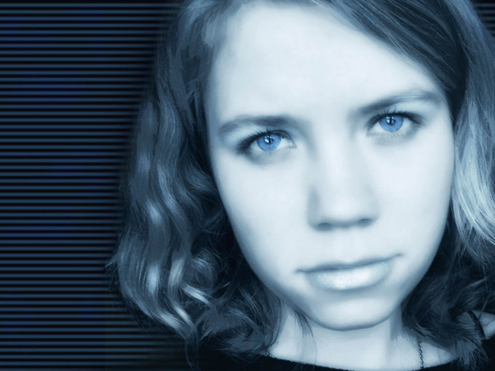
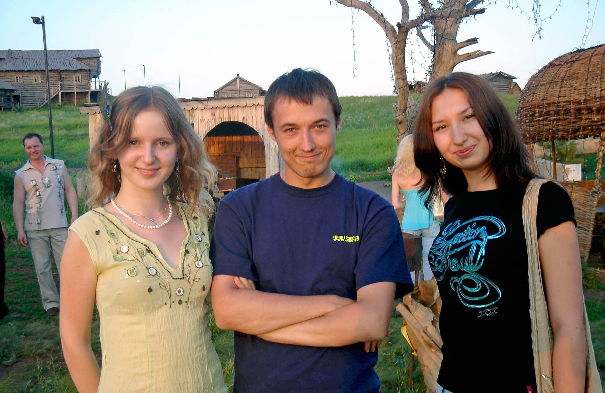

Мне **22 года** и я учусь на **последнем курсе** мед. академии.

`video:https://youtu.be/QpnfMPiIGdw`

После маньячного Нового года у Машки, когда я всю ночь гулял по улицам Саракташа, 
мы в первый раз съездили в Екатеринбург, где я попал в больницу. 

В прошлом году мама переехала в другую квартиру и мы стали жить самостоятельно. 

Зимой Машка какое-то время работала в «Амнезии», а потом устроилась монтажером на оренбургское телевидение. 

Я заканчивал последний курс института, помогал Друзю с диссертацией, посещал кружок психиатрии и выступал с докладом на СНО. 

Мы с группой ездили в санаторий на восстановительную медицину и ходили в морг. Вместе с нами туда одно время ходил Барсук.

`video:https://youtu.be/3A5NsXaAkK4`

Однажды они со Светкой приехали к нам ночью и мы смотрели кино на простыне. 

Также мы с пацанами периодически ездили а Саракташ, пили пиво, гуляли, катались на снегоходе, ездили на свадьбу к Лешику в Салават. Весной у Маши умер папа, а у меня бабушка.

В мае я лежал в больнице от военкомата. Потом началась подготовка к итоговым экзаменам, удачную сдачу которых мы отмечали у Ольги на даче. 

Ура, мы закончили институт!

###Лето

Летом мы снова собрались нашей большой компанией в Саракташе. Отмечали юбилей деда, ели тарик, ходили на природу с Мариной, Барсуком и пацанами, зависали у Андрюхи и Оксаны, играли в компьютер.

В середине нулевых наблюдалось бурное развитие коммуникаций. В 2004 у меня появился диалап-интернет, он был очень медленным. В следующем году мы попробовали с Барсуком настроить спутниковую тарелку, но получилось так себе. На ней нормально можно было только «рыбачить» – собирать трафик всех пользователей в одну папку и потом перебирать. С 2006 появился ADSL, а в 2010 – оптоволокно.

Мне нравилось программировать и учиться новому, особенно веб-разработке. В прошлом году наш друг Стас выкупил доменное имя Saraktash.ru и я сделал первый сайт поселка. 

`video:https://youtu.be/YtceWarmbKI`

Вокруг сайта быстро образовалось сообщество из первых пользователей интернета, на форуме бурлила жизнь, а летом мы решили устроить первую встречу в реале.

Стас и старшие товарищи помогли с организацией. Мы арендовали крепость на Красной горе, перетащили туда оборудование из клуба и устроили грандиозную ночную вечеринку (первый «Превед»). 

Сайт будет жить следующие 5 лет, пока не умрет при появлении социальных сетей, а мы проведем еще 2 таких вечеринки. 

Работа над ним дала мне практические знания по программированию и кучу новых знакомых. А еще через 10 лет это станет моим основным занятием.

В 2006 популярны форумы, чаты, icq-мессенджеры, сайты знакомств и первые браузерные игры. Интернет в те годы – это абсолютная свобода, никаких запретов, никакой цензуры. Главное место в рунете – Живой журнал, набор высококачественных блогов, где люди пишут и спорят на разные темы. Даже Маша стала вести дневник по моему примеру, а я свой наоборот забросил.

Из техники получают распространение плоские ЖК-мониторы и смартфоны Nokia на Симбиан. У меня экспериментальная модель, в виде кошелька с сенсорным экраном, с ней я буду жить целых 5 лет. Первый айфон выйдет только в следующем году, а нормальный андроид – в 2010. 

В августе дважды ездили в Соль-Илецк : сначала со Светкой и машиной мамой, а второй раз, на Машин ДР – с ее дядей и Зиной. 

Периодически к нам в гости заезжали Барсук со Светкой, Илья с Ленкой, Марина и сосед Малой.

Светка с Машкой любят играть в Героев меча и магии. Но наша самая главная страсть - Варкрафт 3. Я подсадил на него всех своих друзей и даже Машку. На выходных мы ходили на всю ночь в компьютерный клуб, а с соседом даже натянули кабель, чтобы играть в него по сети.  

Внутри Варкрафта несколько игр на любой вкус: классическая стратегия, игра за героя (будущая Дота) и карты с дорожками (будущий Tower Defence). А еще из него вырастит величайшая онлайн-рпг – WordOfWarcraft.

###Осень

Осенью мне исполнилось **23 года** и я поступил в **интернатуру** по психиатрии. На мой ДР ходили на «Бенасси», было скучно. В плане музыки сохранялось доминирование электрохауса, но сами вечеринки стали более примитивными, а мои институтские друзья разъехались. 

`video:https://youtu.be/-ue-vxgDTPk`

Маша заочно училась в институте на менеджера, я делал за нее контрольные по информатике. Мы вместе смотрели Вавилон, играли в Варкрафт и ездили в Саракташ. Однако разница во взглядах на жизнь постепенно разрушала наши отношения и мы стали друг друга раздражать.

Маше хотелось от меня свадьбы и больше тусняков, а мне – погружения в компьютер и свой внутренний мир. Она все чаще стала гулять по ночам с подругами и мы все чаще стали ссориться. 

Примерно такое же происходило между Барсуком и Светкой, у которой мы отмечали Новый Год. Там было скучно и неуютно. Мы всю ночь проговорили с Джоном на диване, а потом с Машкой и Зиной уехали в Екатеринбург, где окончательно поссорились.

`video:https://youtu.be/kXCHdpaT_Zk`

Так, на грустной ноте, начался 2007 год.
