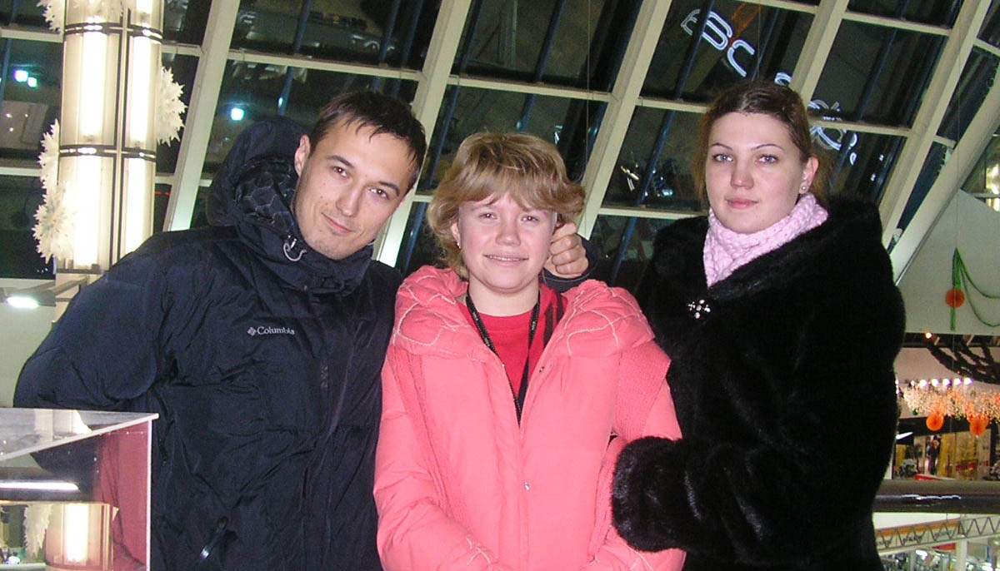
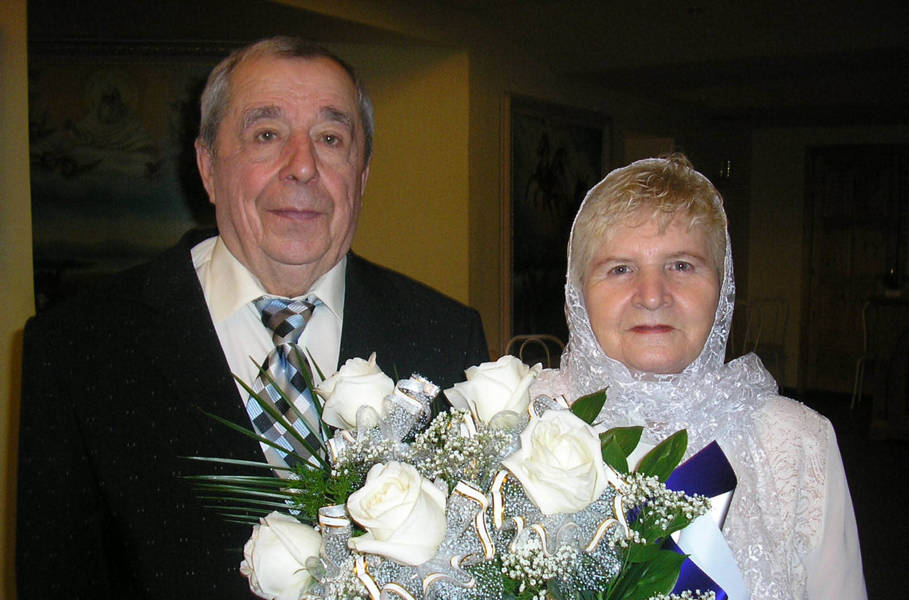

Мне **23 года** и я учусь в **интернатуре** по психиатрии.

После скучной встречи нового года у Светки мы с Машкой съездили в Екатеринбург, где окончательно поссорились. 

Потом я узнал про их отношения с Джоном, заболел ангиной и впал в депрессию. Все это сильно напоминало начало [2002 года](../2002).

`video:https://youtu.be/z_UKhF-_XCs`

Вскоре Машка уехала в Екатеринбург, а Светка в Москву. За последние 9 лет мы трижды пытались построить отношения, но каждый раз неудачно. 

Мои бабушка и дедушка отмечали 50 лет совместной жизни, а у меня завершилась история, тянувшаяся аж с [1995 года](../1995). Окончательная точка буде поставлена в [2014 года](../2014), когда я увижусь с Анютой и женюсь на Саше. Но до этого еще далеко.

А пока я ходил на практику в ПНД, посещал занятия по наркологии, готовился к экзаменам, писал дневник практики и делал сайт Мастерицы.

Однако одиночество длилось не долго и уже весной мы начали встречаться с Настей, которой я давно нравился. Настя была сестрой моего друга Ильи, училась в пед. институте и часто тусила с нами. Мы встречались по выходным, гуляли по весеннему Оренбургу и ездили в Саракташ, играли в мортал комбат и учили эсперанто, все было хорошо.

`video:https://youtu.be/ner4CTmYFeY`

###Лето

В июне, после сдачи выпускных экзаменов в интернатуре, я загремел в больницу с пневмотораксом. Стояла речь об операции, было очень страшно, но все обошлось. После этого я окончательно бросил курить, что считаю одним из главных своих достижений. Из-за болезни мой летний отпуск продлился аж до октября.

Летом Настя уехала в лагерь работать вожатой, а я помирился с Джоном. 

Мы снова отмечали "Превед" на Красной Горе. Я сделал вторую версию сайта Saraktash.ru, значительно оптимизировав скорость загрузки. Параллельно я активно изучал PHP, написав интернет-магазин полностью с нуля в блокноте.

Тусил с ребятами с сайта, красил с Валерой машину и рисовал графити.

Ездил на природу с Андрюхой и Мариной.

Дважды с Ольгой и Ильей путешествовали по Башкирии, заезжали к Лешику и Насте, доехали аж до Стерлитамака, тусили у дяди Ильи. 

###Осень

Осенью мне исполнилось **24 года** и я устроился в ПНД, ходил на работу пешком и жил в свое удовольствие. 

Поначалу был весь завален работой, куча бумаг, брал на дом писать истории, но потом вошел в ритм. В основном я сидел на приеме, а один день в неделю ездил на вызовы. Посмотрел такие места, куда нормальный человек никогда не доберется. График работы был посменным, у меня было куча свободного времени. Также я помогал Друзю с написанием статей.

`video: https://youtu.be/Mf4JFb89IYE`

Каждую неделю у меня кто-то тусил: то Андрюха, то малой, то Илья, то Барсук, то Майер, то Кузнец. Ну и конечно Настя регулярно приезжала. Мы вместе готовили, гуляли и смотрели кино. Я сочинял для нее японские стихи и делал картинки в фотошопе.

Я играл в игрушки, ел все вредное (жаренную картошку с корнишонами) и пил пиво. Долго такая лафа продолжаться не могла – однажды мы с Андрюхой отравились пивом и началась моя эпопея с диетами и лечением желудка.

В ту осень Барсуку сломали челюсть и он уехал в Москву. у Андрюхи родился сын, приезжал Миша из Тулы, мы тусили с ним и Шакиром в Саракташе. А еще мы там провели Первую гламурную RnB-вечеринку.

А еще в ноябре мы ездили с Ольгой на юбилей к Лешику.

С одной стороны работа была ненапряжной. С другой стороны, зарплата была маленькая и меня угнетал мысль, что я всю жизнь буду сидеть в обшарпанной поликлинике и слушать сумасшедших. Мне даже запрещали печатать документы (только писать), это был полный маразм. 

При приеме на работу главврач расказывал, что делает мне этим большое одолжение, тк свободных ставок нет. Когда спустя пару месяцев я решел уволится, он не хотел меня отпускать, тк оказывается штат укомплектован только на половину. Это был мой первый неудачный опыт работы в практической медицине. В 2015 [будет второй](../2015).

В ноябре моя одногруппница Ленка выбила место себе место в ординатуру, но учиться не смогла из-за беременности. Так мне удалось поступить в ординатуру и я был очень счастлив. 

