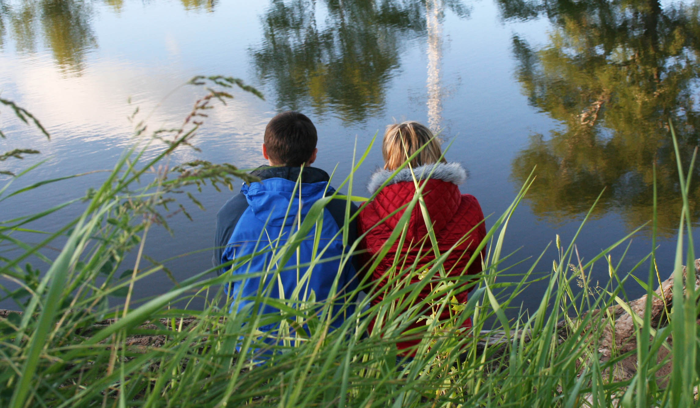
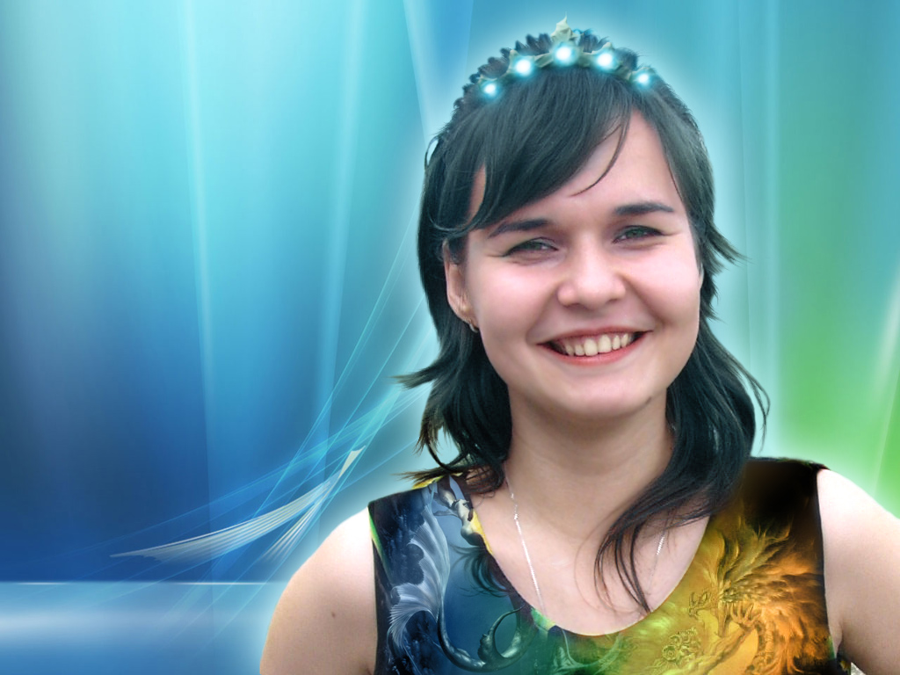

Мне **24 года** и я учусь в **ординатуре** по психиатрии.

Новый 2008 год мы отметили у меня дома, с Шакиром, Надей и Джонами. 

Потом на все каникулы ездили в Саракташ, где провели «Первую гламурную RNB-вечеринку». 

Среди молодежи набирает популярность рэп, ребята проводят батлы и выступления, записывают свои песни и выкладывают их на сайте Саракташа. 

`video:https://youtu.be/t5x3Ke21hUA`

Я не особо люблю такое направление, предпочитая транс и электрохаус. Да, мне нравится общая энергетика и танцевальный бит, но мне также хочется, чтобы в музыке была мелодия и интересные звуки, а в идеале и гипнотическое звучание.

`video:https://youtu.be/c4TORCoH5Rg`

Сайт был основательно оптимизирован, теперь он быстро открывается, даже на моем телефоне. Хотя мобильников с сенсорными экранами почти ни у кого еще нет, первые айфоны появятся только летом.

Я дружу с Настей, сестрой моего друга Ильи. Настя заканчивает пед. институт и собирается поступать в аспирантуру. 

Она артистичная, любит придумывать всякие игры и дарит мне самодельные подарки, открытки и плакаты с конфетами. А я сочиняю японские стихи, учу эсперанто, рисую смешные рисунки в паинте и чувствую себя счастливым.

Мы ездим друг к другу на выходные, гуляем по паркам или смотрим сериал «Рим».

Я учусь в ординатуре по психиатрии, хожу в психбольницу пешком по весенним лужам, а дома играю в Doom 3, Unreal Tornament и Fallout Tactics. 

`video:https://youtu.be/6xUnSVTh8fI`

На кафедре я составляю учебные пособия для студентов, настраиваю электронный документооборот, натягиваю сети и изучаю Линукс. 

Настя очень усердно училась, сначала она стала лучшей студенткой вуза, а в конце весны выиграла Всероссийскую олимпиаду по педагогике и заболела звездной болезнью. Постепенно наши отношения становились все хуже и в течении лета стали совсем плохими.

Весной в квартире начался ремонт и я переехал жить к маме. 

На Майера упала бетонная плита, он потерял память, лечил его и помогал с реабилитацией. 

### Лето

Настя на все лето уехала в лагерь, отказавшись от поездки в Калмыкию. Я на каникулах ездил в Саракташ, где мы организовывали последний «Превед». 

Гулял с пацанами и Настей Тюркиной. 

`video:https://youtu.be/ZL5m_5Ik74A`

Ездил на речку с Мариной, Андреем и Оксаной.

Лечил желудок, читал Пелевена, книжки про буддизм и сетевой маркетинг.  

Встречался с Лешиком. Вместе с Ильей ездили в Саракташ на празднование дня города.

Меня с детства интересовала эзотерика, но чем глубже я туда погружался, чем четче осознавал, что это полная ерунда, а поработав в психбольнице понял, что это лишь игры разума. 

`video:https://youtu.be/8ayRMVlsSZM`

Пару лет назад я прочитал книгу «Крылья пробуждения» и поразился, насколько глубок буддизим и насколько он похож на когнитивно-поведенческую психотерапию. Буддизм станет моим последним религиозным увлечением. Как настоящий буддист, я не делал ничего.

Летом в Калмыкию привезли выставку буддийских реликвий, я решил туда съездить. Так как Настя отказалась, компанию мне составила мама.

Калмыкия оказалась удивительной, вроде бы Россия, но какая-то совсем другая, экзотическая. Эта поездка оставила яркие и приятные воспоминая. 

Однако посмотрев на традиционный буддизм вблизи, энтузиазма у меня несколько поубавилось. Если западный буддизм похож скорее на рационально-этический кодекс, то народный буддизм это почти как православие. Через несколько лет, пройдя личную психотерапию и познакомившись с доказательной медициной, я окончательно стану на торону скептицизма.

 После Калмыкии мы заехали на Казантип &ndash;  крупнейший фестиваль элетронной музыки, куда я со школы мечтал попасть. В деревне Поповка, рядом фестивалем, столи покосившиеся домики, где днем под навесами отдыхали наркоманы, а по разбитым колеям ездили дорогие спортивные машины. Там мы протусили всю ночь.

Побывали в Севастополе, ездили на станцию космической связи. Остаток отдыха провели преимущественно в Ялте, одили на море, гуляли по паркам.

Параллельно с буддизмом, я стал увлекаться всем восточным, сидел на корточках, ел палочками и даже ремонт в квартире делал в таком стиле. Пока я жил у мамы, рабочие сломали стены, поменяли окна и полностью переделали интерьер. 

В тот период я нашел много хорошей эзотерической музыки: мистические суфии Toires и Thunder Of The Swords, индейские вожди Karunesh и Alborada del Inka, разнообразный Oliver Shanti, готическая Era и Lesiem.

`video:https://youtu.be/cPTAvSW_L2U`

`video:https://youtu.be/1xMVgqU9kTc`

### Осень

Начало осени было достаточно мрачным. Мне исполнилось 25&nbsp;лет, я&nbsp;расстался с Настей и не стал отмечать свой юбилей.

Большую часть времени проводил дома за компом, почти ни с кем из друзей не общался и, начитавшись невротизирующих книжек про успешность и личностный рост, почти постоянно находился в напряжении и рефлексии. 

Ближе к зиме стало немного получше. Я тусил на кафедре, верстал методичку для интернов, помогал Друзю писать статьи, подружился с Сашей Шлафером.

`video:https://youtu.be/GEBoBlz_eIY`

Ко мне на отделение пришли Татьяна Бондарева и Наташка Кузьмина. 

Я играл в Fallout и Fear, верстал сайт для роддома. Примерно в то же время у меня зажила эрозия, хотя диету я так и продолжал соблюдать. 

Получили распространиение социальные сети, которые изменят вид интернета. Они и будущая цензура постепенно убъют сайт Саракташа. Благодаря скайпу и видеозвонкам я могу созваниваться с ребятами из других городов, в основном с Лешиком и Настей Тюркиной. 

В следующем году я уеду из Оренбурга и буду общаться с друзьями только по интернету.