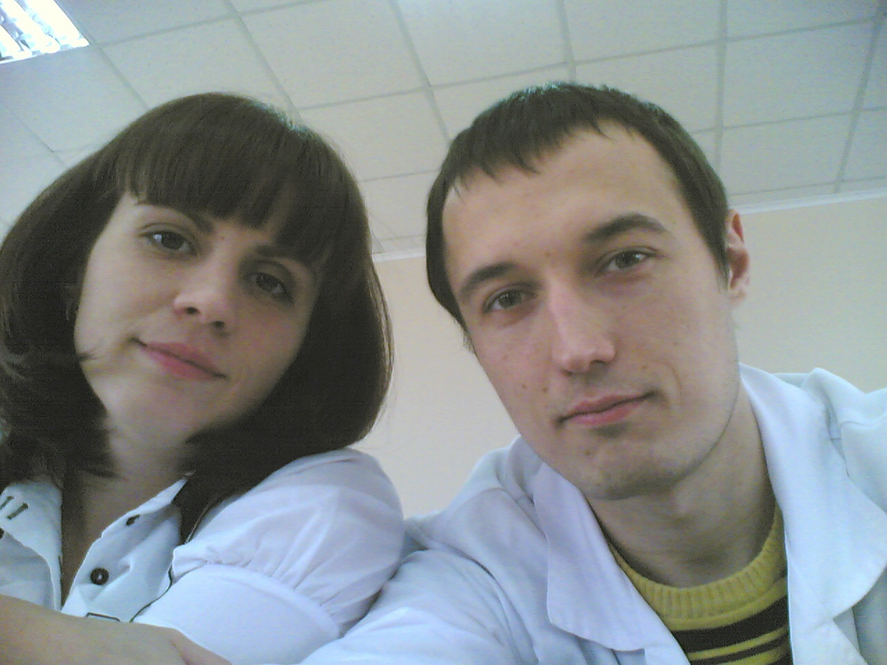
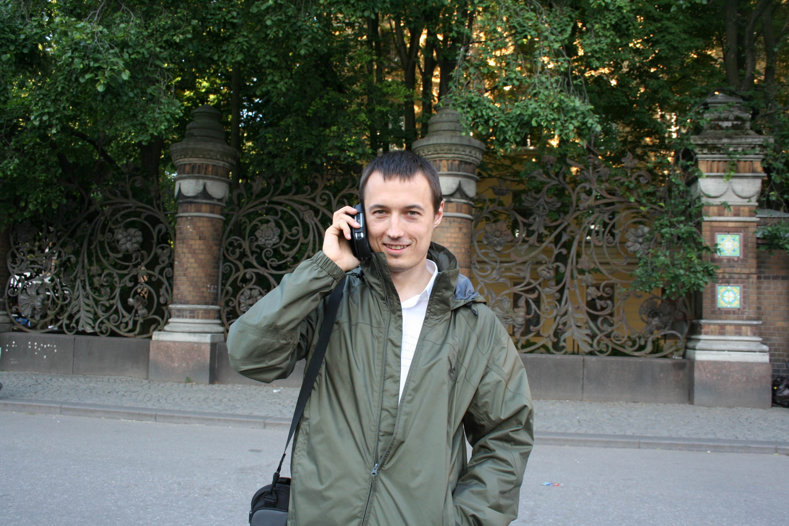
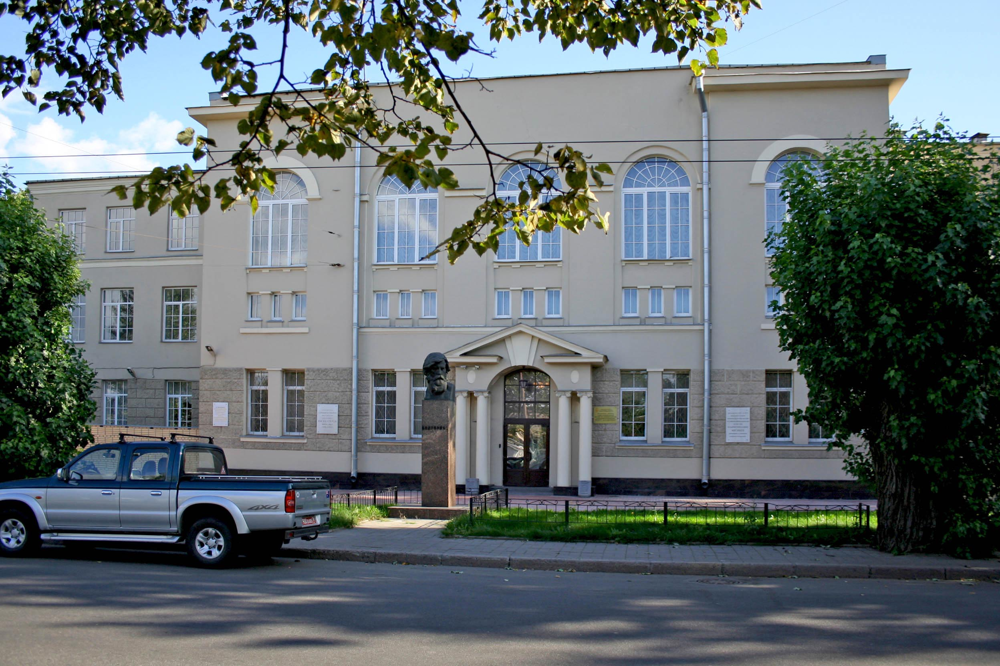
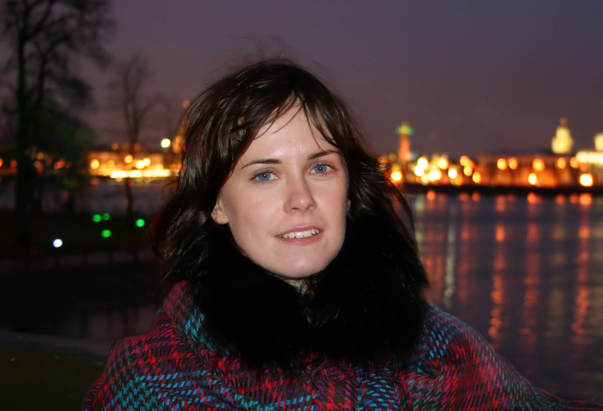

Основным событием 2009 года стало поступление в аспирантуру и переезд в Питер. 

Мне **25 лет**, идет второй год **ординатуры** по психиатрии. 

В то время я жил у мамы, т.к. в моей квартире на Кичигина шел ремонт. За исключением работы почти ни с кем не общался, иногда только гулял с Барсуком, а больше зависал дома за компом. 

Прочитанные ранее книги на тему бизнеса, расстройство желудка, диета, чувство одиночества, ограниченное общение друзьями и отсутствие любимого человека меня порядком невротизировали.

Были конечно и позитивные моменты: я делал сайты, оформил Майеру инвалидность, гулял по весеннему Оренбургу с Барсуком, Татьяной Шулаевой и Наташкой Кузьминой.

`video:https://youtu.be/HkidrPBvwd0`

Доделал ремонт, написал статью и методичку, отсканировал все свои рисунки, закончил ординатуру. 

`video:https://youtu.be/DJbJ97PM0ao`

После окончания ординатуры встал вопрос, что делать дальше. Сам я думал, что пойду обратно работать в диспансер, но мне хотелось. Была возможность выучиться на программиста axapta, но это значило перечеркнуть всю медицинскую подготовку, мне было жалко. 

Поэтому когда мне на кафедре предложили ехать в Питер заниматься наукой, я решился. Было много сомнений, получится ли, как я там буду жить один, смогу ли осилить учебу и т.п., как оказалось, беспочвенные страхи. 

Пришлось подтянуть английский, собрать документы, поволноваться, но все прошло хорошо. Так я оказался в Питере.

###Лето

После сдачи документов все лето провел в Саракташе. 

Тусил с пацанами, встречался с друзьями по cайту.

Ездил с родней на речку. Играл в Fear2 и Assassin creed.

Ходил на свадьбу к Илье и Денису Кузнецову, где был свидетелем.

Пока я вечером тусил со свидетельнецей, ее сестру убили, предположительно родственники невесты. Немного прикоснувшись к народному духу, мне очень захотелось свалить из этого окружения. 

###Санкт-Петербург

Осенью моя жизнь круто поменялась. Мне исполнилось **26 лет**, я поступил в **аспирантуру** и уехал жить в **Петербург**.

Вместе со мной сюда приехал и Барсук. С ним и Ромой мы тусили каждые выходные. Пацаны нашли работу своей мечты и периодически я катался с ними по прекрасному ночному Питеру, это было очень круто. 

Первое время было все такое новое, клевое, интересное. На работе меня сильно не напрягали, я искал литературу, вел творческую милье-терапию. Гулял с Мариной, виделся с Толиком, ездил по пригородам с Танюхой Шулаевой.

`video:https://youtu.be/dIF2m4fkTW8`

В конце года я набрался смелости и познакомился с Сашей, моей будущей женой, в которую влюбился с первого взгляда еще при поступлении в аспирантуру. 

 

Я не знал Сашиной фамилии, поэтому мне пришлось провести целую спецоперацию, чтобы заглянуть в ее личное дело. 

Также в конце года решился вопрос с квартирой и я переехал на Малую Каштановую.

За этот год я посмотрел **20 фильмов** (в т.ч. Стиляги, Хранители, Аватар) и прочитал **26 книг**.  
Слушал: нейрофанк, full-on trance, тибетскую музыку и радио Рекорд.  

