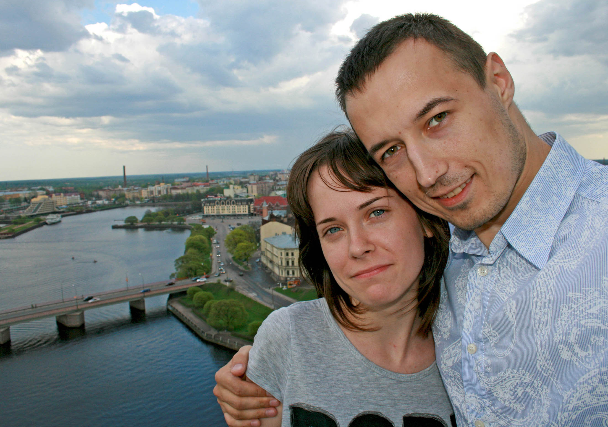
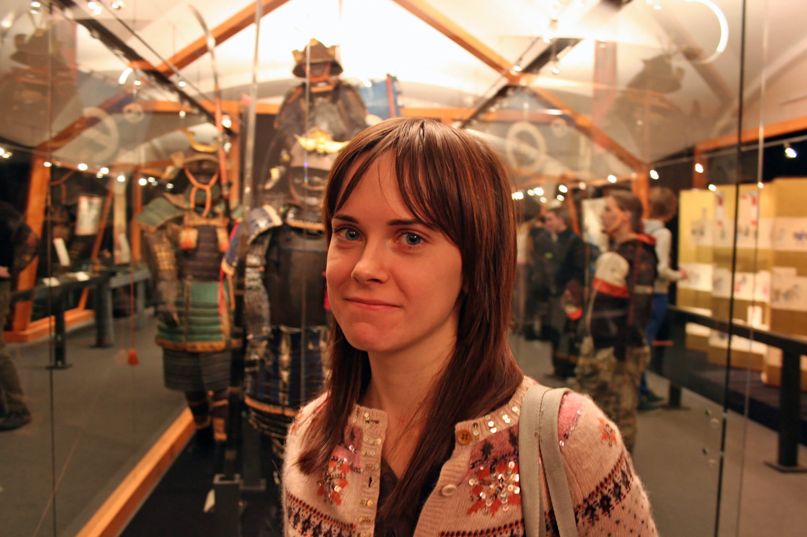
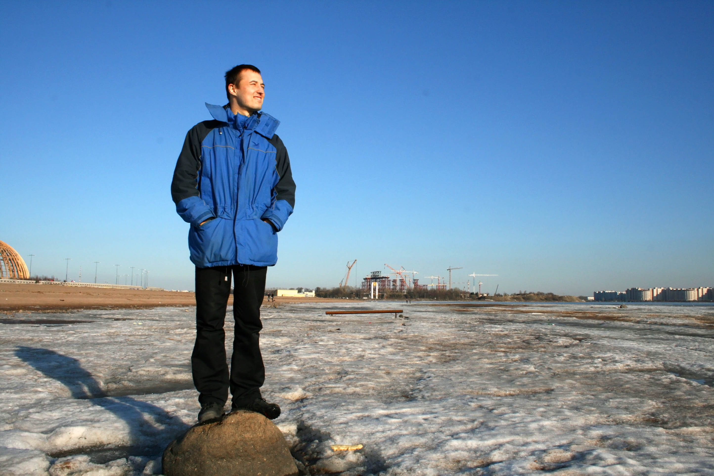

На начало 2010 мне **26 лет**. Полгода назад я приехал в Питер, чтобы учиться в аспирантуре в институте. Вместе со мной приехал мой друг Барсук.

Я работаю в отделении геронтологии НИИ им. Бехтерева. Мой официальный руководитель, Н.Г. Незнанов, главный психиатр и директор этого института, но его я вижу редко. Непосредственно мной руководят две женщины: суровая и властная Н.М. Залуцкая и зав.отд. С.Е. Татульян – милейший души человек. 

Еще у нас пара докторов, пара психологов, много учащейся молодежи и атмосфера творческого бардака. Старинный особняк, большой парк, интересные задания и умные люди – почти как Хогвартсе.

Как доктор я курирую несколько больных на отделении и веду амбулаторный прием, а вечером провожу групповые занятия с бабушками. Если приходят пациенты, подходящие для исследований, то беру у них анализы или даю лекарства. Пару раз в месяц развожу кровь по другим лабораториям города. Мы изучаем причины потери памяти и снижения настроения. Основная целевая аудитория – дамы за семьдесят.

Еще я хожу на лекции и подготовительные занятия, где иногда вижу Сашу.  Перевожу иностранные статьи, выписываю незнакомые слова и учу их в автобусе. К концу года я научился читать тексты без словаря и успешно сдал кандидатские экзамены.

С диссертацией пока ничего непонятно. Незнанов поручил мне расследовать гипотезу, что депрессии могут приводить к деменции. Я честно ходил по диспансерам и по результатам была написана моя первая самостоятельная статья, но толку от этого особого не было. 

Вообще, идея о том, что можно делать науку где-то вовне, глубоко порочна. Исследования нужно проводить там, где ты работаешь, на материале своих пациентов и в знакомой обстановке. Если же тебя отправляют незнамо куда, на правах золушки смотреть архивы или проверять туманные фантазии, это просто трата сил и времени. Из за этого от нас ушла пара хороших ребят. 

К концу года эта мысль пришла и к моему руководителю. Мне наконец-то утвердили тему диссертации – изучение депрессий у пожилых. Саша в это время тусила на отделении неврозов и исследовала личности у алкоголиков. На работе мы не общались и делали вид, что не знакомы, чтобы сплетней не было.

После нового года я переехал в квартиру на Каштановой, мы с Барсуком перевезли с Оренбурга самые необходимые вещи и какое-то время жили вместе, а потом ко мне перебралась Саша. 

`video:https://youtu.be/PvOPNlC-pf4`

У нас был в разгаре романтический период. Мы много гуляли по весеннему Питеру, его улицам, дворцам и паркам, ездили в пригороды, смотрели выставки, ходили на залив. 

`video:https://youtu.be/92aqK0jTm0w`

### Лето

Лето выдалось теплым. Вместе с коллегами ездили в Выборг и с Барсуком на дачу, лепили песочные фигуры, ходили по торговым центрам. 

Еще я ездил в гости к дяде, ходил на свадьбу к Марине и проводил свои исследования в ПНД.

`video:https://youtu.be/c5fTo_YR5aU`

В этом году я впервые побывал заграницей. Мы с мамой ездили по маршруту Вена – Мюнхен – Прага и заезжали к тете в Москву. 

Вена поразила меня запредельным количеством скульптур, пасмурный Мюнхен – красивыми фото, а Прага – вкусной едой и средневековой архитектурой. 

Сидели в кафе у Фрейда, плавали по подземным пещерам, ходили в венскую оперу, смотрели горные дворцы и замки, особенно сказочный Нойшвайштайн и огромный Пражский град.

Мне понравились ухоженные чистые и деревни, барочные церкви, простые снаружи и роскошные внутри, бесшумный городской транспорт и общий высокий уровень жизни людей.

`video:https://youtu.be/r5iF-98x-q4`

### Осень

Осенью мне исполнилось **27 лет**. Мы с мамой ездили в Крым, в гости к Сашиным родственникам – маме и бабушке. 

Отдыхали в Ялте, жили в красивом отеле прямо над морем, ездили по окрестностям, плавали на лодке, смотрели ядерные хранилища Балаклавы, дворцы Алупки, слушали вечерами индейцев и встречались с Сашиными друзьями.

После возвращения начался второй год аспирантуры. Гуляли по осенним паркам, ездили в пригороды, ходили в пышечные, встречались с Ксенией. Начали ходить по хозяйственным магазинам, чтобы немного обустроить новую квартиру. 

`video:https://youtu.be/2M8vZeChVAY`

Т.о. 2010 стал первым годом, полностью прожитым в Питере. Во многом он стал подготовительным. Развитие отношений с Сашей, подготовка к написанию диссертации и первая поездка заграницу стали основными его событиями. Все это продолжиться и в следующем году.
