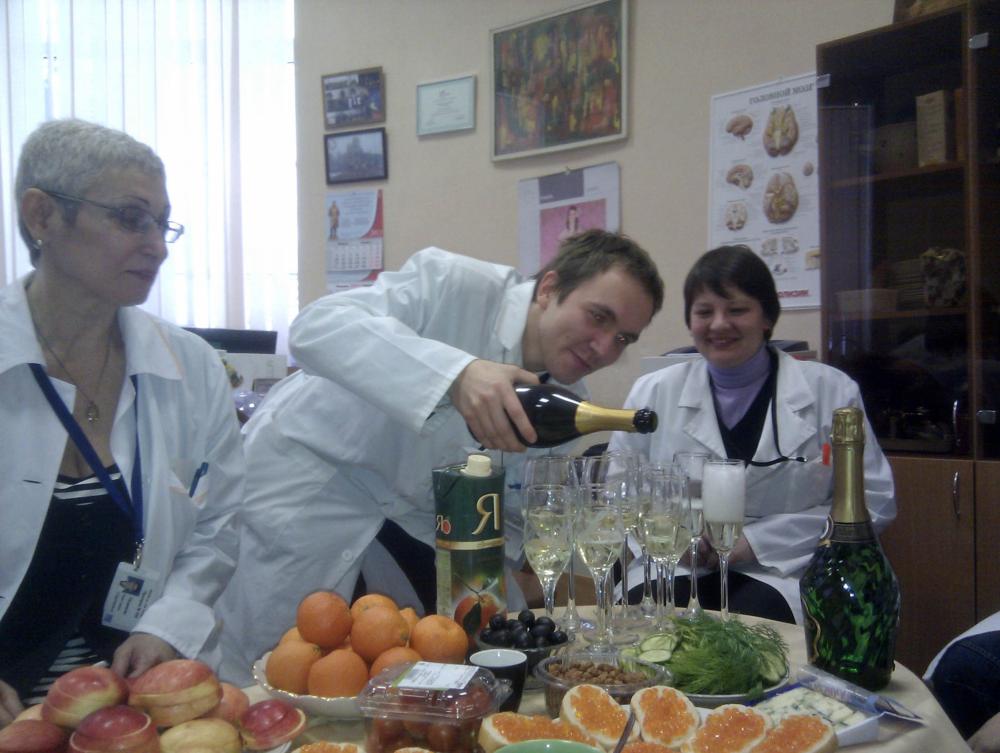
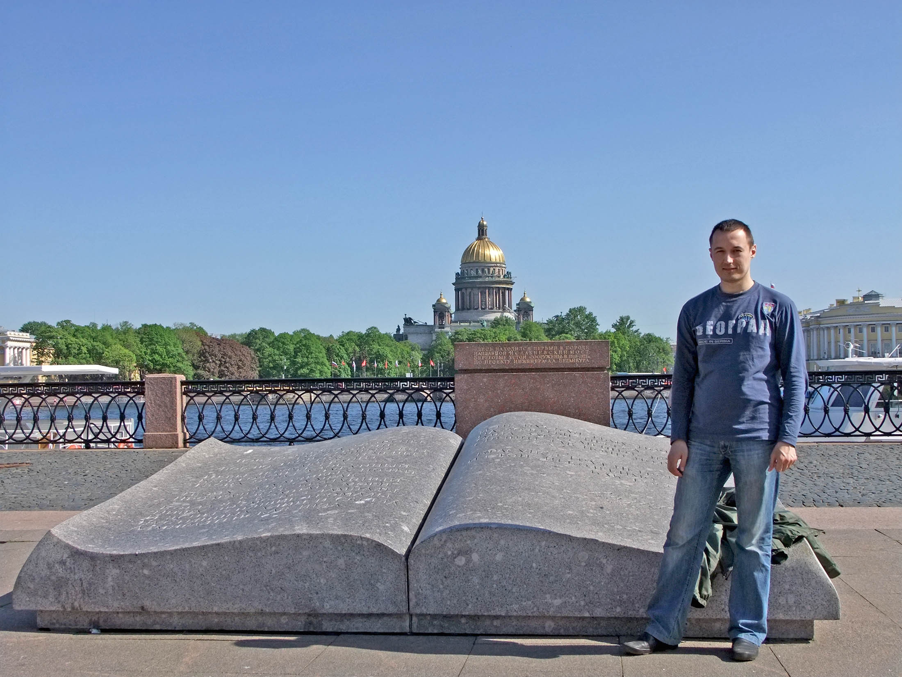
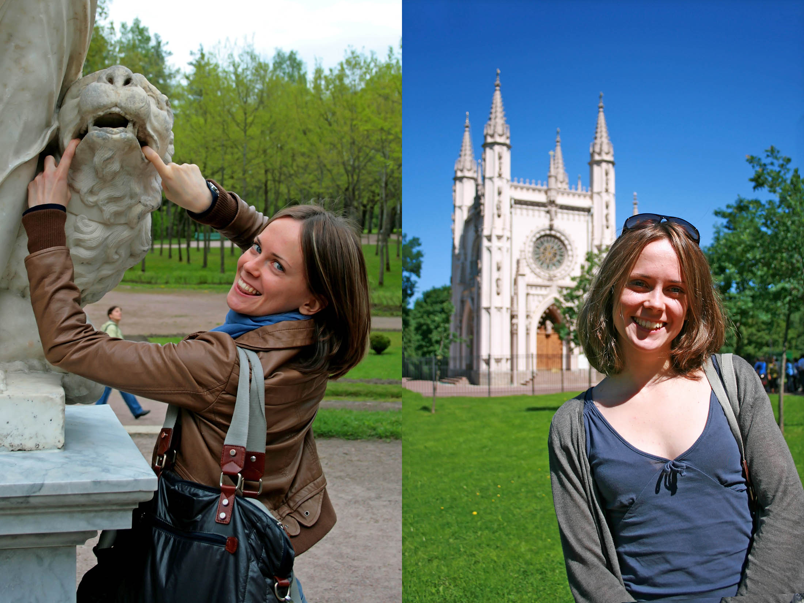
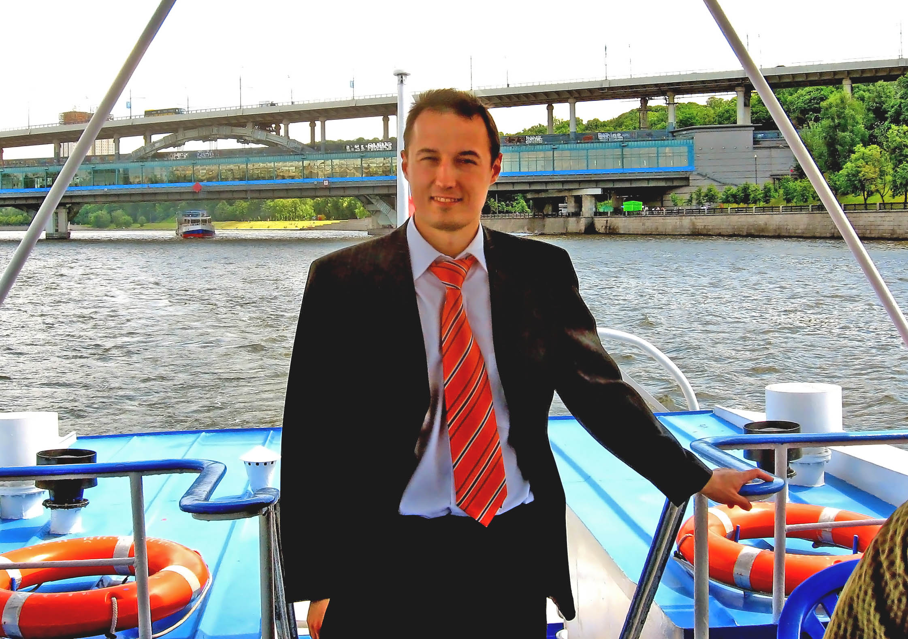
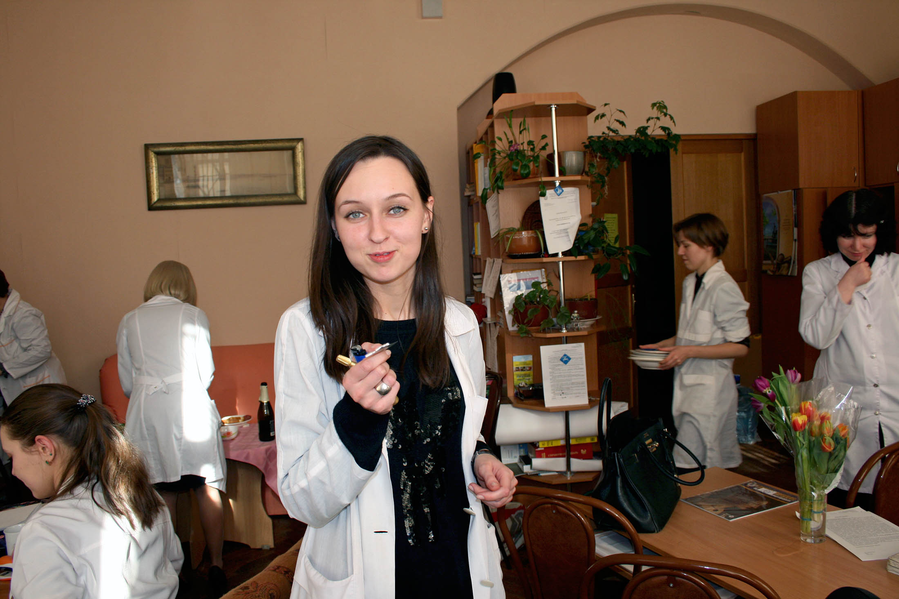

Год запомнился курсами английского и поездкой в Калининград.

Мне **27 лет**, я живу в Санкт-Петербурге и учусь в НИИ им. В.М. Бехтерева, на **2 курсе** аспирантуры по психиатрии.

Мне утвердили тему диссертации - изучение депрессий у пожилых. Кроме этого у нас идут исследования ранних признаков болезни Альцгеймера и некоторых лекарств. Работа очень разнообразная, никогда не знаешь, чем сегодня займешься.

Наша молодежная компания состоит из загадочно-депрессивной Юли Шарыги, веселой и взрослой Веры, рассеянного Вани и эксцентричной Маши Беликовой. 

Весной к нам еще пришли суровая Юля Бельцева и молчаливая Маша Савельева. В следущем году, после окончания учебы, мы втроем останемся на отделении работать научными сотрудниками.

Я смотрю амбулаторных пациентов как консультирующий врач, отбираю некоторых из них в исследования, организую забор и развозку анализов по лабораториям, наполняю базы данных и перевожу много иностранной литературы. 

Периодически мы ходим на конференции или обучающие лекции, с ланчами и фуршетами. Иногда бывают и форс-мажоры: побеги, попытки суицида или массовые госпитализации.

`video:https://youtu.be/nbRKCc3bmis`

Мы с Сашей думаем об эмиграции и даже записались на курсы разговорного английского по методу Шехтера. Курсы были веселыми и несколько театральными, мы преодолели психологический барьер и начали болтать. С ребятами с курсов мы гуляли по городу, играли в игры и ставили спектакль. Паралельно я занимался английским на сайте LinguaLeo.

Мы с Сашей активно изучаем Питер, ходим по разным интересным местам. Посетили музей религий и Исакиевский собор, играли в кёрлинг, смотрели французскую оперету. А я даже стал слушать классическую музыку.

`video:https://youtu.be/KCRtyYsEX1s`

Мы встречались после занятий, гуляли, лепили снеговиков, красили яйца в стиле Звездных Воин. Саша стала думать, как обустроить квартиру, тк весь интерьер был от застройщика. На выходных мы смотрели кино на диване или ходили по торговым центрам, подбирая обстановку для дома. Я прикрутил в подъезде муляж камеры, после чего там перестали курить. А ближе к концу лета мы сделали дома небольшой ремонт, покрасили стены и двери, повесили светящий карниз.

Весной приезжали коллеги из Оренбурга, многие из них потом передут жить в Петербург. Приезжал Илья Пахомов с идеей иммиграции в Израиль. Однако скоро он расстанется со своей женой Наташей и никуда не поедет.

### Лето

Этим летом стояла сильная жара. Мы посмотрели почти все пригороды Петербурга.

Гуляли по паркам Александрии, Павловска и Гатчины, смотрели средневековую крепость Старой Ладоги, катались на зорбе, ходили на парад. 

`video:https://youtu.be/EK_QZj5meqA`

Плавали ночнью по каналам, смотрели на развод мостов, бродили по романтичному и прекрасному городу.

У меня набралась небольшая статистика по исследованиям, по ней я написал свою первую статью и сделал доклад на международной конференции, посвященный сосудистой депрессии. 

В перерывах успел погулять по городу с коллегами и покататься по Москве-реке.

А еще мы с ребятами собирались за городом у нашего психолога Веры, ходили в кино и тусили в барах.

В августе мы с Сашей ездили в гости к моему дяде в Калининград. Ездили на Курсшкую косу, в танцующий лес и на орнитологическую станцию, путешествовали по немецким фортам и укреплениям. Побывали на концерте органной музыки, в музее янтаря, океанариуме и зоопарке. 

Но больше всего нам понравилось представление в замке Шаакен, где мы одевались в средневековые латы, стреляли из лука и участвовали в разных конкурсах.

`video:https://youtu.be/zD3fZq9ohwo`

Еще я дважды ездил в Оренбург, встречался с одногруппниками и сканировал старые фото.

### Осень

Осенью мне исполнилось **28 лет**. Начался третий год аспирантуры.

К нам на отделение пришли новые ребята: эпатажный Серега, дерзкая Вика и сумасшедшая Аня. Складывалась интересная компания.

Мы ходили с заведующей в театральный музей и на джазовый концерт, ездили с Сашей в Ораниенбаум. Ввзяли кота Василия - мелкого, тревожного и оручего.

Сашина мама купила квартиру в Петербурге и переехала сюда жить. Саша устроилась на работу в Икею в отдел по продаже кухонь. Уже тогда стало понятно, что защищаться она не будет.

`video:https://youtu.be/ijC4YYNsOa0`

В конце года прошли массовые протесты против нечестных выборов в госдуму, которых власть реально испугалась, после чего в стране началось закручиване гаек.

Однако нефть все еще стоит дорого, а валюта - дешево. Мы наслаждаемся качественными европейскими продуктами и оформляем загран паспорта, чтобы со следущего года начать путешествовать по другим странам.

###Медиа

В этом году я посмотрел **80 фильмов** (самые интересные: Страх и трепет, Бульвар Саесет, Список Шиндлера, Элитный отряд) и **3** сериала (Галактика, Королевство), прочитал **16** книг. 

Слушал преимущественно Scooter, оперы из арий и радио Рекорд.