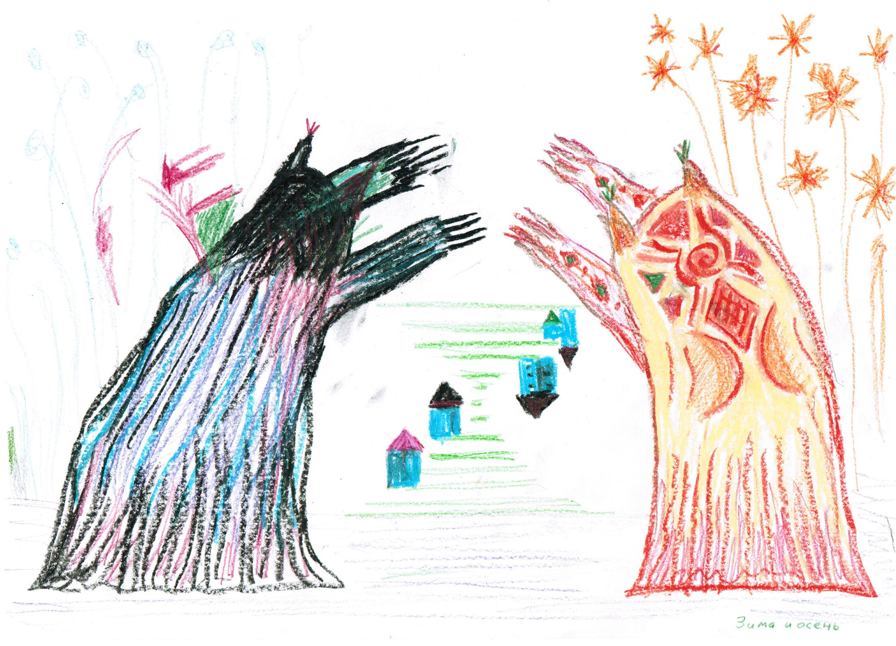

В начале 2012 года мне **28 лет** и я учусь на последнем курсе аспирантуры в НИИ им. В.М. Бехтерева. 

В институте я занимаюсь изучением настроения и памяти, а также лечу больных как врач-психиатр. Еще я исследую таблетки, развожу кровь по лабораториям, анализирую данные, готовлю статьи и иногда выступаю с докладами.

Моя главная цель – написание диссертации. За этот год я обследовал необходимое количество больных (всего 110 чел), закончил обзор литературы и начал делать предварительный расчет статистики. Двое моих коллег, Саша Шлафер и Ваня Мешандин, уже защитились. 

Но мне хочется все сделать идеально, из-за чего процесс затягивается и бывает сложно вообще хоть что-то написать. Приступая к работе, я мысленно представляю, как приношу готовый доклад к руководителю, а он говорит, что все плохо и выкидывает его в мусор. Я страдаю гастритом, сижу на диетах, плохо сплю и ощущаю постоянную тревогу.

Первую половину года в нашей квартире шел ремонт в ванной. Поэтому нам с Сашей пришлось жить с ее сестрой. На пользу нашим отношениям это не пошло, я был раздражительный и мы часто ссорились. Стало понятно, что надо что-то делать.

Еще в Оренбурге я пытался заниматься психотерапией, но тогда меня кинули на деньги. Поэтому в этот раз я шел уже опаской. Но все получилось хорошо. Моим психотерапевтом стал В.Я. Сазонов, хороший врач и человек, эдакий идеальный папа. Несколько месяцев мы занимались дважды в неделю по часу, а в конце лета я прошел психодинамическую группу.

Группа – это жесть! Чего там только не было: умирающие от рака люди, раздевание догола, драки и интим, а за всем этим стояло глубокое переосмысление собственной жизни. Но группа мне хорошо помогла, постепенно прошла тревога, улучшились отношения с Сашей и мамой, появилось понимание ценности бытия. Это наверное одно из лучших вложений денег в моей жизни.

Занятия психотерапией затронули и моих коллег. К тому времени у нас сложился веселый и дружный молодежный коллектив. Мы часто оставались после работы, чтобы поболтать на психологические темы, проводили тесты, играли в игры, рисовали всякие ощущения. 

`video:https://youtu.be/iFsU3ox9mSI`

Наш новый психотерапевт Женя жила в моем районе, мы вместе ездили на работу и быстро подружились. 

Молчаливая Маша тоже стала ходить на терапию и раскрылась как очень интересный человек. 

С Юлей Бельцевой мы нашли точки соприкосновения в интересе к построению и анализу баз данных, а к концу года у нас начали внедрять электронную историю болезни. 

У другой Юли, нашей чахоточной красотки, случился роман с ординатором Сережей, в результате оба ушли из института. 

Но самой странной была Аня. Она рассказывала удивительные истории и делала непонятные вещи, а после окончания учебы умерла, вероятно совершила суицид. Меня это потрясло.

Психолог Вера периодически привечала нас у себя на даче, где мы жарили шашлыки и пели песни под гитару. 

`video:https://youtu.be/OUhdRcRz554`

Фармкомпании регулярно приглашали в музеи и рестораны, чтобы приятно провести время и послушать лекцию. Так мы посмотрели готический дворец Кочубея и дом Державина, ходили в музей кофе.  

Еще периодически у нас были выездные экскурсии от института. Мы побывали в Великом Новгороде и Луге, посмотрели дачи Римского-Корсакова и Чесменский монастырь, побывали в парке русского деревянного зодчества. Ходили в кино и боулинг, сидели в барах, пили абсент, гуляли по городу. 

Из музыки я в основном слушаю различные виды транса, котрые крутят на радио Рекорд. Однажды мы ходили на концерт Тиесто, а потом всю ночь гуляли по городу и сидели на крыше.

`video:https://youtu.be/ZOrNb804PrA`

В середине лета институт как обычно закрылся на отпуск и мы с мамой улетели на Мальту. Первую половину дня учились в языковой школе и болтали на английском, а остальное время путешествовали. 

Мальта – это два маленьких острова, почти полностью застроены домами из желтого известняка.Тут невероятное количество крепостей и церквей. Каждый дом имеет свое имя, отлитый в керамике номер и святого перед дверью. На праздник местного святого выходит весь город, они с песнями носят его статуи и флаги, а фейерверки продолжаются по несколько часов. Море теплое и ласковое, но пляжей совсем нет.

Мы посмотрели древнейшие в мире неолитические храмы Джагантии, рыцарскую столицу-крепость Валлетту, а также Мдину, где снимали самый крутой сериал современности – Игру престолов.

`video:https://youtu.be/CSaq-fljdpE`

В конце лета у Саши был короткий отпуск и мы отправились на пароме в круиз по столицам Балтики: Хельсинки, Стокгольму и Таллину. Нам очень понравилось, особенно в Таллине с его средневековой атмосферой. 

Путешествия по крепостям и замкам подстегнули мой интерес к истории. Я читаю книги про древний Восток, расселение индоевропейцев, рыцарей и викингов, а также слушаю средневековую и этническую музыку.

`video:https://youtu.be/qfXlHH0spzk`

### Осень

Осенью мне исполнилось **29 лет**, обучение закончилось и мы с Машей и Юлей перешли на позиции научных сотрудников. 

На отделение пришла новая порция интернов и ординаторов.

Наши совместные путешествия продолжились, мы ездили Иван-город и Копорье, лазали по средневековым замкам и крепостям.

Еще мы посетили несколько отличных концертов. Во-первых, это Scooter, мечта детства. В тот день шел сильнейший снегопад, весь город встал, но народу было много. Взрослые люди вокруг меня прыгали под заводные ритмы своей молодости и я также получил огромное удовольствие.

`video:https://youtu.be/Y5pdgyOzJtE`

Во-вторых, это выступление Линды, первицы моей рефлексивной юности, и Яна Тирсена, который нравится Саше. Но самым интересным оказался концерт Теодор Бастард. 

`video:https://youtu.be/1xAFYR7oyss`

Видео плохо передает гипнотическую атмосферу, возникающую от тягучего даба и красивого вокала Яны Вевы, поющей песни на неизвестном языке. Но поверьте, в живую это завораживает.

`video:https://youtu.be/iMDp6vtaqKU`

В конце года мы с Сашей несколько раз ездили в Финляндию на выходные, куда из Питера ходил скоростной поезд. Гуляли по музеям, ходили в зоопарк, плавали на остров-крепость Свиаборг.

В последнюю поездку мы попали на празднование Рождества. Работали только церкви и кладбища, но нам все равно было весело. Мы жили в технологичном готическом отеле, гуляли по украшенному городу и сидели в стрид-фуд кафе.

За этот год я посмотрел 59 фильмов (-21). Самый интересный из них – "Облачный атлас". Я решил, что теперь буду смотреть кино по списку рейтинга IMDB, в котором присутствуют как новые блокбастеры, так и старые, но хорошие фильмы. 

`video:https://youtu.be/_rZou_PqFoo`

Прочитал 24 книги (+8), в основном по психотерапии, истории и фантастике. 

В следующем году меня ждет большой ремонт, написание основной части диссертации и массовое производство научных статей.
