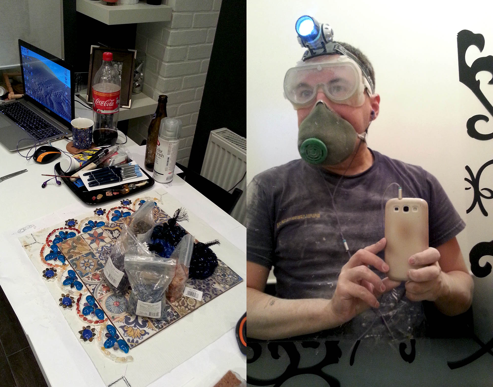

Коммунисты долгое время сравнивали свои достижения с 1913 годом, когда Российская империя была на пике своего могущества. Таким же стал 2013 для Российской федерации. Нефть по 110, доллар по 35, деньги в страну текут рекой, подогревая амбиции и тщеславие руководства. 

В следующем году Россия принимает у себя олимпиаду в Сочи, по всей стране реализуются различые мегапроекты –  строительство стадионов, трубопроводов и мостов. 

Для меня этот год тоже был очень успешным, он был наполнен интересным ремонтом, научной работой, написанием диссертации и путешествиями с коллегами. 

Мне **29 лет**, я живу в Санкт-Петербурге и работаю в институте им. В.М.&nbsp;Бехтерева. Мой типичный день начинается с совещания у заведущей, потом прием больных, консультации, обход отделения, обед с ребятами в ТЦ, оформление историй, групповые занятия с бабушками и личная психотерапия. 

В понедельник я развожу кровь по лабораториям, а по средам у нас обход с директором. Я заканчиваю достаточно рано и могу вечером что-нибудь поделать по дому. Саша возвращается очень поздно и каждый вечер я хожу в парк, чтобы ее встречать.

В начале года мы устроили дома большой ремонт на кухне, в ванной и прихожей, с выравниванием стен и заменой водопровода. Пока шел ремонт, мы жили у Ксении, вместе с мамой и бабушкой, и ходили всем семейством в Гранд-макет – огромную модель России, от Камчатки до Сочи.

В это время на Чукотке умер Сашин папа, с которым я так и не успел познакомится. Саша говорит, что я похож на него. Может поэтому она меня и выбрала?

`video:https://youtu.be/EAmGUYiU6pI`

Саша работает в Икее, любит скандинавский дизайн и сделала замечательный проект кухни. Половина стен теперь из белого кирпича, половина – темная, на потолке балки с подсветкой, мебель из стекла и металла, столешка вместо стола и шкаф между комнатами. Большу часть работ мы делали сами.

Мне досталась прихожая. Я с детства любил читать про древние цивилизации, пирамиды, заброшенные храмы и все такое. Однажды в учебнике по истории за 5 класс я наткнулся на картинку про Вавилон, где были изображены врата Иштар, которые глубоко запали мне душу. Теперь появилась возможность все это реализовать дома. 

`video:https://youtu.be/I1Hbht4iNQg`

Технология была такая. Сначала с экрана компьютера перерисовывались древние фрезки. Потом рисунок с бумаги переносился на пенопласт и дополнялся выдавливанием. В полученные формы заливался жидкий ротбант (гипс), который после застывания подвергался обточке, шлифовке и раскраске. 

Стены в комнате были покрыты грубой гипсовой штукатуркой, похожей на известняк, на которую был нанесен слой прозрачного лака. Над каждым дверным проемом висели фигуры богов или героев, а точечное освещение создавало эффект нахождения в музее.

Богиня ночи Иштар с совами, герой Гильгамеш с котиком, святой дух Фарвахар с пожарной сигнализацией в лапах и парочка духов Шеду (аналог православных херувимов) выглядели в наших широтах очень экзотично.

Центром комнаты стала колонна Иштар, оформленная как ворота в Вавилоне. Каждый ее кирпичек был вырезан, а потом раскрашен в свой собственный оттенок синего, ромашки отливались на месте, а фигуры быков и драконов были сделаны отдельно и вставлялись в специальные ниши. На всю работу уйдет примерно два года. 

Зато потом, проходя мимо и смотря на них, я буду испытывать огромное удовольствие, ведь это было моей детской мечтой. Еще одной моей мечтой было найти [Анюту](/1995). И в этом году я ее нашел. В Африке! Мы стали переписываться и я начал думать, как бы нам увидеться.

`video:https://youtu.be/PxvvX-xZgR8`

Тем временем Саша стала продвигать вопрос со свадьбой. В результате психотерапии, на которую до сих пор хожу, наши отношения стали гораздо лучше. Я очень люблю Сашу, но меня угнетают все эти социальные условности. Я не против регистрации отношений, но не понимаю, почему мы должны действовать по какому-то непонятному сценарию: организовывать посиделки, приглашать родственников, выбирать, кого позвать, а кого нет. Особенно большие проблемы у меня с отцом, мы почти не общаемся.

Для Саши важно, чтобы отношения были официальными. Я же всегда был убежден, что люди должны быть в первую очередь настоящими друзьями, а есть штамп в паспорте или нет, это уже дело десятое. По опыту родителей мне казалось, что брак это что-то типа ловушки и после его заключения отношения могут ухудшиться, так как становится меньше стимулов прислушиваться к мнению своего партнера. Но эти страхи оказались напрасными и в конце года мы подали заявку в ЗАГС.

У меня отличные отношения с колегами, у нас дружный и веселый молодежный коллектив.

После работы мы периодически ходили на лекции от фарм. компаний, гуляли в ботаническом саду, слушали романсы и сидели до вечера в суши-барах.

Ходили на Пиратскую станцию, в музей артиллерии и в музей метро, дважды были у Веры на шашлыках, играли в диксит и мафию, собирались всем отделением в кафе-зоопарке на берегу Невы. 

`video:https://youtu.be/zJFBxmOWVok`

Ездили с экскурсией в Шлиссельбург и на остров Орешек, смотрели крепости и танки, побывали на местах битв за Ленинград. 

Меня стала интересовать военно-морская тематика: я побывал морском параде кораблей в Кронштадте, мексиканском паруснике, подводной лодке "Народоволец" и кораблях НАТО. Еще я купил себе модель корабля для сборки, но так её и не собрал.

Ходили с сашиными друзьями на "Алые паруса" – праздник в честь выпускников, который завершился потрясающим салютом и прогулками до утра, ездили на пикник в Удельный парк, плавали ночью по Неве.

Весной я летал на конференцию в **Ростов**, где выступал с докладом, посвященным депресиям. Выступил не очень, тк у меня пропала часть текста и пришлось импровизировать по слайдам. Зато я сходил в краеведческий музее, где посмотрел половецких идолов, богатую коллекцию каменных орудий и предметов из истории казачества, а еще покатался ночью на кораблике по Дону.

На майские праздники летал в **Оренбург**. Гуляли с пацанами, жарили сосиски у Стаса, встречались с Лешиком Ганеевым.

Летом мы с Сашей 5 дней отдыхали в **Кушадасах**. Это была самая дорогая поездка, если считать посуточно. Турки развели нас как  лохов, уговорив накупить кучу всякого барахла.

Отель был типу "все включено" и в результате я потолстел килограмм на 10. Море было холодное, купались только в бассейнах. Зато мы стреляли из лука, ходили в хамам и ездили на экскурсии.

Посмотрели античный город Эфес со знаменитым храмом Афродиты, фоткались на белоснежных известняковых склонах в Памукалле, купались в теплых термальных источниках, ездили на камнерезные и гончарные фабрики.

После возвращения ненадолго приезжала моя мама, ездили в Павловск, катались на велосипедах. Мне очень нравится, что у них с Сашей хорошие отношения. 

###Осень

Осенью мне исполнилось **30 лет**. После ДР Саша уехала на Украину, а я погрузился в работу. В этом году объем моей научной продукции был рекордным: опубликовано 5 статей, написаны основные главы диссертации, всего около 100 страниц. Были разработаны новые базы данных (на акцессе), внедрена электронная история болезни, сданы экзамены по специальности. Был оформлен постоянный рабочий контракт на следующие 3 года. А еще, благодаря помощи в разного рода "наукометрических" делах, у меня улучшились отношения с руководителями других подразделений.

У меня появился новый ноутбук &ndash; стильный сенсорный Asus u500, на котором я прошел MassEffect и FarCry 3. Cаша привезла с Украины дикого котенка, которого я потом отдал в хорошие руки. Ксения взяла кота Тимофея, который потом будет жить у нас, а мама вернулась с Камчатки и завела себе шотландскую вислоухую кошку.

Я впервые побывал на скалодроме, ходил с ребятами в Константиновский дворец и встречался с Женей Фрицем. 

Ближе к зиме мы доделали ремонт и пригласили моих и сашиных друзей на Хеллуин. Следующие 6 лет мы будем отмечать этот праздник у нас.

Мы наряжались в костюмы, играли в игры и снимали пародию на "Гарлем Шейк", было многолюдно и весело. 

Ближе к концу году у нас были сплошные празднования с родственниками, друзьями и коллегами. На Новый Год приехал Джон и мы вместе пошли праздновать к Юле Стрельцовой.

##Медиа

Этот год стал очень музыкальным, открыл для себя несколько стилей: 

**DubStep** (BroStep) &ndash; визитная карточка 2010х, потомок Drum'n'Bass/2step и наверное самое значимое открытие в музыке за последнее время. DubStep я начал слушать еще в прошлом году, а в этом мы уже ходили на фестиваль "Пиратская станция", где отрывались по полной.

`video:https://youtu.be/spitVENkpgw`

**IDM, Glitch** и родственные им стили &ndash; странная музыка, состоящая из ломаного ритма, интересных звуков и случайных сбоев электронного оборудования.

`video:https://youtu.be/DhrBL3cJ39o`

**Средневековая и тувинская музыка**, особенно прекрасная Намгар. Через пару лет мы с ней встретимся.

`video:https://youtu.be/OlX0_mQBKE0`

**Progressive House** &ndash; тоже увлечение еще с прошлого года. Тогда мне очень понравился DeadMou5 и вообще прогрессив третьей волны, я стал искать похожую музыку и нашел кучу всякого, в том числе и романтичный DeepHouse.

`video:https://youtu.be/tKi9Z-f6qX4`

За этот год было посмотрено 54 фильма (-4), 5 сериалов и 4 мультика, прочитано 14 книг (-10). Самое интересное кино &ndash; Великий Гэтсби.

В целом, этот год для меня был очень удачным. А следующий будет еще лучше.