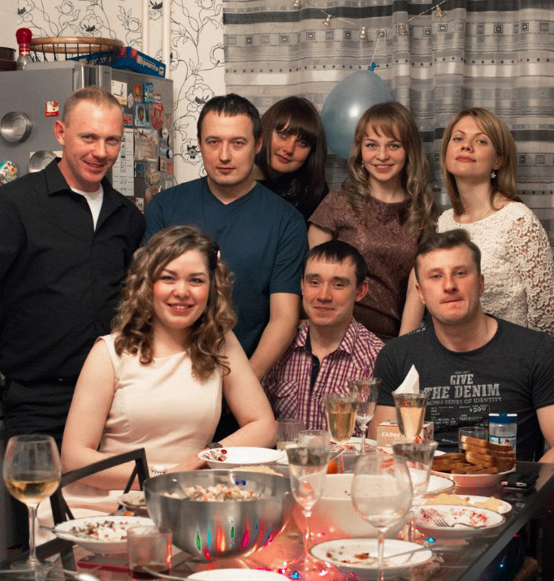

Самыми яркими событиями этого года стали поездка к Анюте в Замбию и наша с Сашей свадьба. 

Зима была очень теплой, снега не было, шли дожди и кругом была зеленая трава. На Новый Год приезжал Джон из Москвы, тусили Юли Стрельцовой, гуляли по городу.

`video:https://youtu.be/_HMP36Jb0EM`

Мне **30 лет** и я работаю научным сотрудником в НИИ им. В.М. Бехтерева. Диссертация поти готова, остались только исправления и шлифовка. Весной прошла предзащита на отделении, а в следующем году должна быть защита.

В научном плане год был не особо продуктивным, в основном было опубликовано что готовилось еще в прошлом году. Зато теперь у меня есть статья на английском языке, написанная вместе с профессором Дубининой. Мы пытаемся определить, какие анализы могли бы предсказать потерю памяти у человека в будущем, чтобы вовремя начать лечение.

Кроме лечения и науки, приходится заниматься кучей других вещей. Этой весной мы с Юлей наполняли сайта института, печатали плакаты и участивовали в выставке Ленэскпо. Выставка напоминала цирк-шапито, где собрались вместе священники, экстрасенсы и разного рода городские сумасшедшие, а мы сидели в ящике и предлагали им прийти полечиться. 

`video:https://youtu.be/Q82RcSPHgEA`

Женя переехала в Купчино и мы снова возвращаемся домой вместе.  

В прошлом году мы сделали основной ремонт, а в этом занимались украшательством. Я продолжаю оформлять прихожую, докрашиваю колонну и вырезаю из гипса фигуры месопотамской мифологии. Некоторые из них я делаю в подарок.

##Замбия

Год назад я нашел [Анюту](/1995) и феврале мы с Сашей полетели к ней в гости в Замбию. Это была мечта моего детства. 

Меня не хотели отпускать на работе, поэтому подготовка проходила в тайне. Перед поезкой я много думал на тему отношений, представлял нашу встречу, пересмативал "[5 см в секуду](https://www.youtube.com/watch?v=n4TAfAbAi0Q)" и "[Королевство полной луны](https://www.youtube.com/watch?v=nBfurv7oL5Q)". 

`video:https://youtu.be/PxvvX-xZgR8`

За прошедшие годы мои воспоминания порядком стерлись и обросли сверху множеством разных фантазий. Последний раз мы виделись еще детьми и, отправляясь в путь, я не очень понимал, чего ожидать.

Стив и Анюта оказались замечательными ребятами. С ними мы увидели Африку глазами людей, которые там живут, такой, какой ее сложно узнать самостоятельно.

У нас было всего 10 дней, но путешествие получилось незабываемым. Вместе с тремя детьми на микроавтобусе мы объездили весь юг Замбии, от Лусаки до Ливингстоуна.

Посмотрели водопад Виктория, плавали по озеру Кариба, были на сафари и крокодиловой ферме. Какие же теплые были там вечера.

##Регистрация

Эта поездка позволила мне определиться со своими отношениями и после возвращения мы с Сашей расписались. 

Церемония прошла очень скромно, были только сашина мама, сестра и Женя в качестве моей свидетельницы. Родителей не было. Мы посидели в ресторане, а потом провели ночь в отеле с видом на Неву.

Перед этим мы долго спорили, как провести свадьбу. Традиционные застолья с родственниками, конкурсами и массовой пьянкой всегда казались мне пошлыми и бессмысленными. Но я очень хотел, чтобы у Саши был праздник, поэтому стал обдумывать другие варианты. 

`video:https://youtu.be/89rDUZ4pmys`

##Лето

В этом году в Питере стояло на удивление долгое и приятное лето. Ксения начала встречаться с Вовой, своим будущим мужем, мы познакомились, когда ездили на рыцарский фестиваль в Выборг.

Лето было очень насыщенным. Мы гуляли по городу, плавали по каналам, катались на велосипедах и катамаранах, ездили в Петергоф, Павловск и Кронштадт.

Вместе с сашиными коллегами отдыхать за город, а потом на озеро в Комарово смотреть звездопад: жарили шашлыки, топили баню и играли в настольные игры.

На выходных собирались с ребятами у Веры, ходили с Машей на Аврору и концерт Теодора Бастарда. 

Ездили от института на Валдай, в музец колоколов и Иверский монастырь патриарха Никона. 

Ходили на концерт классической музыки, оперу "Руслан и Людмила" и балет Баядерка.

Между поездками я сидел дома, ел арбузы, играл в игры, делал скульптуры и дописывал диссертацию. 

В середине лета приезжал в Оренбург. Собирался с ребятами у Ильи на даче, виделся с Барсуком и Светкой, а после возвращения гулял по Питеру со Стасом и Юликом.

##Крит

В конце лета мы Сашей, Ксенией и мамами ездили отдыхать на Крит. 

Первую половину отпуска провели на вилле, стовшей возле маленькой деревушке, а вторую в окресностях столицы.

Посмотрели великолепную минойскую керамику в музее Ираклиона и знаменитый Кносский дворец, где по преданию жил Минотавр. 

Плавали на остров Сантарини, купались на потрясающе теплых пляжах Балос и Грамвуза, ездили в прекрасный город Ханья.

А в городе Ретимно состоялась наша греческая свадьба. 

Я договорился  веселым дядькой Гегхамом, который организовал нам фотосессию в старом городе и красивую церемонию на закате на берегу моря.

Однако совместное проживание с родственниками не пошло на пользу и мне пришлось пересмотреть свои отношения с Ксенией.

##Осень

Осенью мне исполнился **31 год**, а в стране начался кризис. Весной на Украине снова свергли президента и пока там был бардак, Россия присоединила Крым. Попытка отделения Донбаса превратилась в кровавую гражданскую войну с образованием бандитских республик. Офигевший от такого развития событий прогрессивный мир ввел против России санкции, которые будут душить ее экономику еще долгие годы. 

В довершение ко всему упали цены на нефть и упали надолго. Сытые годы закончились и мы в один момент стали в два раза беднее. Курс доллара взлетел, а народ кинулся скупать товары впрок. Однако присоединение Крыма вызвало сильную патриотическую волну и пока она сохранялась, люди готовы были терпеть снижение доходов.

На оставшиеся деньги мы доделали ремонт в зале, купили телевизор и кровать, поменяли телефоны. Квартира приобрела уютный и законченный вид. Я начал пользоваться айфоном и проходил с ним почти год, но так и не привык к тому, что телефон считает себя умнее меня.

Диссертация почти дописана, но наш ученый совет закрыли на перерегистрацию и в этом году уже не защититься. Наш дружный коллектив начал распадаться &ndash; Женя ушла на другое отделение, а меня все больше стала напрягать обстановка и низкая зарплата.

Ходили с заведующей в Главный штаб и с Женей в Эрмитаж, где я был впервые.

На Хеллуин традиционно собирались у нас, было очень весело.

Дважды с Сашей ездили в Лаппеэранту, там было достаточно холодно. Нашим отношениям исполнилось 5 лет.

В этом году я посмотрел 56 фильмов (самые захватывающие из них про космос: Гравитация, Игра Эндера и Интерстеллар), 16 мультиков (в основном Миедзакиевских) и 5 сериалов (в т.ч. Престолы, Викинги, Физрук, Фарго), прочитал 20 книг. Слушал преимущественно  Прогрессив и Евроденс. 

общался с Шакиром, который сейчас в Москве у Джона

Миедзякивские мультики
Скачал приложение для DI-радио. Слушал фанки-хаус, хеппи-хардкор, прогрессив, тек-хаус. Евроденис.
Играл в Mass effect 3, Вторжение, Medievel 2, Сталкер, Borderland 2

Прочитал: Ф. Дика, книги про средневековье

Год в видео

##Итоги

В целом год был удачным для нас с Сашей. Мы осуществили свои мечты, много путешествовали и всего посмотрели, Сашу повысили на работе, я почти дописал диссертацию, дома приятно и у нас по прежнему хорошие отношения. Несмотря на ухудшающуюся экономическую и политическую ситуацию, мы пока в меру оптимистичны и строим планы на будущее. 

 я окончательно убедился, что это мой человек. Дальше оставались только технические детали. Такое решение позволило нам всем вместе съездить отдохнуть на Крит и Санторин, провести замечательную свадебную церемонию на берегу моря и избавило от необходимости устраивать дорогие и непонятно кому нужные "торжества". Мы молодцы. Уверен, что любой другой вариант был бы или менее интересным, либо более затратным. Ну и вовремя все сделали, до резкого роста курса валюты.

