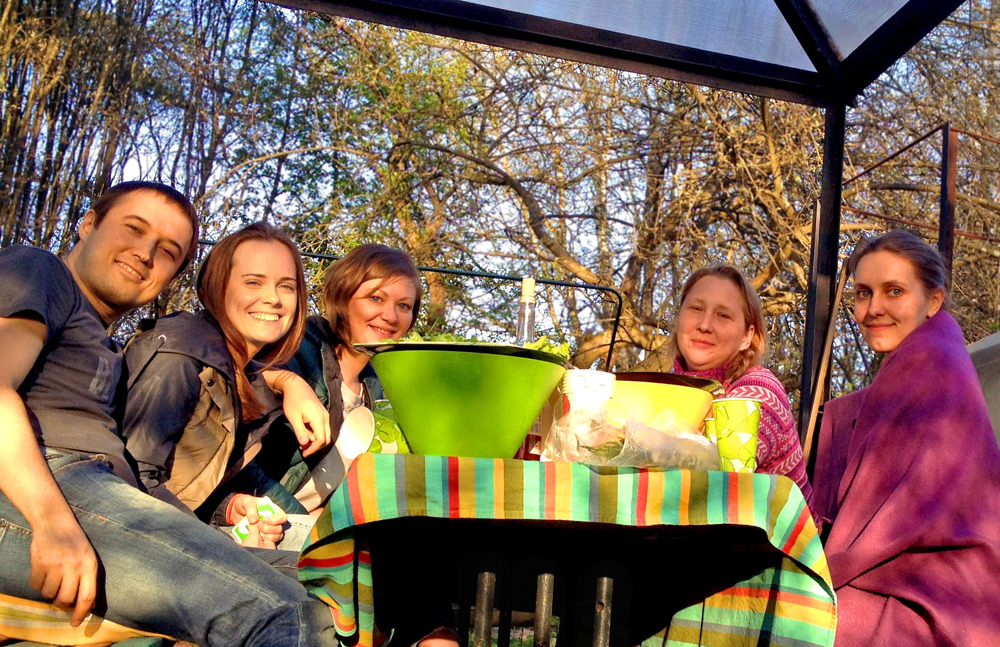
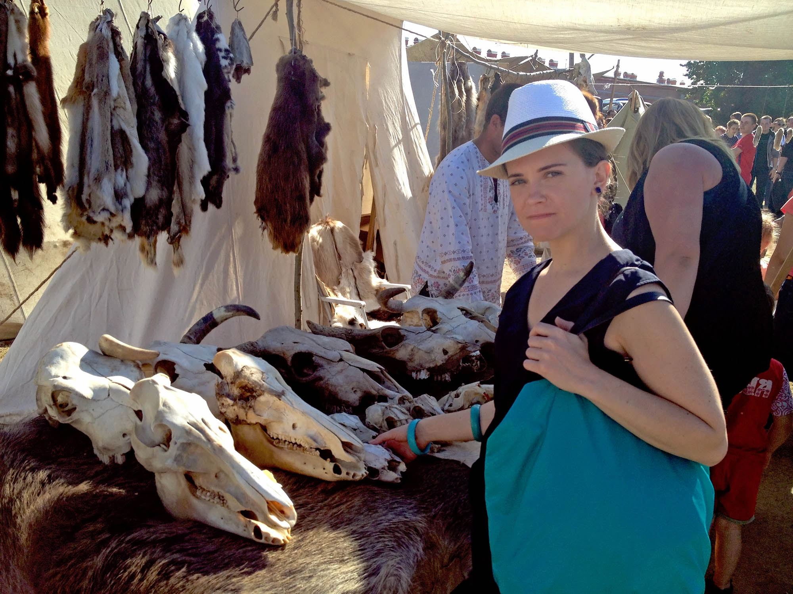

Мне 31 год и я еще работаю научным сотрудником в НИИ им. Бехтерева. Основными событиями этого года стали защита кандидатской диссертации и работа в ПНД, оставившая самые отвратительные воспоминания.

Новогодние праздники провели дома. Саша была в отпуске, мы доделали ремонт в зале, поменяли фасады на кухне и стали проводить романтические вечера в красивой обстановке.

##Защита диссертации

В начале года в институте вновь открыли ученый совет. За 3 месяца я доделал диссертацию, прошел предзащиту, написал автореферат, собрал весь пакет необходимых документов и в марте успешно защитился. В процессе я умудрился переболеть ротавирусом и основательно похудеть.

`video:https://youtu.be/Cz8R80akhqs`

Защита прошла идеально, все члены ученого совета проголосовали "за". Начиная эту работу шесть лет назад, я не очень понимал, во что она в итоге выльется. У меня был собран большой материал по течению депрессий у разных людей на протяжении жизни, но не было какой-то единой теории для его осмысления. Пришлось применить методы автоматической классификации, когда компьютер, анализируя множество параметров, объединял пациентов в определённые группы. 

В результате мне удалось обнаружить, что характер течения депрессии зависит от возраста ее начала и показать, в чем именно заключается эта зависимость. Насколько мне известно, никто ранее подобного не делал. 

Ура, огромная работа была завершена, однако я сам при этом почти ничего не почувствовал. Скорее был удивлен, что все закончилось.

##Смена работы

Кроме диссертации меня в НИИ ничего не держало. После обвала рубля в прошлом году моя зарплата стала совсем гомеопатической. Меня и других ребят напрягала обстановка на отделении, особенно отношения с моей начальницей. Например, одной из ее идей было отправить нас с Юлей работать рядом с радиоактивными материалами. В результате этого всего наш дружный коллектив достаточно быстро стал распадаться.

Понимание необходимости смены работы все сильнее давило на меня. Я не знал, что мне делать и это порядком нервировало. Мне хотелось больше IT и поменьше лечебной практики, но такой возможности в институте не было. В попытке осознать куда нужно двигаться, я стал смотреть в прошлое – слушать музыку 90x и писать эти мемуары.

`video:https://youtu.be/ckewGKiWIow`

Юля предложила мне устроиться консультантом на подработку в блокадную больницу, где я проработал до осени. 

Работа была не сложная, но требовала много писанины. Обычно осмотр и написание психиатрического заключения занимает около часа, таким образом за вечер можно посмотреть не более 2-3 человек.

Обычно первое, что я делаю на новом месте, это раскладка инструментов по полочкам и поиск способов оптимизации процессов. На кафедре в Оренбурге я натягивал компьютерные сети, в Бехтеревке внедрял электронный документооборот, а тут я решил написать программу для автоматизации психиатрического заключения.

На все ушло около 4х месяцев, делал ее вечерами на MS Access. Зато результат превзошел все ожидания. Программа не только позволяла описывать психостатус за 5 минут, но также собирала данные для дальнейшего научного анализа. Уже к концу года мы с Юлей собрали материалов на пару статей.

`video:https://youtu.be/3jTjBt0Enyw`

В начале лета я сходил на собеседование в дневной стационар ПНД и меня взяли. Начмед вела себя довольно по хамски, но я был уверен в себе и никаких тревожных лампочек в моей голове тогда не загорелось. Зарплата была в 2 раза больше, чем в НИИ, но дорога занимала почти 2 часа в одну сторону.

Все лето прошло в работе, много гулял пешком. Утром приезжал в ПНД, общался с больными, потом пешком через реку шел до Блокадной больницы, где смотрел бабушек, поздно вечером возвращался домой и дописывал программу. По началу мне все нравилось, только я сильно уставал.

##Путешествия

Весной Саша ездила в Крым, а у нас была последняя поездка от института в Великий Новгород. Летом мы ходили на выставку викингов, где я прикупил себе чудесной посуды с раскопок.

В конце августа ездили с Сашей в **Афины** и **Стамбул**. В Греции поселились в пригороде столицы, море было холодным, поэтому мы просто гуляли и ходили по музеям. 

А вот **Стамбул** – это кайф, там было очень хорошо. Эклектичный, шумный, колоритный, я просто влюбился в этот город на стыке цивилизаций. 

Мы целыми днями бродили по улицам, смотрели достопримечательности, ели вкусную еду и отметили мой ДР на берегу Босфора. Мне исполнилось 32 года.

##Осень

После возвращения из отпуска сократили ставку в блокадной больнице, а на основной работе в ДС у меня начались проблемы. 

Руководство похвалялось, что у них все четко, как а армии. На деле же если там что-то и было от армии, так только самодурство и садизм. Заведующая регулярно выдавала истерики, начмед планомерно унижала подчиненных, а главный врач делала вид, что ничего не знает. Через несколько лет, не выдержав издевательств, коллектив уволится в полном составе. А пока я сидел в своем кабинете с видом на кладбище и думал, что я делаю не так.

Впервые я столкнулся с тем, что не могу оптимизировать свою работу. Мои навыки программирования и научные знания оказались никому не нужны. Нагрузка на врачей была значительно больше положенной, требования – нереальными, а многие распоряжения – незаконными. Штат был всегда недоукомплектованный, чтобы сократить финансирование. Если какая-то ставка оказывалась занята, то ее вскоре "освобождали". Все это сопровождалось атмосферой напряженности, интриг, попытками отдельных врачей выслужиться и не попасть в опалу. Я так не умел.

`video:https://youtu.be/GrgzkMF6y7k`

Ко мне появились бесконечные придирки и я находился в постоянной тревоге. Переживал за больных, за качество своей работы, боялся, что руководство может меня подставить по-крупному. Моя жизнь превратилась в ад, начались проблемы со сном и артериальным давлением, на работу ходил как на каторгу, но считал, что не должен сдаваться. В итоге ближе к началу зимы я уволился из этого гадюшника. Только с парой ребят у меня остались хорошие отношение. Все остальное хотелось забыть как страшный сон.

Произошедшее меня обескуражило. Появились сомнения в себе и в своей деятельности. Решил немного отдохнуть и подумать, чем бы мне хотелось заниматься. 

Походил на психотерапию, начал готовить балкон к ремонту и печь хлеб. Попробовал изучать программирование и даже закончил курс по питону, но он мне не особо понравился. Хорошо хоть, что у Саши с работой все хорошо.

Осенью мы c ее друзьями снова отмечали традиционный Хэллоуин. 

А ближе к зиме ходили на свадьбу Ксении и Вовы.

##Медиа

Слушал преимущественно старый евродэнс и хеппи-хардкор. Ходил на концерт Намгар, которая в жизни оказалась еще лучше чем на сцене. 

Читал очень мало, не на чем было, дурацкий айфон быстро разряжался. Поменял его в итоге на Samsung G5. Прочитал всего 8 книг (-12): половина научно-популярная литература, другая половина – старая фантастика. 

Лучшее произведение – рассказ Т. Чана "Выдох", про работу мозга у алюминиевых людей. Также понравилась иллюстрированная книга про сибирское вооружение.

Прошел 3 игры: Bioshock Infinity, Call of duty MW2 и прекрасную Deus ex: Human Revolution, которая глубоко запала мне в душу.

`video:https://youtu.be/SeWPnOmNG88`

Посмотрел 62 фильма (+6) и 2 мультика (-12), лучший назвать сложно. Понравились загонистые кино (Исчезнувшая, Патруль времени, Жизнь Девида Гейла), кино про людей (Новый кинотеатр Парадизо, Правила виноделов, Быть Джоном Малковичем), корейские фильмы (Олдбой, Адмирал) и фильмы про Африку (Отель Руанда, Падение черного ястреба). 

Наметилась тенденция увеличения просмотра сериалов, их в этом году было 15 (+10). Наиболее запомнившийся – Космос: пространство и время.

##Итоги

2015 кризисный год для меня закончился в состоянием полной неопределенности. Защита диссертации должна была стать триумфом, но на деле никак не повлияла на мою жизнь. Ужас, пережитый в ПНД, дал мне понять, что я не готов мирится с самодурством и менять качество жизни на деньги. Работать в практической медицине я не хочу, а больше ничего не умею. Сейчас вакансий для психиатров на рынке нет, а на зарплату научного сотрудника в Питере не прожить. В следующем году нужно будет как-то решить этот вопрос.
