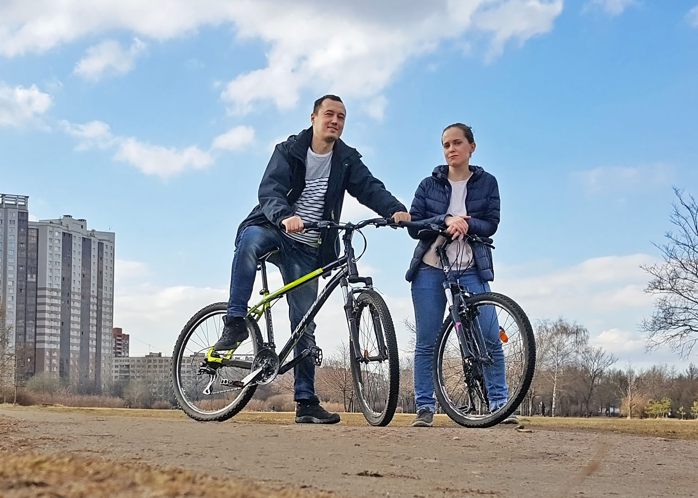
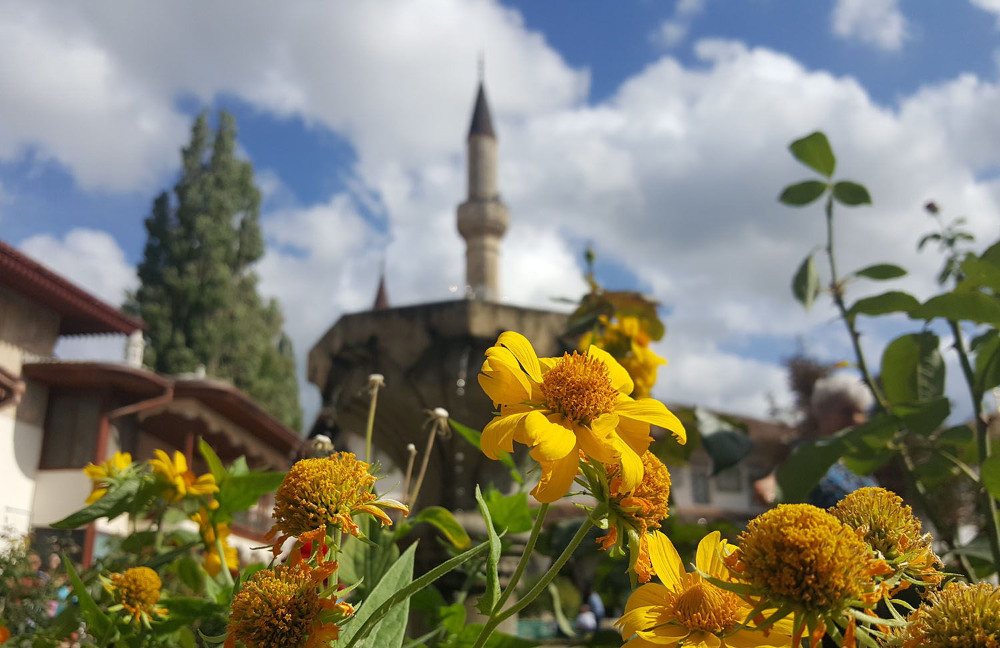

Мне 32 года, я остался без работы и не знаю, что делать дальше. 

## Предыстория

В детстве родители и родственники периодически интересовались моими желаниями, что приятно, но при этом делали все наоборот. Бабушка зачем-то отбирала у меня те игрушки, которыми я играл, и давала в руки другие. Мама настойчиво выспрашивала на базаре, какие джинсы мне нравятся, чтобы потом купить другие. 

Объяснялось это тем, что я недостаточно сообразителен, чтобы сделать правильный выбор. Ведь это большая ответственность, ошибаться нельзя! Постепенно любой выбор стал для меня мучительным и я стал избегать таких ситуаций.

В пятом классе меня отдали в танцевальную школу, которую я ненавидил, но все-таки закончил. Почему именно туда? Потому что я любил рисовать и значит мог стать художником, а они, как известно, все пьяницы, поэтому нет. Почему не бросил?  Потому что ответственный. 

Мне в детстве нравились роботы, компьютеры и все такое. Из-за этого компьютер мне принципиально не покупали, чтобы "не увлекался". Работа не должна нравиться. Отец хотел, чтобы у меня была "серьезная профессия", а не это баловство. В результате после школы я поступил в мед. институт и уехал в Оренбург. 

#### Оренбург

Выбор медицинской специализации проходил "от противного". Резать людей мне было жалко, детей и беременных я не любил, а работать терапевтом за копейки мне не хотелось. Больше всего мне нравилось размышлять над устройством мира и был опыт в изучении потустороних сил, поэтому я пошел в психиатрию.

Параллельно я увлекался программированием для веб. Интернет тогда только появился, это было очень модно. Основным проектом был сайт нашего поселка, благодаря которому я приобрел много новых знакомых. Кроме этого я делал на заказ сайты разных организаций и даже написал с нуля интернет-магазин.

В веб-разработке меня привлекало несколько вещей:
- Радость создания чего-то нового. Ты что-то делаешь, а оно потом работает. Примерно такие же ощущения, как от сборки конструктора в детстве. Только теперь без ограничений в деталях.
- Востребованность. Ты помогаешь людям, решаешь какие-то реальные проблемы, делаешь их жизнь лучше. 
- Наглядность. В отличие от других видов программирования, результат легко показать, просто разместив сайт в интернете.
- Низкий порог входа. Постепенное нарастание сложности позволяет на каждом этапе получать положительный опыт, укрепляя мотивацию. Чтобы начать достаточно блокнота и браузера. 
- Творческая составляющая. Веб находится на стыке инженерии и искусства, поэтому ты сам определяешь не только работу, но и внешний вид своего продукта.
- Когнитивная сложность. Любая инженерия это компромисс. Чем сложнее становится продукт, тем больше в нем внутренних ограничений. Значит можно интересно размышлять об его архитектуре, подбирая оптимальные варианты. 

Отдельными плюсами были возможность удаленной работы, отсутствие необходимости в непосредственном общении с людьми и ясные договорные отношения. Это все то, чего мне не хватало в медицине. Но бросить все и поменять род занятий мне совесть не позволяла.

Я старался уклониться от работы практикующим врачом, пытаясь найти для себя какие-то другие варианты в рамках полученной специализации. Сидеть в поликлинике участковым психиатром мне было тоскливо и скучно, поэтому я предпочитал учиться дальше. Достигнув потолка в Оренбурге, я переехал в Питер, чтобы заниматься наукой.

#### Санкт-Петербург

Научный период занял 6 лет. За это время я поработал в НИИ, написал диссертацию, поучаствовал в исследованиях, женился на лучшем друге и довел до ума квартиру. На веб-разработку времени не было, но я все равно немножко программировал: делал базы данных, писал прикладные программы, внедрял электронный документооборот. 

Хотя заниматься наукой было интересно, но она совершенно не приносила денег. Зарплата была гомеопатическая, как и выплаты за исследования. Чтобы заработать денег, я снова пошел в практическую медицину, но ничего хорошего из этого не получилось. Даже в институте, с его академической средой, проявлялись родовые травмы отечественной системы здравоохранения: бесправие и незащищенность перед лицом руководства, потребительское отношение со стороны пациентов и огромная ответственность, связанная с последствиями выбора, который нужно делать каждый день.

Психически больные люди могут вытворить что угодно: необычно отреагировать на лечение, навредить и даже лишить жизни себя или окружающих. В таких ситуациях меру вины будет определять руководство, а у особо невезучих &ndash; товарищ следователь. Нет никакой возможности все предусмотреть, потому что нет никаких четких критериев. Можно всю жизнь делать правильный выбор, но ошибиться однажды и поехать на нары.

В дневном стационаре, где я пытался работать, это все усугублялось сволочным руководством, которое занималось откровенно незаконными вещами и могло в любой момент сделать любого крайним. Благодаря им стало понятно, насколько мне в рамках этой системы было плохо. 

- Кто-то может сказать, "а как другие работают?" Ну так и работают. Медики народ сердобольный, ответственный, готовый терпеть много несправедливости. 

- Еще говорят, "ты знал, куда шел". Нет, не знал. В институте все выглядело гораздо оптимистичнее. 

- Ну и коронная фраза пациентов, "не нравится &ndash; уходи". Вот я и ушел. 

В конце 2015 года в стране бушевал кризис, психбольницы закрывали, куча врачей оказалось на улице, психиатрических вакансий не было как и надежд на изменение ситуации в будущем. Тогда я решил уйти в веб-разработку.

## Учеба

`video:https://youtu.be/T7GKDM4xyzs`

`video:https://youtu.be/RLhpBuJmouU`
 
 

 
Работа
За этот год прошел 2 интенсива по верстке на HTML Academy, цикл по JavaScript и TypeScript, получил навыки современного фронтэнд разработчика. Научился верстать по БЭМ, работать с Git, делать сборки с помощью Gulp и Node.js, использовать less и sass препроцессинг, немного писать на JS.

technomart (700x466, 245Kb) pink900 (700x466, 322Kb)

camuxm22NAk (700x392, 64Kb)

Кроме учебных, сделал несколько проектов на фрилансе. Денег мне это особо не принесло, да и режим дня стал ненормальным, зато я смог почувствовать свои навыки и свою востребованность в новой специальности. А в конце года я устроился на удаленную работу в маленькую питерскую веб-студию.

putins-portrait (700x466, 228Kb) stamp2 (700x466, 304Kb)

Кроме навыков программирования, я научился паять и разобрался с загрузочными дисками, сделал Саше картину и сайт.

Из ремонта в этом году было немного. Починили ванную, перебрали кладовку, доделали балкон, повесили картинки на кухне.

 

Отдых
Катались на велосипедах у себя в парке, устраивали пикники, жарили шашлык.

Почти все мои курсы пришлись на период разъездов.

Весной мы с Сашей ездили в Крым, было немного дождливо.

Крым

 

Летом мы ездили в Казань (она нам очень понравилась) и в Оренбург: гуляли по городу, ездили с мамой в Бузулукский бор, побывали в Саракташе.

### Казань

### Оренбург

### Саракташ

Еще мы Сашиной тетей ездили по церквям в пригородах Петербурга и ходили в Русский музей.

 

`video:https://youtu.be/20FJaE_kki0`

`video:https://youtu.be/CC5dw6GYP_k`

А осенью с Артемом и Юлей путешествовали по Крыму: ставили палатки на берегу моря, купались на песчаных пляжах, катались по горам на уазиках, жили в Бахчисарае, ездили в Севастополь, Фиолент, Ялту и Новый свет, совершили восхождение на Димержи. Это была очень прикольная поездка.

Донузлав

Бахчисарай

 

Новый свет

Димерджи

## Родственники

Моя мама получила новый импульс в жизни: занялась собой, стала учить английский, несколько раз ездила в Италию.

Отец заболел, весь год обследовался и лечился. Столкновение со смертью заставило его по новому посмотреть на себя и свою жизнь, начал мне регулярно звонить, с ним стало возможным нормально общаться. Он вообще последние годы дрейфовал в сторону нормального человека, а тут как-то совсем стал нормальным. Переехал в квартиру, завел себе тетку, перестал обижаться на все, стал интересоваться духовной жизнью.

Дядька привел деда в чувство, он перестал выпивать, начал гулять и следить за здоровьем. Бабушке все стало легче.

На мой ДР у Ксении родился племянник и мы с Сашей месяц жили у нее. Но Ксения - это Ксения, с ей бывает тяжело.

 

А у мой родной Саши все нормально. Нормально - это хорошо.

 

## Друзья

Так как я сидел дома, то общался с друзьями немного. Весной мы собирались с коллегами из Бехтеревки, ходили с Машей и Лешей в суворовский музей, ездил к Жене в "творческое пространство". Пару раз виделись с Настей.

В основном к нам в гости приезжали Юля или Дарина. Также мы устраивали традиционный (уже третий) Хеллуин.

 

 

## Медиа

За этот год я посмотрел в 2 раза меньше фильмов (35), но гораздо больше мультиков и сериалов (по 13), прочитал 6 книг (в основном по верстке). Саша посмотрела 20 сериалов (это ее любимое занятие). Лучший сериал года - "Пространство". Из фильмов понравились "Доктор Стрендж", "Макбет" и "Варкрафт" (великолепная экранизация любимой игры).

Открытие года в музыке - Brooklyn Bounce и Elysium (глитч-хоп). Brooklyn Bounce я и раньше любил, но теперь смог найти все выпущенные ими песни. Также я отсканировал Сашины диски и накачал музыки из своего детства и юности.

Играл я немного. В этом году все игры были на космическую тематику, самое заметное явление - триумфальное возвращение HomeWorld и ее наследницы - Desert of Kharak.

`video:https://youtu.be/GZW6RRfGAhk`

 

Итог
Встречаю новый год со сдержанным оптимизмом. Несмотря на год фактического бездействия, мне удалось получить новую специальность и устроиться на работу. Многие мне говорили, что человек не должен менять специальность, если он ей посвятил столько времени, сколько я медицине. Мне не кажется это правильным. Дневной стационар дал понять, насколько же мне было на самом деле неуютно в лечебной работе. Не знаю, что меня ждет в IT, но я уверен, что лучше попробовать заняться тем, чем нравится, чем всю провести всю жизнь в нелюбимом занятие, гадая, могло бы получиться или нет.

.jpg)

