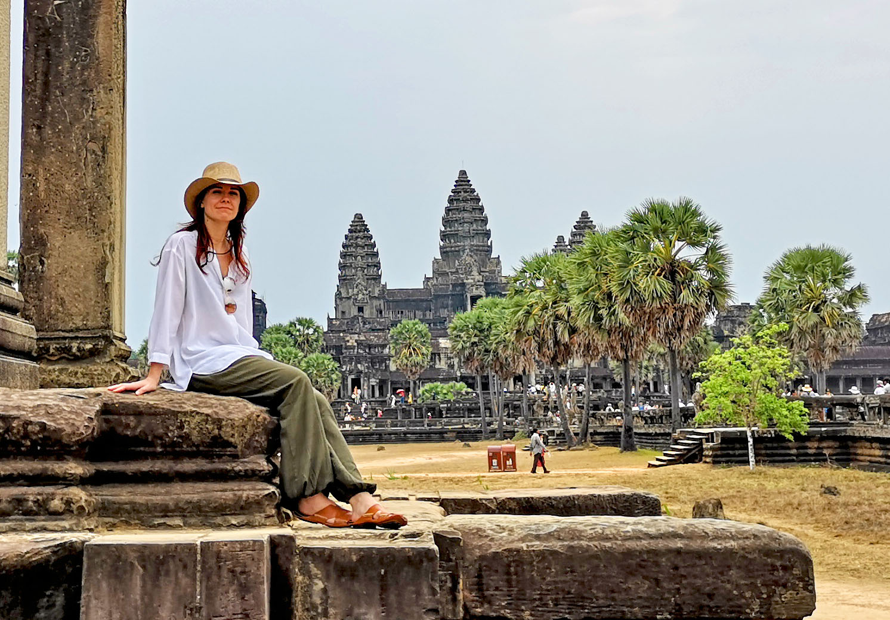
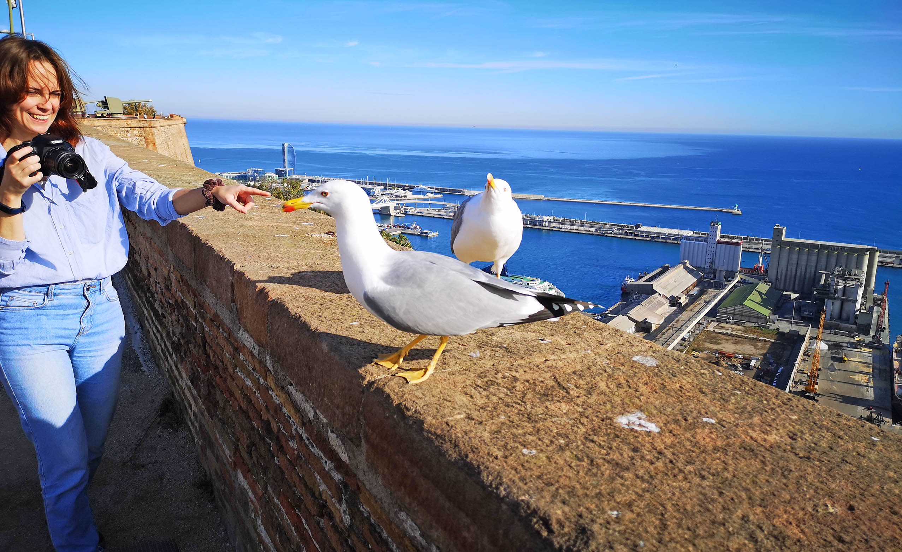

На начало 2019 года мне **35 лет**, я живу в Санкт-Петербурге и занимаюсь фронтенд-разработкой.

Для меня этот год прошел очень спокойно, но был отмечен целым урожаем смертей: летом умер мой дедушка, бабушка Саши и папа Жени Мироненко.

Четыре года назад я поменял специальность и еще ни разу не пожалел. Пока у меня все хорошо и стабильно, мне нравится коллектив и сложившиеся условия. Однако меня не отпускает ощущение профессионального застоя. Я собирался походить на собеседования и даже готовился к ним, но так никуда и не пошел. Потенциально есть возможность найти место с большими возможностями, но я переживаю, что качество жизни при этом может стать хуже.

В этом году мы запустили несколько проектов: два крупных магазина (Пушок и Росмет) и несколько небольших сайтов (Трейлекс, Газовозы). Открылся физический офис, к нам пришла новый дизайнер Юля. Уволился Леша, теперь я частично перекрываю задачи по бекенду, пишу на PHP и провожу собеседования.

Я стараюсь регулярно ходить на завтраки и встречатьсяс ребятами из Spb.frontend. Побывал на Nodeschool, BeerJS, нескольких митапах и новогодней вечеринке. В нашем сообществе теплая и приятная атмосфера, обычно я возвращаюсь от туда с зарядом позитива и новыми идеями.

Мне удалось более-менее разобратся с Redux и значительно улучшить психостатус, добавив подключение к удаленной БД (Backendless), адаптивную верстку и сохранение в localStorage. Оформил и выложил свой первый приличный репозиторий на гитхаб.

Провел исследование экранов и браузеров, разобрался с загрузкой фото по ajax, верстал крутые адаптивные таблицы, оптимизировал скорость загрузки, настраивал облачный сервер Jelastic, поднимал окружение на Маке, сделал сайт жениному папе на GravCMS.

Смотрел лекции ШРИ, читал про rest api на Yii2, пытался разобраться с админкой на реакте, настраивал VSCode. Пробовал сделать новую сборку с вебпаком, подключал Express и MongoDB, начал интересоваться Docker и GraphQl.

Платформа, на которой я 15 лет писал дневник, уже совсем испортилась. Начал делать новый блог мемуаров на Getsby, перенес туда часть постов. У меня не очень хорошая память и перечитывая свои воспоминания, я как-будто путешествую во времени. А еще в дни, когда все кажется грустным, можно открыть и почитать, как много в жизни было всего хорошего и интересного.

###Путешествия

С Сашей у нас теплые дружеские отношения и периодически я в нее снова влюбляюсь. В этом году у нас было несколько совместных поездок.

В марте был грандиозный тур по ЮВА: 3 недели, 3 страны и 10 перелетов. Сначала мы немного потусили в Дубае, а потом лазали по джунглям Камбоджи, рассматривая затерянные храмы и потрясающие древние пирамиды Ангкора. 

`video: https://youtu.be/QTeUZLwDSsA`

Отдыхали на пляжах Краби, гоняли на спидботе по островам Андаманского моря, купались и сноркали в теплой воде. 

`video: https://youtu.be/KkD0w5SpG68`

Летали на тросах между деревьями в Чангмае, ходили в национальные и зоо-парки, видели панду и светящийся планктон.

`video: https://youtu.be/HEJodaV2QMA`

Летом пару недель жил у отца в **Саракташе**. Смотрели Чернобль, жарили у Шикира шашлыки, измеряли Фонтан, готовили Том-ям. Встречался с Ильей, ходил в гости к Друзю, виделся с Максом, Стасом и Димой Городиловым. Приезжала мама, ездили в д. Валерой и Кейсом на Красную гору.

`video: https://youtu.be/L0GsgqmeVfU`

Осенью путешествовали по путевке в **Тунис**. Мне исполнилось 36. 

`video: https://youtu.be/HIS5GZUOl2w`

Углублялись в пустыню Сахара, ночевали в оазисе, катались по дюнам на верблюдах и квадроциклах. Посмотрели место съемок Звездных Войн, развалины Карфагена и синий город Сиди-бу-Саид, побывали в гигантском римском амфитеатре, пещерных жилищах и на плантациях финиковых пальм, гуляли по узким улочкам средневековых медин.

В конце ноября ездили в **Испанию**. Посмотрели прекрасную Барселону с невероятным количеством интересных зданий, церковь Святого семейства, парк Гуэль и городской форт, катались на канатной дороге, гуляли по паркам, ходили в частный музей и клуб. 

Основную часть отпуска провели в небольшом домике в горах Сьера-Невада. Погода стояла солнечная, отдых был простой и по семейному приятным. Вокруг росли плантации миндальных орехов и авакадо, а за ними возвышались заснеженные пики трехтысячников, с петляющими между ними дорогами, ветрогенераторами и разбросанными по склонам маленькими деревушками.

Ездили высоко в горы и на море, смотрели небольшие горные замки и сонные прибрежные городки. Пару дней жили в Гранаде, посмотрев сам город и Альгамбру - жемчужину исламской европейской архитектуры. Последние два дня провели в Малаге, где отметили десятилетие нашей дружбы.

Дома гуляли с Сашей по парку, катались на великах, ходили на фестиваль фонариков.

Летом Саша дважды ездила в Крым: сначала на юбилей бабушки, а потом на ее похороны.

###Друзья и встречи

Из икеевской компании друзей осталась только Даша. В этом году она купила квартиру и отказалась от перезда в другой город. Ездили к друг другу в гости, гуляли, лепили пеликена на заливе, много смеялись. Даша раскрашивает нашу жизнь новыми красками.

Несколько раз приезжала в гости Юля Косинова из своего Омска. В этом году она развелась с Артемом и впервые съездила в Тай. Виделись с Татьяной Чумановой и Лизой, ходили в музей Эрарту. Дарина в декрете и с нами не общается.

Несколько раз встречался со своими Бехтеревскими друзьями. Сидели в центре на крыше, ходили в индийский ресторан, ездили к Юле Бельцевой в Сестрорецк. Созванивался с Кругловым и Татульян.

Женя Александрова побывала в Тибете. Мы тоже хотели, но потом передумали. Собирали с ней мебель, пилили столешку, вешали полки, общались про буддизм. А ее подруга Анюта выдвигалась в муниципальные депутаты, но, к сожалению, не прошла. В этом году в Питере были очень грязные выборы, в Москве избивали и сажали протестующих, а в Сибири бушевали пожары.

Я регулярно общаюсь в чате со своими однокурсниками и вижу, что с медициной в нашей стране становится все грустнее. Периодически я пишу для них небольшие сочинения на общие темы и собираю кучу лайков. Они хотят, чтобы я выпустил книгу, но я не вижу в этом большого смысла. Зато теперь у меня много приятелей.

Илья уехал в Бузулук заведовать отделением в роддоме и выкупил у Дашки дом, но это выматывающая вахтовая работа. Татьяна родила дочку и ей провели интернет, общался с ее сыном, он хочет стать программистом. А у Лешика Ганеева все стабильно.

Барсук уже полтора года в командировке, в основном на юге, тоже устает. Рисовали с ним по скайпу, а в конце года он купир тур на Гоа, думаю там его место силы.

У Джона умер отец, он стал совсем грустный и почти перестал общаться, а у Майера без перемен. Я благодарен ребятам, что помогали папе и бабушке осваиваться с техникой и всегда приходили на помощь.

Несколько раз созванивался с Машей Зориной. Я искренне считал, что у нее все хорошо, но она меня убедила в обратном. Пару раз общался с Анютой. Стивен устроился в миссию, они перехали из Чомы в деревню, Алина пошла в старшую школу. Анюте там не очень нравится.

Эльмир по прежнему очерован своей чудо-женщиной и весь год писал книгу по психологии, в надежде завоевать ее симпатию. Но я думаю, что это все тщетно. Пытались замутить с ним какой-нибудь мега проект, но ничего не получилось.

Больше всего я общался с Шакиром. Летом мы весело тусили в Саракташе, в течении года периодически созванивались и играли в СтарКрафт2, а еще Шакир оцифровал и выложил в инет наши старые видео.

Отцу провели интернет, а пацаны настроили комп. Теперь он регулярно звонит мне по скайпу. Ему наконец-то прооперировали грыжу, он прошел перекомиссию и пока в стабильной ремиссии.

Летом умер дедушка, предположительно от рака ПЖ. Мама поменяла всю обстановку у бабушки, перевезла ей мебель с Пролетарской. Дядька подарил ей планшет, но она в нем не очень понимает, хотя и очень любит общаться по видеосвязи. Дважды в день к ней ходит Валя, навещают соседи и родственники, но ей все равно одиноко. Они с дедом вместе прожили более 60 лет.

Зимой мама дважды приезжала к нам в гости и ходила на группу, мы видились в Оренбурге летом, а потом еще осенью. У мамы все хорошо.

После смерти бабушки Сашина мама вернулась в Питер. Теперь они живут вместе с Ксюхой и племянником. Вова в этом году поменял работу и пошел на повышение, но с тещей он не разговаривает. Племянник растет с опережением, в свои три года он очень активный и общительный. Мы с Сашей решили, что тоже хотим завести ребенка.

###Дома

Дома без серьезных перемен. Перекрасили кухню в бирюзовый цвет. Собрали несколько коробок с ненужной одеждой, выкинули старую электронику. Пробовали заказывать на дом ужины из Яндекс-шефа, все понравилось. Купил себе удобное кресло DXRacer, сделал клевые ящики для белья, разобрал всю свою музыку. Отвез маме комп, поменял блок питания, пытался настроить Мак. 

Саше удалось вырастить на балконе огурцы и она немного пыталась учиться верстке. Периодически вечерами я жарил жаркое, смотрел матчи по СтарКрафт, паял, пил Тибарин и втыкал в ТикТок.

Сдал анализы на почки, сделал ФГДС, перепечатал свою детскую мед.карту. Пока все хорошо, только образовался свищ на десне. В этом году даже не было ангин, а лор сказал, что гланды рабочие и удалять их нет смысла. 

###Медиа

За год было посмотрено 38 фильмов (+8) и 1 мультфильм (-3), 12&nbsp;сериалов (+4), прочитано 12 книг (+3). 

Лучший фильм: Зеленая книга. Также понравились: Движение вверх, Звезда родилась, Громкая связь, Меган Ливи, Комплекс Баадера-Майнхоф.

Лучший сериал: Чернобыль. Хорошие: Пацаны, Пространство, Энн. Отвратительно закончились Игра престолов и Звездные Войны.

Лучшая книга: Лю Цисинь. Задача трех тел. Понравились Сомали М. Шепот ужаса и Ден Симмонс. Террор.

Отрытие года в музыке &ndash; Netta, которая делает музыку голосом. 

`video: https://youtu.be/n9UgUdyMRAk`

Еще я слушал: LittleBig - Skibidi, GoBanana; Ленинград - Вояж, i_$u$$; Rammstein - Deutschland; Ic3peak - Смерти больше нет; Sia - Flames; Forest Sword - Crow; Tones And I - Dance Monkey.

Из старого: aphrodita, Жажда скорости, electro, eurodance, музыка из Stellaris и HomeWorld.

Периодически смотрел на ютубе Катю Шульман и Наталью Зубаревич, чемпионаты по СтарКрафт2, канал Постнаука, Варламова, и всяко-разное про историю, протесты, просрочку, конфликты с полицией и прочий треш.

